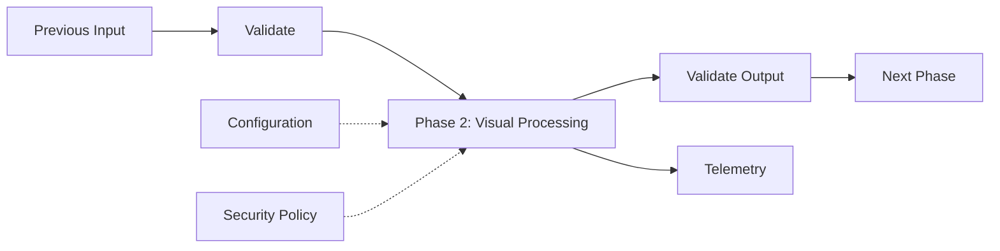
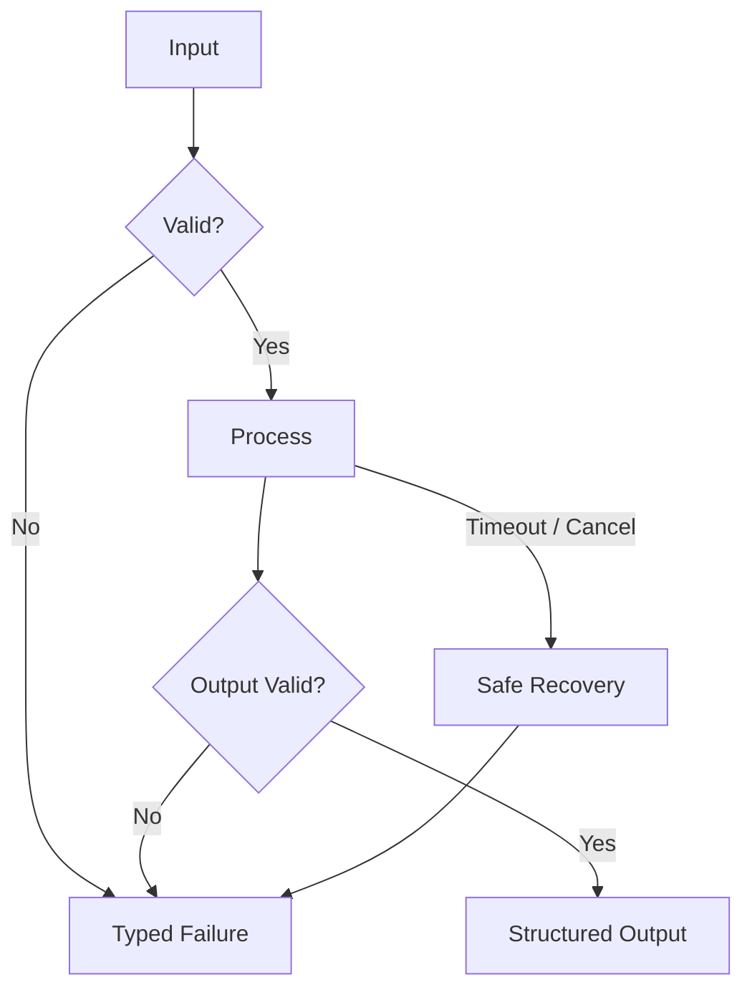
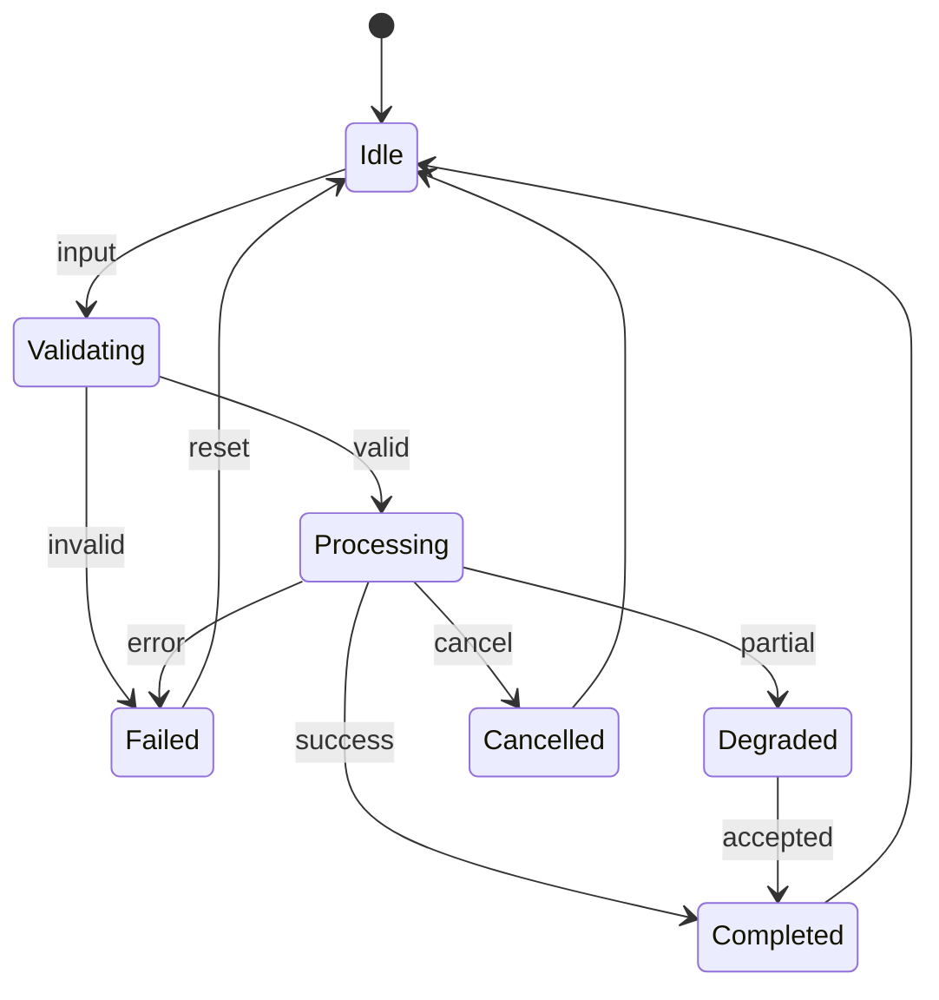
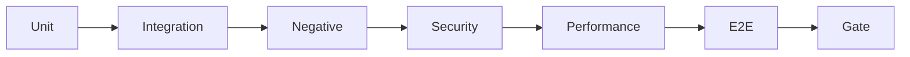

# OmniSense AI — Phase 2 — Visual Processing

**Document Type:** Detailed Engineering Specification
**Phase ID:** P02
**Status:** Planned
**Normative terms:** MUST = mandatory; SHOULD = recommended; MAY = optional.
**Principle:** Intelligence without uncontrolled authority.

---

## 1. Executive Summary

Frame validation, resize, crop, color conversion, normalization, quality assessment and change detection.

This is the implementation contract for Phase 2. It is intended for architecture, implementation, code review, testing, security review, debugging, operations and phase acceptance. It deliberately defines not only what the phase should do, but also what it must never do, how data is validated, how errors are classified, how resources are owned, how observability works, and what evidence is required before handoff.

## 2. Objectives

Deliver the phase capability completely inside its boundary.
Expose stable contracts instead of leaking implementation details.
Validate inputs before expensive or privileged processing.
Represent success, partial success, cancellation, timeout and failure explicitly.
Release every resource owned by the phase.
Make behavior reproducible through deterministic fixtures.
Keep privacy, least privilege and fail-closed behavior mandatory.

## 3. Scope

### In Scope

Phase implementation.
Interfaces and schemas.
Validation.
Configuration.
Lifecycle management.
Error handling.
Logging and metrics.
Security controls.
Performance measurement.
Automated tests.
Documentation and handoff evidence.

### Out of Scope

Undocumented future-phase features.
Unrestricted shell/process/filesystem authority.
Hidden recording or surveillance.
Treating pixels, OCR, web content or model output as trusted instructions.
Debug bypasses.
Hard-coded secrets.
Success claims without evidence.

## 4. Boundary

Frame validation, resize, crop, color conversion, normalization, quality assessment and change detection.

The phase MUST expose only documented capabilities. A later phase may consume outputs, but it MUST NOT depend on private internals or gain authority through an undocumented shortcut.

## 5. System Context

## 6. Trust Model

| Source | Trust | Rule |
|---|---|---|
| Pixels / screen content | Low | Observation only |
| OCR | Low | Untrusted data |
| Window/app metadata | Low/Medium | Context evidence |
| External content | Low | Never authority |
| Model output | Low | Validate before use |
| User authorization | High within scope | Explicit and bounded |
| Security policy | Highest | Cannot be overridden |

## 7. Architecture

| Component | Responsibility | Forbidden behavior |
|---|---|---|
| Input adapter | Receive phase input | Bypass validation |
| Validator | Schema/range/semantic checks | Silent unsafe acceptance |
| Normalizer | Canonical representation | Invisible semantic change |
| Core processor | Phase-specific work | Future-phase authority |
| Quality gate | Output quality | Hide degradation |
| Output builder | Stable result | Leak mutable internals |
| Error mapper | Stable categories | Hide root cause |
| Resource manager | Ownership and cleanup | Leaks |
| Telemetry | Safe diagnostics | Secrets/private data |
| Config loader | Validated settings | Unsafe defaults |

## 8. Component Design

### 8.1 Input adapter

Single responsibility is mandatory.
Inputs MUST be validated.
Outputs MUST satisfy a documented contract.
Hidden mutable global state SHOULD be avoided.
Resource ownership MUST be explicit.
Failure behavior MUST be deterministic where possible.
Security checks MUST occur at the actual enforcement boundary.
Positive and negative tests are required.
Platform assumptions MUST be documented.
The component MUST remain replaceable where practical.

### 8.2 validator

Single responsibility is mandatory.
Inputs MUST be validated.
Outputs MUST satisfy a documented contract.
Hidden mutable global state SHOULD be avoided.
Resource ownership MUST be explicit.
Failure behavior MUST be deterministic where possible.
Security checks MUST occur at the actual enforcement boundary.
Positive and negative tests are required.
Platform assumptions MUST be documented.
The component MUST remain replaceable where practical.

### 8.3 normalizer

Single responsibility is mandatory.
Inputs MUST be validated.
Outputs MUST satisfy a documented contract.
Hidden mutable global state SHOULD be avoided.
Resource ownership MUST be explicit.
Failure behavior MUST be deterministic where possible.
Security checks MUST occur at the actual enforcement boundary.
Positive and negative tests are required.
Platform assumptions MUST be documented.
The component MUST remain replaceable where practical.

### 8.4 core processor

Single responsibility is mandatory.
Inputs MUST be validated.
Outputs MUST satisfy a documented contract.
Hidden mutable global state SHOULD be avoided.
Resource ownership MUST be explicit.
Failure behavior MUST be deterministic where possible.
Security checks MUST occur at the actual enforcement boundary.
Positive and negative tests are required.
Platform assumptions MUST be documented.
The component MUST remain replaceable where practical.

### 8.5 quality gate

Single responsibility is mandatory.
Inputs MUST be validated.
Outputs MUST satisfy a documented contract.
Hidden mutable global state SHOULD be avoided.
Resource ownership MUST be explicit.
Failure behavior MUST be deterministic where possible.
Security checks MUST occur at the actual enforcement boundary.
Positive and negative tests are required.
Platform assumptions MUST be documented.
The component MUST remain replaceable where practical.

### 8.6 output builder

Single responsibility is mandatory.
Inputs MUST be validated.
Outputs MUST satisfy a documented contract.
Hidden mutable global state SHOULD be avoided.
Resource ownership MUST be explicit.
Failure behavior MUST be deterministic where possible.
Security checks MUST occur at the actual enforcement boundary.
Positive and negative tests are required.
Platform assumptions MUST be documented.
The component MUST remain replaceable where practical.

### 8.7 error mapper

Single responsibility is mandatory.
Inputs MUST be validated.
Outputs MUST satisfy a documented contract.
Hidden mutable global state SHOULD be avoided.
Resource ownership MUST be explicit.
Failure behavior MUST be deterministic where possible.
Security checks MUST occur at the actual enforcement boundary.
Positive and negative tests are required.
Platform assumptions MUST be documented.
The component MUST remain replaceable where practical.

### 8.8 resource manager

Single responsibility is mandatory.
Inputs MUST be validated.
Outputs MUST satisfy a documented contract.
Hidden mutable global state SHOULD be avoided.
Resource ownership MUST be explicit.
Failure behavior MUST be deterministic where possible.
Security checks MUST occur at the actual enforcement boundary.
Positive and negative tests are required.
Platform assumptions MUST be documented.
The component MUST remain replaceable where practical.

### 8.9 configuration

Single responsibility is mandatory.
Inputs MUST be validated.
Outputs MUST satisfy a documented contract.
Hidden mutable global state SHOULD be avoided.
Resource ownership MUST be explicit.
Failure behavior MUST be deterministic where possible.
Security checks MUST occur at the actual enforcement boundary.
Positive and negative tests are required.
Platform assumptions MUST be documented.
The component MUST remain replaceable where practical.

### 8.10 telemetry

Single responsibility is mandatory.
Inputs MUST be validated.
Outputs MUST satisfy a documented contract.
Hidden mutable global state SHOULD be avoided.
Resource ownership MUST be explicit.
Failure behavior MUST be deterministic where possible.
Security checks MUST occur at the actual enforcement boundary.
Positive and negative tests are required.
Platform assumptions MUST be documented.
The component MUST remain replaceable where practical.

### 8.11 health monitor

Single responsibility is mandatory.
Inputs MUST be validated.
Outputs MUST satisfy a documented contract.
Hidden mutable global state SHOULD be avoided.
Resource ownership MUST be explicit.
Failure behavior MUST be deterministic where possible.
Security checks MUST occur at the actual enforcement boundary.
Positive and negative tests are required.
Platform assumptions MUST be documented.
The component MUST remain replaceable where practical.

### 8.12 test harness

Single responsibility is mandatory.
Inputs MUST be validated.
Outputs MUST satisfy a documented contract.
Hidden mutable global state SHOULD be avoided.
Resource ownership MUST be explicit.
Failure behavior MUST be deterministic where possible.
Security checks MUST occur at the actual enforcement boundary.
Positive and negative tests are required.
Platform assumptions MUST be documented.
The component MUST remain replaceable where practical.

## 9. Functional Requirements

### FR-02-001 — input acceptance

Phase 2 MUST explicitly handle input acceptance. The relevant boundary MUST validate preconditions, execute only phase-owned behavior, produce a documented result or typed failure, and release owned resources. If the requirement is not applicable to a specific path, the exception MUST be documented and covered by review.

Verification: automated test where feasible plus code-review verification of the enforcement location.

### FR-02-002 — schema validation

Phase 2 MUST explicitly handle schema validation. The relevant boundary MUST validate preconditions, execute only phase-owned behavior, produce a documented result or typed failure, and release owned resources. If the requirement is not applicable to a specific path, the exception MUST be documented and covered by review.

Verification: automated test where feasible plus code-review verification of the enforcement location.

### FR-02-003 — size limits

Phase 2 MUST explicitly handle size limits. The relevant boundary MUST validate preconditions, execute only phase-owned behavior, produce a documented result or typed failure, and release owned resources. If the requirement is not applicable to a specific path, the exception MUST be documented and covered by review.

Verification: automated test where feasible plus code-review verification of the enforcement location.

### FR-02-004 — range validation

Phase 2 MUST explicitly handle range validation. The relevant boundary MUST validate preconditions, execute only phase-owned behavior, produce a documented result or typed failure, and release owned resources. If the requirement is not applicable to a specific path, the exception MUST be documented and covered by review.

Verification: automated test where feasible plus code-review verification of the enforcement location.

### FR-02-005 — normalization

Phase 2 MUST explicitly handle normalization. The relevant boundary MUST validate preconditions, execute only phase-owned behavior, produce a documented result or typed failure, and release owned resources. If the requirement is not applicable to a specific path, the exception MUST be documented and covered by review.

Verification: automated test where feasible plus code-review verification of the enforcement location.

### FR-02-006 — processing

Phase 2 MUST explicitly handle processing. The relevant boundary MUST validate preconditions, execute only phase-owned behavior, produce a documented result or typed failure, and release owned resources. If the requirement is not applicable to a specific path, the exception MUST be documented and covered by review.

Verification: automated test where feasible plus code-review verification of the enforcement location.

### FR-02-007 — quality checks

Phase 2 MUST explicitly handle quality checks. The relevant boundary MUST validate preconditions, execute only phase-owned behavior, produce a documented result or typed failure, and release owned resources. If the requirement is not applicable to a specific path, the exception MUST be documented and covered by review.

Verification: automated test where feasible plus code-review verification of the enforcement location.

### FR-02-008 — output construction

Phase 2 MUST explicitly handle output construction. The relevant boundary MUST validate preconditions, execute only phase-owned behavior, produce a documented result or typed failure, and release owned resources. If the requirement is not applicable to a specific path, the exception MUST be documented and covered by review.

Verification: automated test where feasible plus code-review verification of the enforcement location.

### FR-02-009 — output validation

Phase 2 MUST explicitly handle output validation. The relevant boundary MUST validate preconditions, execute only phase-owned behavior, produce a documented result or typed failure, and release owned resources. If the requirement is not applicable to a specific path, the exception MUST be documented and covered by review.

Verification: automated test where feasible plus code-review verification of the enforcement location.

### FR-02-010 — configuration

Phase 2 MUST explicitly handle configuration. The relevant boundary MUST validate preconditions, execute only phase-owned behavior, produce a documented result or typed failure, and release owned resources. If the requirement is not applicable to a specific path, the exception MUST be documented and covered by review.

Verification: automated test where feasible plus code-review verification of the enforcement location.

### FR-02-011 — resource ownership

Phase 2 MUST explicitly handle resource ownership. The relevant boundary MUST validate preconditions, execute only phase-owned behavior, produce a documented result or typed failure, and release owned resources. If the requirement is not applicable to a specific path, the exception MUST be documented and covered by review.

Verification: automated test where feasible plus code-review verification of the enforcement location.

### FR-02-012 — cleanup

Phase 2 MUST explicitly handle cleanup. The relevant boundary MUST validate preconditions, execute only phase-owned behavior, produce a documented result or typed failure, and release owned resources. If the requirement is not applicable to a specific path, the exception MUST be documented and covered by review.

Verification: automated test where feasible plus code-review verification of the enforcement location.

### FR-02-013 — timeout

Phase 2 MUST explicitly handle timeout. The relevant boundary MUST validate preconditions, execute only phase-owned behavior, produce a documented result or typed failure, and release owned resources. If the requirement is not applicable to a specific path, the exception MUST be documented and covered by review.

Verification: automated test where feasible plus code-review verification of the enforcement location.

### FR-02-014 — cancellation

Phase 2 MUST explicitly handle cancellation. The relevant boundary MUST validate preconditions, execute only phase-owned behavior, produce a documented result or typed failure, and release owned resources. If the requirement is not applicable to a specific path, the exception MUST be documented and covered by review.

Verification: automated test where feasible plus code-review verification of the enforcement location.

### FR-02-015 — concurrency

Phase 2 MUST explicitly handle concurrency. The relevant boundary MUST validate preconditions, execute only phase-owned behavior, produce a documented result or typed failure, and release owned resources. If the requirement is not applicable to a specific path, the exception MUST be documented and covered by review.

Verification: automated test where feasible plus code-review verification of the enforcement location.

### FR-02-016 — idempotency

Phase 2 MUST explicitly handle idempotency. The relevant boundary MUST validate preconditions, execute only phase-owned behavior, produce a documented result or typed failure, and release owned resources. If the requirement is not applicable to a specific path, the exception MUST be documented and covered by review.

Verification: automated test where feasible plus code-review verification of the enforcement location.

### FR-02-017 — correlation IDs

Phase 2 MUST explicitly handle correlation IDs. The relevant boundary MUST validate preconditions, execute only phase-owned behavior, produce a documented result or typed failure, and release owned resources. If the requirement is not applicable to a specific path, the exception MUST be documented and covered by review.

Verification: automated test where feasible plus code-review verification of the enforcement location.

### FR-02-018 — provenance

Phase 2 MUST explicitly handle provenance. The relevant boundary MUST validate preconditions, execute only phase-owned behavior, produce a documented result or typed failure, and release owned resources. If the requirement is not applicable to a specific path, the exception MUST be documented and covered by review.

Verification: automated test where feasible plus code-review verification of the enforcement location.

### FR-02-019 — confidence

Phase 2 MUST explicitly handle confidence. The relevant boundary MUST validate preconditions, execute only phase-owned behavior, produce a documented result or typed failure, and release owned resources. If the requirement is not applicable to a specific path, the exception MUST be documented and covered by review.

Verification: automated test where feasible plus code-review verification of the enforcement location.

### FR-02-020 — partial results

Phase 2 MUST explicitly handle partial results. The relevant boundary MUST validate preconditions, execute only phase-owned behavior, produce a documented result or typed failure, and release owned resources. If the requirement is not applicable to a specific path, the exception MUST be documented and covered by review.

Verification: automated test where feasible plus code-review verification of the enforcement location.

### FR-02-021 — degraded mode

Phase 2 MUST explicitly handle degraded mode. The relevant boundary MUST validate preconditions, execute only phase-owned behavior, produce a documented result or typed failure, and release owned resources. If the requirement is not applicable to a specific path, the exception MUST be documented and covered by review.

Verification: automated test where feasible plus code-review verification of the enforcement location.

### FR-02-022 — dependency isolation

Phase 2 MUST explicitly handle dependency isolation. The relevant boundary MUST validate preconditions, execute only phase-owned behavior, produce a documented result or typed failure, and release owned resources. If the requirement is not applicable to a specific path, the exception MUST be documented and covered by review.

Verification: automated test where feasible plus code-review verification of the enforcement location.

### FR-02-023 — dependency failure

Phase 2 MUST explicitly handle dependency failure. The relevant boundary MUST validate preconditions, execute only phase-owned behavior, produce a documented result or typed failure, and release owned resources. If the requirement is not applicable to a specific path, the exception MUST be documented and covered by review.

Verification: automated test where feasible plus code-review verification of the enforcement location.

### FR-02-024 — platform failure

Phase 2 MUST explicitly handle platform failure. The relevant boundary MUST validate preconditions, execute only phase-owned behavior, produce a documented result or typed failure, and release owned resources. If the requirement is not applicable to a specific path, the exception MUST be documented and covered by review.

Verification: automated test where feasible plus code-review verification of the enforcement location.

### FR-02-025 — serialization

Phase 2 MUST explicitly handle serialization. The relevant boundary MUST validate preconditions, execute only phase-owned behavior, produce a documented result or typed failure, and release owned resources. If the requirement is not applicable to a specific path, the exception MUST be documented and covered by review.

Verification: automated test where feasible plus code-review verification of the enforcement location.

### FR-02-026 — deserialization

Phase 2 MUST explicitly handle deserialization. The relevant boundary MUST validate preconditions, execute only phase-owned behavior, produce a documented result or typed failure, and release owned resources. If the requirement is not applicable to a specific path, the exception MUST be documented and covered by review.

Verification: automated test where feasible plus code-review verification of the enforcement location.

### FR-02-027 — privacy

Phase 2 MUST explicitly handle privacy. The relevant boundary MUST validate preconditions, execute only phase-owned behavior, produce a documented result or typed failure, and release owned resources. If the requirement is not applicable to a specific path, the exception MUST be documented and covered by review.

Verification: automated test where feasible plus code-review verification of the enforcement location.

### FR-02-028 — redaction

Phase 2 MUST explicitly handle redaction. The relevant boundary MUST validate preconditions, execute only phase-owned behavior, produce a documented result or typed failure, and release owned resources. If the requirement is not applicable to a specific path, the exception MUST be documented and covered by review.

Verification: automated test where feasible plus code-review verification of the enforcement location.

### FR-02-029 — security rejection

Phase 2 MUST explicitly handle security rejection. The relevant boundary MUST validate preconditions, execute only phase-owned behavior, produce a documented result or typed failure, and release owned resources. If the requirement is not applicable to a specific path, the exception MUST be documented and covered by review.

Verification: automated test where feasible plus code-review verification of the enforcement location.

### FR-02-030 — policy enforcement

Phase 2 MUST explicitly handle policy enforcement. The relevant boundary MUST validate preconditions, execute only phase-owned behavior, produce a documented result or typed failure, and release owned resources. If the requirement is not applicable to a specific path, the exception MUST be documented and covered by review.

Verification: automated test where feasible plus code-review verification of the enforcement location.

### FR-02-031 — health

Phase 2 MUST explicitly handle health. The relevant boundary MUST validate preconditions, execute only phase-owned behavior, produce a documented result or typed failure, and release owned resources. If the requirement is not applicable to a specific path, the exception MUST be documented and covered by review.

Verification: automated test where feasible plus code-review verification of the enforcement location.

### FR-02-032 — startup

Phase 2 MUST explicitly handle startup. The relevant boundary MUST validate preconditions, execute only phase-owned behavior, produce a documented result or typed failure, and release owned resources. If the requirement is not applicable to a specific path, the exception MUST be documented and covered by review.

Verification: automated test where feasible plus code-review verification of the enforcement location.

### FR-02-033 — shutdown

Phase 2 MUST explicitly handle shutdown. The relevant boundary MUST validate preconditions, execute only phase-owned behavior, produce a documented result or typed failure, and release owned resources. If the requirement is not applicable to a specific path, the exception MUST be documented and covered by review.

Verification: automated test where feasible plus code-review verification of the enforcement location.

### FR-02-034 — restart

Phase 2 MUST explicitly handle restart. The relevant boundary MUST validate preconditions, execute only phase-owned behavior, produce a documented result or typed failure, and release owned resources. If the requirement is not applicable to a specific path, the exception MUST be documented and covered by review.

Verification: automated test where feasible plus code-review verification of the enforcement location.

### FR-02-035 — state consistency

Phase 2 MUST explicitly handle state consistency. The relevant boundary MUST validate preconditions, execute only phase-owned behavior, produce a documented result or typed failure, and release owned resources. If the requirement is not applicable to a specific path, the exception MUST be documented and covered by review.

Verification: automated test where feasible plus code-review verification of the enforcement location.

### FR-02-036 — backpressure

Phase 2 MUST explicitly handle backpressure. The relevant boundary MUST validate preconditions, execute only phase-owned behavior, produce a documented result or typed failure, and release owned resources. If the requirement is not applicable to a specific path, the exception MUST be documented and covered by review.

Verification: automated test where feasible plus code-review verification of the enforcement location.

### FR-02-037 — error mapping

Phase 2 MUST explicitly handle error mapping. The relevant boundary MUST validate preconditions, execute only phase-owned behavior, produce a documented result or typed failure, and release owned resources. If the requirement is not applicable to a specific path, the exception MUST be documented and covered by review.

Verification: automated test where feasible plus code-review verification of the enforcement location.

### FR-02-038 — recovery

Phase 2 MUST explicitly handle recovery. The relevant boundary MUST validate preconditions, execute only phase-owned behavior, produce a documented result or typed failure, and release owned resources. If the requirement is not applicable to a specific path, the exception MUST be documented and covered by review.

Verification: automated test where feasible plus code-review verification of the enforcement location.

### FR-02-039 — regression

Phase 2 MUST explicitly handle regression. The relevant boundary MUST validate preconditions, execute only phase-owned behavior, produce a documented result or typed failure, and release owned resources. If the requirement is not applicable to a specific path, the exception MUST be documented and covered by review.

Verification: automated test where feasible plus code-review verification of the enforcement location.

### FR-02-040 — documentation

Phase 2 MUST explicitly handle documentation. The relevant boundary MUST validate preconditions, execute only phase-owned behavior, produce a documented result or typed failure, and release owned resources. If the requirement is not applicable to a specific path, the exception MUST be documented and covered by review.

Verification: automated test where feasible plus code-review verification of the enforcement location.

### FR-02-041 — handoff

Phase 2 MUST explicitly handle handoff. The relevant boundary MUST validate preconditions, execute only phase-owned behavior, produce a documented result or typed failure, and release owned resources. If the requirement is not applicable to a specific path, the exception MUST be documented and covered by review.

Verification: automated test where feasible plus code-review verification of the enforcement location.

### FR-02-042 — version compatibility

Phase 2 MUST explicitly handle version compatibility. The relevant boundary MUST validate preconditions, execute only phase-owned behavior, produce a documented result or typed failure, and release owned resources. If the requirement is not applicable to a specific path, the exception MUST be documented and covered by review.

Verification: automated test where feasible plus code-review verification of the enforcement location.

### FR-02-043 — diagnostics

Phase 2 MUST explicitly handle diagnostics. The relevant boundary MUST validate preconditions, execute only phase-owned behavior, produce a documented result or typed failure, and release owned resources. If the requirement is not applicable to a specific path, the exception MUST be documented and covered by review.

Verification: automated test where feasible plus code-review verification of the enforcement location.

### FR-02-044 — resource budgeting

Phase 2 MUST explicitly handle resource budgeting. The relevant boundary MUST validate preconditions, execute only phase-owned behavior, produce a documented result or typed failure, and release owned resources. If the requirement is not applicable to a specific path, the exception MUST be documented and covered by review.

Verification: automated test where feasible plus code-review verification of the enforcement location.

### FR-02-045 — deterministic fixtures

Phase 2 MUST explicitly handle deterministic fixtures. The relevant boundary MUST validate preconditions, execute only phase-owned behavior, produce a documented result or typed failure, and release owned resources. If the requirement is not applicable to a specific path, the exception MUST be documented and covered by review.

Verification: automated test where feasible plus code-review verification of the enforcement location.

### FR-02-046 — safe defaults

Phase 2 MUST explicitly handle safe defaults. The relevant boundary MUST validate preconditions, execute only phase-owned behavior, produce a documented result or typed failure, and release owned resources. If the requirement is not applicable to a specific path, the exception MUST be documented and covered by review.

Verification: automated test where feasible plus code-review verification of the enforcement location.

### FR-02-047 — boundary enforcement

Phase 2 MUST explicitly handle boundary enforcement. The relevant boundary MUST validate preconditions, execute only phase-owned behavior, produce a documented result or typed failure, and release owned resources. If the requirement is not applicable to a specific path, the exception MUST be documented and covered by review.

Verification: automated test where feasible plus code-review verification of the enforcement location.

### FR-02-048 — operational visibility

Phase 2 MUST explicitly handle operational visibility. The relevant boundary MUST validate preconditions, execute only phase-owned behavior, produce a documented result or typed failure, and release owned resources. If the requirement is not applicable to a specific path, the exception MUST be documented and covered by review.

Verification: automated test where feasible plus code-review verification of the enforcement location.

### FR-02-049 — failure evidence

Phase 2 MUST explicitly handle failure evidence. The relevant boundary MUST validate preconditions, execute only phase-owned behavior, produce a documented result or typed failure, and release owned resources. If the requirement is not applicable to a specific path, the exception MUST be documented and covered by review.

Verification: automated test where feasible plus code-review verification of the enforcement location.

### FR-02-050 — release evidence

Phase 2 MUST explicitly handle release evidence. The relevant boundary MUST validate preconditions, execute only phase-owned behavior, produce a documented result or typed failure, and release owned resources. If the requirement is not applicable to a specific path, the exception MUST be documented and covered by review.

Verification: automated test where feasible plus code-review verification of the enforcement location.

### FR-02-051 — maintainability

Phase 2 MUST explicitly handle maintainability. The relevant boundary MUST validate preconditions, execute only phase-owned behavior, produce a documented result or typed failure, and release owned resources. If the requirement is not applicable to a specific path, the exception MUST be documented and covered by review.

Verification: automated test where feasible plus code-review verification of the enforcement location.

### FR-02-052 — testability

Phase 2 MUST explicitly handle testability. The relevant boundary MUST validate preconditions, execute only phase-owned behavior, produce a documented result or typed failure, and release owned resources. If the requirement is not applicable to a specific path, the exception MUST be documented and covered by review.

Verification: automated test where feasible plus code-review verification of the enforcement location.

### FR-02-053 — portability

Phase 2 MUST explicitly handle portability. The relevant boundary MUST validate preconditions, execute only phase-owned behavior, produce a documented result or typed failure, and release owned resources. If the requirement is not applicable to a specific path, the exception MUST be documented and covered by review.

Verification: automated test where feasible plus code-review verification of the enforcement location.

### FR-02-054 — contract stability

Phase 2 MUST explicitly handle contract stability. The relevant boundary MUST validate preconditions, execute only phase-owned behavior, produce a documented result or typed failure, and release owned resources. If the requirement is not applicable to a specific path, the exception MUST be documented and covered by review.

Verification: automated test where feasible plus code-review verification of the enforcement location.

### FR-02-055 — migration

Phase 2 MUST explicitly handle migration. The relevant boundary MUST validate preconditions, execute only phase-owned behavior, produce a documented result or typed failure, and release owned resources. If the requirement is not applicable to a specific path, the exception MUST be documented and covered by review.

Verification: automated test where feasible plus code-review verification of the enforcement location.

### FR-02-056 — rollback

Phase 2 MUST explicitly handle rollback. The relevant boundary MUST validate preconditions, execute only phase-owned behavior, produce a documented result or typed failure, and release owned resources. If the requirement is not applicable to a specific path, the exception MUST be documented and covered by review.

Verification: automated test where feasible plus code-review verification of the enforcement location.

### FR-02-057 — configuration precedence

Phase 2 MUST explicitly handle configuration precedence. The relevant boundary MUST validate preconditions, execute only phase-owned behavior, produce a documented result or typed failure, and release owned resources. If the requirement is not applicable to a specific path, the exception MUST be documented and covered by review.

Verification: automated test where feasible plus code-review verification of the enforcement location.

### FR-02-058 — environment isolation

Phase 2 MUST explicitly handle environment isolation. The relevant boundary MUST validate preconditions, execute only phase-owned behavior, produce a documented result or typed failure, and release owned resources. If the requirement is not applicable to a specific path, the exception MUST be documented and covered by review.

Verification: automated test where feasible plus code-review verification of the enforcement location.

### FR-02-059 — input provenance

Phase 2 MUST explicitly handle input provenance. The relevant boundary MUST validate preconditions, execute only phase-owned behavior, produce a documented result or typed failure, and release owned resources. If the requirement is not applicable to a specific path, the exception MUST be documented and covered by review.

Verification: automated test where feasible plus code-review verification of the enforcement location.

### FR-02-060 — output provenance

Phase 2 MUST explicitly handle output provenance. The relevant boundary MUST validate preconditions, execute only phase-owned behavior, produce a documented result or typed failure, and release owned resources. If the requirement is not applicable to a specific path, the exception MUST be documented and covered by review.

Verification: automated test where feasible plus code-review verification of the enforcement location.

### FR-02-061 — schema evolution

Phase 2 MUST explicitly handle schema evolution. The relevant boundary MUST validate preconditions, execute only phase-owned behavior, produce a documented result or typed failure, and release owned resources. If the requirement is not applicable to a specific path, the exception MUST be documented and covered by review.

Verification: automated test where feasible plus code-review verification of the enforcement location.

### FR-02-062 — compatibility checks

Phase 2 MUST explicitly handle compatibility checks. The relevant boundary MUST validate preconditions, execute only phase-owned behavior, produce a documented result or typed failure, and release owned resources. If the requirement is not applicable to a specific path, the exception MUST be documented and covered by review.

Verification: automated test where feasible plus code-review verification of the enforcement location.

## 10. Non-Functional Requirements

### NFR-001 — correctness

The correctness property MUST have a measurable or reviewable implementation characteristic and a verification method. Optimization MUST NOT weaken correctness, security, privacy or cleanup.

### NFR-002 — reliability

The reliability property MUST have a measurable or reviewable implementation characteristic and a verification method. Optimization MUST NOT weaken correctness, security, privacy or cleanup.

### NFR-003 — maintainability

The maintainability property MUST have a measurable or reviewable implementation characteristic and a verification method. Optimization MUST NOT weaken correctness, security, privacy or cleanup.

### NFR-004 — testability

The testability property MUST have a measurable or reviewable implementation characteristic and a verification method. Optimization MUST NOT weaken correctness, security, privacy or cleanup.

### NFR-005 — observability

The observability property MUST have a measurable or reviewable implementation characteristic and a verification method. Optimization MUST NOT weaken correctness, security, privacy or cleanup.

### NFR-006 — privacy

The privacy property MUST have a measurable or reviewable implementation characteristic and a verification method. Optimization MUST NOT weaken correctness, security, privacy or cleanup.

### NFR-007 — security

The security property MUST have a measurable or reviewable implementation characteristic and a verification method. Optimization MUST NOT weaken correctness, security, privacy or cleanup.

### NFR-008 — resource safety

The resource safety property MUST have a measurable or reviewable implementation characteristic and a verification method. Optimization MUST NOT weaken correctness, security, privacy or cleanup.

### NFR-009 — portability

The portability property MUST have a measurable or reviewable implementation characteristic and a verification method. Optimization MUST NOT weaken correctness, security, privacy or cleanup.

### NFR-010 — compatibility

The compatibility property MUST have a measurable or reviewable implementation characteristic and a verification method. Optimization MUST NOT weaken correctness, security, privacy or cleanup.

### NFR-011 — latency

The latency property MUST have a measurable or reviewable implementation characteristic and a verification method. Optimization MUST NOT weaken correctness, security, privacy or cleanup.

### NFR-012 — throughput

The throughput property MUST have a measurable or reviewable implementation characteristic and a verification method. Optimization MUST NOT weaken correctness, security, privacy or cleanup.

### NFR-013 — memory stability

The memory stability property MUST have a measurable or reviewable implementation characteristic and a verification method. Optimization MUST NOT weaken correctness, security, privacy or cleanup.

### NFR-014 — CPU efficiency

The CPU efficiency property MUST have a measurable or reviewable implementation characteristic and a verification method. Optimization MUST NOT weaken correctness, security, privacy or cleanup.

### NFR-015 — GPU efficiency

The GPU efficiency property MUST have a measurable or reviewable implementation characteristic and a verification method. Optimization MUST NOT weaken correctness, security, privacy or cleanup.

### NFR-016 — graceful degradation

The graceful degradation property MUST have a measurable or reviewable implementation characteristic and a verification method. Optimization MUST NOT weaken correctness, security, privacy or cleanup.

### NFR-017 — cancellation

The cancellation property MUST have a measurable or reviewable implementation characteristic and a verification method. Optimization MUST NOT weaken correctness, security, privacy or cleanup.

### NFR-018 — timeout behavior

The timeout behavior property MUST have a measurable or reviewable implementation characteristic and a verification method. Optimization MUST NOT weaken correctness, security, privacy or cleanup.

### NFR-019 — reproducibility

The reproducibility property MUST have a measurable or reviewable implementation characteristic and a verification method. Optimization MUST NOT weaken correctness, security, privacy or cleanup.

### NFR-020 — diagnosability

The diagnosability property MUST have a measurable or reviewable implementation characteristic and a verification method. Optimization MUST NOT weaken correctness, security, privacy or cleanup.

### NFR-021 — dependency hygiene

The dependency hygiene property MUST have a measurable or reviewable implementation characteristic and a verification method. Optimization MUST NOT weaken correctness, security, privacy or cleanup.

### NFR-022 — license compatibility

The license compatibility property MUST have a measurable or reviewable implementation characteristic and a verification method. Optimization MUST NOT weaken correctness, security, privacy or cleanup.

### NFR-023 — safe defaults

The safe defaults property MUST have a measurable or reviewable implementation characteristic and a verification method. Optimization MUST NOT weaken correctness, security, privacy or cleanup.

### NFR-024 — versionability

The versionability property MUST have a measurable or reviewable implementation characteristic and a verification method. Optimization MUST NOT weaken correctness, security, privacy or cleanup.

### NFR-025 — backward compatibility

The backward compatibility property MUST have a measurable or reviewable implementation characteristic and a verification method. Optimization MUST NOT weaken correctness, security, privacy or cleanup.

### NFR-026 — operational clarity

The operational clarity property MUST have a measurable or reviewable implementation characteristic and a verification method. Optimization MUST NOT weaken correctness, security, privacy or cleanup.

### NFR-027 — failure isolation

The failure isolation property MUST have a measurable or reviewable implementation characteristic and a verification method. Optimization MUST NOT weaken correctness, security, privacy or cleanup.

### NFR-028 — startup predictability

The startup predictability property MUST have a measurable or reviewable implementation characteristic and a verification method. Optimization MUST NOT weaken correctness, security, privacy or cleanup.

### NFR-029 — shutdown predictability

The shutdown predictability property MUST have a measurable or reviewable implementation characteristic and a verification method. Optimization MUST NOT weaken correctness, security, privacy or cleanup.

## 11. Data Contracts

### 11.1 PhaseInput

| Field | Rule |
|---|---|
| schema_version | Explicit contract version |
| correlation_id | Links related operations when needed |
| timestamp | Consistent format |
| status | Explicit result state |
| payload | Phase-relevant data only |
| provenance | Source/transformation where meaningful |
| confidence | Bounded when applicable |
| diagnostics | Safe operational metadata |
| limits | Applied resource/data limits where relevant |

Contracts MUST be validated at the boundary. Internal mutable objects MUST NOT become accidental public API.

### 11.2 PhaseOutput

| Field | Rule |
|---|---|
| schema_version | Explicit contract version |
| correlation_id | Links related operations when needed |
| timestamp | Consistent format |
| status | Explicit result state |
| payload | Phase-relevant data only |
| provenance | Source/transformation where meaningful |
| confidence | Bounded when applicable |
| diagnostics | Safe operational metadata |
| limits | Applied resource/data limits where relevant |

Contracts MUST be validated at the boundary. Internal mutable objects MUST NOT become accidental public API.

### 11.3 ProcessingMetadata

| Field | Rule |
|---|---|
| schema_version | Explicit contract version |
| correlation_id | Links related operations when needed |
| timestamp | Consistent format |
| status | Explicit result state |
| payload | Phase-relevant data only |
| provenance | Source/transformation where meaningful |
| confidence | Bounded when applicable |
| diagnostics | Safe operational metadata |
| limits | Applied resource/data limits where relevant |

Contracts MUST be validated at the boundary. Internal mutable objects MUST NOT become accidental public API.

### 11.4 QualityReport

| Field | Rule |
|---|---|
| schema_version | Explicit contract version |
| correlation_id | Links related operations when needed |
| timestamp | Consistent format |
| status | Explicit result state |
| payload | Phase-relevant data only |
| provenance | Source/transformation where meaningful |
| confidence | Bounded when applicable |
| diagnostics | Safe operational metadata |
| limits | Applied resource/data limits where relevant |

Contracts MUST be validated at the boundary. Internal mutable objects MUST NOT become accidental public API.

### 11.5 ConfigurationSnapshot

| Field | Rule |
|---|---|
| schema_version | Explicit contract version |
| correlation_id | Links related operations when needed |
| timestamp | Consistent format |
| status | Explicit result state |
| payload | Phase-relevant data only |
| provenance | Source/transformation where meaningful |
| confidence | Bounded when applicable |
| diagnostics | Safe operational metadata |
| limits | Applied resource/data limits where relevant |

Contracts MUST be validated at the boundary. Internal mutable objects MUST NOT become accidental public API.

### 11.6 HealthState

| Field | Rule |
|---|---|
| schema_version | Explicit contract version |
| correlation_id | Links related operations when needed |
| timestamp | Consistent format |
| status | Explicit result state |
| payload | Phase-relevant data only |
| provenance | Source/transformation where meaningful |
| confidence | Bounded when applicable |
| diagnostics | Safe operational metadata |
| limits | Applied resource/data limits where relevant |

Contracts MUST be validated at the boundary. Internal mutable objects MUST NOT become accidental public API.

### 11.7 ErrorRecord

| Field | Rule |
|---|---|
| schema_version | Explicit contract version |
| correlation_id | Links related operations when needed |
| timestamp | Consistent format |
| status | Explicit result state |
| payload | Phase-relevant data only |
| provenance | Source/transformation where meaningful |
| confidence | Bounded when applicable |
| diagnostics | Safe operational metadata |
| limits | Applied resource/data limits where relevant |

Contracts MUST be validated at the boundary. Internal mutable objects MUST NOT become accidental public API.

### 11.8 TelemetryEvent

| Field | Rule |
|---|---|
| schema_version | Explicit contract version |
| correlation_id | Links related operations when needed |
| timestamp | Consistent format |
| status | Explicit result state |
| payload | Phase-relevant data only |
| provenance | Source/transformation where meaningful |
| confidence | Bounded when applicable |
| diagnostics | Safe operational metadata |
| limits | Applied resource/data limits where relevant |

Contracts MUST be validated at the boundary. Internal mutable objects MUST NOT become accidental public API.

### 11.9 CorrelationContext

| Field | Rule |
|---|---|
| schema_version | Explicit contract version |
| correlation_id | Links related operations when needed |
| timestamp | Consistent format |
| status | Explicit result state |
| payload | Phase-relevant data only |
| provenance | Source/transformation where meaningful |
| confidence | Bounded when applicable |
| diagnostics | Safe operational metadata |
| limits | Applied resource/data limits where relevant |

Contracts MUST be validated at the boundary. Internal mutable objects MUST NOT become accidental public API.

### 11.10 ResourceHandle

| Field | Rule |
|---|---|
| schema_version | Explicit contract version |
| correlation_id | Links related operations when needed |
| timestamp | Consistent format |
| status | Explicit result state |
| payload | Phase-relevant data only |
| provenance | Source/transformation where meaningful |
| confidence | Bounded when applicable |
| diagnostics | Safe operational metadata |
| limits | Applied resource/data limits where relevant |

Contracts MUST be validated at the boundary. Internal mutable objects MUST NOT become accidental public API.

### 11.11 CancellationContext

| Field | Rule |
|---|---|
| schema_version | Explicit contract version |
| correlation_id | Links related operations when needed |
| timestamp | Consistent format |
| status | Explicit result state |
| payload | Phase-relevant data only |
| provenance | Source/transformation where meaningful |
| confidence | Bounded when applicable |
| diagnostics | Safe operational metadata |
| limits | Applied resource/data limits where relevant |

Contracts MUST be validated at the boundary. Internal mutable objects MUST NOT become accidental public API.

### 11.12 VersionInfo

| Field | Rule |
|---|---|
| schema_version | Explicit contract version |
| correlation_id | Links related operations when needed |
| timestamp | Consistent format |
| status | Explicit result state |
| payload | Phase-relevant data only |
| provenance | Source/transformation where meaningful |
| confidence | Bounded when applicable |
| diagnostics | Safe operational metadata |
| limits | Applied resource/data limits where relevant |

Contracts MUST be validated at the boundary. Internal mutable objects MUST NOT become accidental public API.

### 11.13 CapabilityDescriptor

| Field | Rule |
|---|---|
| schema_version | Explicit contract version |
| correlation_id | Links related operations when needed |
| timestamp | Consistent format |
| status | Explicit result state |
| payload | Phase-relevant data only |
| provenance | Source/transformation where meaningful |
| confidence | Bounded when applicable |
| diagnostics | Safe operational metadata |
| limits | Applied resource/data limits where relevant |

Contracts MUST be validated at the boundary. Internal mutable objects MUST NOT become accidental public API.

### 11.14 DiagnosticContext

| Field | Rule |
|---|---|
| schema_version | Explicit contract version |
| correlation_id | Links related operations when needed |
| timestamp | Consistent format |
| status | Explicit result state |
| payload | Phase-relevant data only |
| provenance | Source/transformation where meaningful |
| confidence | Bounded when applicable |
| diagnostics | Safe operational metadata |
| limits | Applied resource/data limits where relevant |

Contracts MUST be validated at the boundary. Internal mutable objects MUST NOT become accidental public API.

## 12. State Machine

| State | Entry | Exit | Rule |
|---|---|---|---|
| Idle | ready | input | no unbounded operation resources |
| Validating | input | process/fail | reject early |
| Processing | valid | complete/fail/cancel | enforce budgets |
| Degraded | partial | complete/fail | disclose degradation |
| Completed | valid output | idle | stable output |
| Cancelled | cancellation | idle | cleanup mandatory |
| Failed | unrecoverable error | idle/restart | no bypass |

## 13. Processing Algorithms

### Algorithm 1 — Controlled Operation

Receive input through the adapter.
Create or propagate correlation ID.
Validate structural schema.
Validate size, range and semantic limits.
Normalize only approved fields.
Establish timeout and cancellation budget.
Acquire only required resources.
Execute phase-specific processing.
Check deadline and resource conditions.
Evaluate quality and intermediate validity.
Build output contract.
Validate output contract.
Emit safe telemetry.
Release resources in a finally-equivalent path.
Return success, degraded, cancelled or typed failure.

### Algorithm 2 — Controlled Operation

Receive input through the adapter.
Create or propagate correlation ID.
Validate structural schema.
Validate size, range and semantic limits.
Normalize only approved fields.
Establish timeout and cancellation budget.
Acquire only required resources.
Execute phase-specific processing.
Check deadline and resource conditions.
Evaluate quality and intermediate validity.
Build output contract.
Validate output contract.
Emit safe telemetry.
Release resources in a finally-equivalent path.
Return success, degraded, cancelled or typed failure.

### Algorithm 3 — Controlled Operation

Receive input through the adapter.
Create or propagate correlation ID.
Validate structural schema.
Validate size, range and semantic limits.
Normalize only approved fields.
Establish timeout and cancellation budget.
Acquire only required resources.
Execute phase-specific processing.
Check deadline and resource conditions.
Evaluate quality and intermediate validity.
Build output contract.
Validate output contract.
Emit safe telemetry.
Release resources in a finally-equivalent path.
Return success, degraded, cancelled or typed failure.

### Algorithm 4 — Controlled Operation

Receive input through the adapter.
Create or propagate correlation ID.
Validate structural schema.
Validate size, range and semantic limits.
Normalize only approved fields.
Establish timeout and cancellation budget.
Acquire only required resources.
Execute phase-specific processing.
Check deadline and resource conditions.
Evaluate quality and intermediate validity.
Build output contract.
Validate output contract.
Emit safe telemetry.
Release resources in a finally-equivalent path.
Return success, degraded, cancelled or typed failure.

### Algorithm 5 — Controlled Operation

Receive input through the adapter.
Create or propagate correlation ID.
Validate structural schema.
Validate size, range and semantic limits.
Normalize only approved fields.
Establish timeout and cancellation budget.
Acquire only required resources.
Execute phase-specific processing.
Check deadline and resource conditions.
Evaluate quality and intermediate validity.
Build output contract.
Validate output contract.
Emit safe telemetry.
Release resources in a finally-equivalent path.
Return success, degraded, cancelled or typed failure.

### Algorithm 6 — Controlled Operation

Receive input through the adapter.
Create or propagate correlation ID.
Validate structural schema.
Validate size, range and semantic limits.
Normalize only approved fields.
Establish timeout and cancellation budget.
Acquire only required resources.
Execute phase-specific processing.
Check deadline and resource conditions.
Evaluate quality and intermediate validity.
Build output contract.
Validate output contract.
Emit safe telemetry.
Release resources in a finally-equivalent path.
Return success, degraded, cancelled or typed failure.

### Algorithm 7 — Controlled Operation

Receive input through the adapter.
Create or propagate correlation ID.
Validate structural schema.
Validate size, range and semantic limits.
Normalize only approved fields.
Establish timeout and cancellation budget.
Acquire only required resources.
Execute phase-specific processing.
Check deadline and resource conditions.
Evaluate quality and intermediate validity.
Build output contract.
Validate output contract.
Emit safe telemetry.
Release resources in a finally-equivalent path.
Return success, degraded, cancelled or typed failure.

### Algorithm 8 — Controlled Operation

Receive input through the adapter.
Create or propagate correlation ID.
Validate structural schema.
Validate size, range and semantic limits.
Normalize only approved fields.
Establish timeout and cancellation budget.
Acquire only required resources.
Execute phase-specific processing.
Check deadline and resource conditions.
Evaluate quality and intermediate validity.
Build output contract.
Validate output contract.
Emit safe telemetry.
Release resources in a finally-equivalent path.
Return success, degraded, cancelled or typed failure.

### Algorithm 9 — Controlled Operation

Receive input through the adapter.
Create or propagate correlation ID.
Validate structural schema.
Validate size, range and semantic limits.
Normalize only approved fields.
Establish timeout and cancellation budget.
Acquire only required resources.
Execute phase-specific processing.
Check deadline and resource conditions.
Evaluate quality and intermediate validity.
Build output contract.
Validate output contract.
Emit safe telemetry.
Release resources in a finally-equivalent path.
Return success, degraded, cancelled or typed failure.

### Algorithm 10 — Controlled Operation

Receive input through the adapter.
Create or propagate correlation ID.
Validate structural schema.
Validate size, range and semantic limits.
Normalize only approved fields.
Establish timeout and cancellation budget.
Acquire only required resources.
Execute phase-specific processing.
Check deadline and resource conditions.
Evaluate quality and intermediate validity.
Build output contract.
Validate output contract.
Emit safe telemetry.
Release resources in a finally-equivalent path.
Return success, degraded, cancelled or typed failure.

### Algorithm 11 — Controlled Operation

Receive input through the adapter.
Create or propagate correlation ID.
Validate structural schema.
Validate size, range and semantic limits.
Normalize only approved fields.
Establish timeout and cancellation budget.
Acquire only required resources.
Execute phase-specific processing.
Check deadline and resource conditions.
Evaluate quality and intermediate validity.
Build output contract.
Validate output contract.
Emit safe telemetry.
Release resources in a finally-equivalent path.
Return success, degraded, cancelled or typed failure.

### Algorithm 12 — Controlled Operation

Receive input through the adapter.
Create or propagate correlation ID.
Validate structural schema.
Validate size, range and semantic limits.
Normalize only approved fields.
Establish timeout and cancellation budget.
Acquire only required resources.
Execute phase-specific processing.
Check deadline and resource conditions.
Evaluate quality and intermediate validity.
Build output contract.
Validate output contract.
Emit safe telemetry.
Release resources in a finally-equivalent path.
Return success, degraded, cancelled or typed failure.

### Algorithm 13 — Controlled Operation

Receive input through the adapter.
Create or propagate correlation ID.
Validate structural schema.
Validate size, range and semantic limits.
Normalize only approved fields.
Establish timeout and cancellation budget.
Acquire only required resources.
Execute phase-specific processing.
Check deadline and resource conditions.
Evaluate quality and intermediate validity.
Build output contract.
Validate output contract.
Emit safe telemetry.
Release resources in a finally-equivalent path.
Return success, degraded, cancelled or typed failure.

### Algorithm 14 — Controlled Operation

Receive input through the adapter.
Create or propagate correlation ID.
Validate structural schema.
Validate size, range and semantic limits.
Normalize only approved fields.
Establish timeout and cancellation budget.
Acquire only required resources.
Execute phase-specific processing.
Check deadline and resource conditions.
Evaluate quality and intermediate validity.
Build output contract.
Validate output contract.
Emit safe telemetry.
Release resources in a finally-equivalent path.
Return success, degraded, cancelled or typed failure.

### Algorithm 15 — Controlled Operation

Receive input through the adapter.
Create or propagate correlation ID.
Validate structural schema.
Validate size, range and semantic limits.
Normalize only approved fields.
Establish timeout and cancellation budget.
Acquire only required resources.
Execute phase-specific processing.
Check deadline and resource conditions.
Evaluate quality and intermediate validity.
Build output contract.
Validate output contract.
Emit safe telemetry.
Release resources in a finally-equivalent path.
Return success, degraded, cancelled or typed failure.

### Algorithm 16 — Controlled Operation

Receive input through the adapter.
Create or propagate correlation ID.
Validate structural schema.
Validate size, range and semantic limits.
Normalize only approved fields.
Establish timeout and cancellation budget.
Acquire only required resources.
Execute phase-specific processing.
Check deadline and resource conditions.
Evaluate quality and intermediate validity.
Build output contract.
Validate output contract.
Emit safe telemetry.
Release resources in a finally-equivalent path.
Return success, degraded, cancelled or typed failure.

### Algorithm 17 — Controlled Operation

Receive input through the adapter.
Create or propagate correlation ID.
Validate structural schema.
Validate size, range and semantic limits.
Normalize only approved fields.
Establish timeout and cancellation budget.
Acquire only required resources.
Execute phase-specific processing.
Check deadline and resource conditions.
Evaluate quality and intermediate validity.
Build output contract.
Validate output contract.
Emit safe telemetry.
Release resources in a finally-equivalent path.
Return success, degraded, cancelled or typed failure.

### Algorithm 18 — Controlled Operation

Receive input through the adapter.
Create or propagate correlation ID.
Validate structural schema.
Validate size, range and semantic limits.
Normalize only approved fields.
Establish timeout and cancellation budget.
Acquire only required resources.
Execute phase-specific processing.
Check deadline and resource conditions.
Evaluate quality and intermediate validity.
Build output contract.
Validate output contract.
Emit safe telemetry.
Release resources in a finally-equivalent path.
Return success, degraded, cancelled or typed failure.

## 14. Configuration

| Category | Rule |
|---|---|
| enablement | Explicit phase availability |
| limits | Bound data/resource use |
| timeout | Prevent indefinite work |
| concurrency | Bound parallel work |
| quality | Define acceptable output |
| diagnostics | Safe verbosity |
| provider | Replaceable implementation where relevant |
| privacy | Retention/redaction controls where relevant |

Configuration MUST be validated. Secrets MUST never be committed or printed. Unsafe values MUST fail closed. Defaults MUST be documented and safe.

## 15. Error Taxonomy

### ERR-001 — INVALID_INPUT

Map this condition to a stable category. Messages MUST aid diagnosis without exposing credentials, tokens, secrets, private screen data or unnecessary raw content. Recoverable conditions SHOULD expose bounded recovery. Security failures MUST fail closed.

### ERR-002 — SCHEMA_MISMATCH

Map this condition to a stable category. Messages MUST aid diagnosis without exposing credentials, tokens, secrets, private screen data or unnecessary raw content. Recoverable conditions SHOULD expose bounded recovery. Security failures MUST fail closed.

### ERR-003 — OUT_OF_BOUNDS

Map this condition to a stable category. Messages MUST aid diagnosis without exposing credentials, tokens, secrets, private screen data or unnecessary raw content. Recoverable conditions SHOULD expose bounded recovery. Security failures MUST fail closed.

### ERR-004 — UNSUPPORTED_FORMAT

Map this condition to a stable category. Messages MUST aid diagnosis without exposing credentials, tokens, secrets, private screen data or unnecessary raw content. Recoverable conditions SHOULD expose bounded recovery. Security failures MUST fail closed.

### ERR-005 — CONFIG_INVALID

Map this condition to a stable category. Messages MUST aid diagnosis without exposing credentials, tokens, secrets, private screen data or unnecessary raw content. Recoverable conditions SHOULD expose bounded recovery. Security failures MUST fail closed.

### ERR-006 — RESOURCE_UNAVAILABLE

Map this condition to a stable category. Messages MUST aid diagnosis without exposing credentials, tokens, secrets, private screen data or unnecessary raw content. Recoverable conditions SHOULD expose bounded recovery. Security failures MUST fail closed.

### ERR-007 — RESOURCE_EXHAUSTED

Map this condition to a stable category. Messages MUST aid diagnosis without exposing credentials, tokens, secrets, private screen data or unnecessary raw content. Recoverable conditions SHOULD expose bounded recovery. Security failures MUST fail closed.

### ERR-008 — TIMEOUT

Map this condition to a stable category. Messages MUST aid diagnosis without exposing credentials, tokens, secrets, private screen data or unnecessary raw content. Recoverable conditions SHOULD expose bounded recovery. Security failures MUST fail closed.

### ERR-009 — CANCELLED

Map this condition to a stable category. Messages MUST aid diagnosis without exposing credentials, tokens, secrets, private screen data or unnecessary raw content. Recoverable conditions SHOULD expose bounded recovery. Security failures MUST fail closed.

### ERR-010 — DEPENDENCY_UNAVAILABLE

Map this condition to a stable category. Messages MUST aid diagnosis without exposing credentials, tokens, secrets, private screen data or unnecessary raw content. Recoverable conditions SHOULD expose bounded recovery. Security failures MUST fail closed.

### ERR-011 — DEPENDENCY_FAILURE

Map this condition to a stable category. Messages MUST aid diagnosis without exposing credentials, tokens, secrets, private screen data or unnecessary raw content. Recoverable conditions SHOULD expose bounded recovery. Security failures MUST fail closed.

### ERR-012 — PROCESSING_FAILURE

Map this condition to a stable category. Messages MUST aid diagnosis without exposing credentials, tokens, secrets, private screen data or unnecessary raw content. Recoverable conditions SHOULD expose bounded recovery. Security failures MUST fail closed.

### ERR-013 — OUTPUT_INVALID

Map this condition to a stable category. Messages MUST aid diagnosis without exposing credentials, tokens, secrets, private screen data or unnecessary raw content. Recoverable conditions SHOULD expose bounded recovery. Security failures MUST fail closed.

### ERR-014 — PERMISSION_DENIED

Map this condition to a stable category. Messages MUST aid diagnosis without exposing credentials, tokens, secrets, private screen data or unnecessary raw content. Recoverable conditions SHOULD expose bounded recovery. Security failures MUST fail closed.

### ERR-015 — POLICY_DENIED

Map this condition to a stable category. Messages MUST aid diagnosis without exposing credentials, tokens, secrets, private screen data or unnecessary raw content. Recoverable conditions SHOULD expose bounded recovery. Security failures MUST fail closed.

### ERR-016 — RATE_LIMITED

Map this condition to a stable category. Messages MUST aid diagnosis without exposing credentials, tokens, secrets, private screen data or unnecessary raw content. Recoverable conditions SHOULD expose bounded recovery. Security failures MUST fail closed.

### ERR-017 — PLATFORM_UNSUPPORTED

Map this condition to a stable category. Messages MUST aid diagnosis without exposing credentials, tokens, secrets, private screen data or unnecessary raw content. Recoverable conditions SHOULD expose bounded recovery. Security failures MUST fail closed.

### ERR-018 — STATE_CONFLICT

Map this condition to a stable category. Messages MUST aid diagnosis without exposing credentials, tokens, secrets, private screen data or unnecessary raw content. Recoverable conditions SHOULD expose bounded recovery. Security failures MUST fail closed.

### ERR-019 — CONCURRENCY_ERROR

Map this condition to a stable category. Messages MUST aid diagnosis without exposing credentials, tokens, secrets, private screen data or unnecessary raw content. Recoverable conditions SHOULD expose bounded recovery. Security failures MUST fail closed.

### ERR-020 — SERIALIZATION_ERROR

Map this condition to a stable category. Messages MUST aid diagnosis without exposing credentials, tokens, secrets, private screen data or unnecessary raw content. Recoverable conditions SHOULD expose bounded recovery. Security failures MUST fail closed.

### ERR-021 — DESERIALIZATION_ERROR

Map this condition to a stable category. Messages MUST aid diagnosis without exposing credentials, tokens, secrets, private screen data or unnecessary raw content. Recoverable conditions SHOULD expose bounded recovery. Security failures MUST fail closed.

### ERR-022 — SECURITY_REJECTED

Map this condition to a stable category. Messages MUST aid diagnosis without exposing credentials, tokens, secrets, private screen data or unnecessary raw content. Recoverable conditions SHOULD expose bounded recovery. Security failures MUST fail closed.

### ERR-023 — SENSITIVE_DATA_BLOCKED

Map this condition to a stable category. Messages MUST aid diagnosis without exposing credentials, tokens, secrets, private screen data or unnecessary raw content. Recoverable conditions SHOULD expose bounded recovery. Security failures MUST fail closed.

### ERR-024 — DEGRADED_RESULT

Map this condition to a stable category. Messages MUST aid diagnosis without exposing credentials, tokens, secrets, private screen data or unnecessary raw content. Recoverable conditions SHOULD expose bounded recovery. Security failures MUST fail closed.

### ERR-025 — VERIFICATION_FAILED

Map this condition to a stable category. Messages MUST aid diagnosis without exposing credentials, tokens, secrets, private screen data or unnecessary raw content. Recoverable conditions SHOULD expose bounded recovery. Security failures MUST fail closed.

### ERR-026 — CLEANUP_FAILED

Map this condition to a stable category. Messages MUST aid diagnosis without exposing credentials, tokens, secrets, private screen data or unnecessary raw content. Recoverable conditions SHOULD expose bounded recovery. Security failures MUST fail closed.

### ERR-027 — STARTUP_FAILED

Map this condition to a stable category. Messages MUST aid diagnosis without exposing credentials, tokens, secrets, private screen data or unnecessary raw content. Recoverable conditions SHOULD expose bounded recovery. Security failures MUST fail closed.

### ERR-028 — SHUTDOWN_FAILED

Map this condition to a stable category. Messages MUST aid diagnosis without exposing credentials, tokens, secrets, private screen data or unnecessary raw content. Recoverable conditions SHOULD expose bounded recovery. Security failures MUST fail closed.

### ERR-029 — VERSION_MISMATCH

Map this condition to a stable category. Messages MUST aid diagnosis without exposing credentials, tokens, secrets, private screen data or unnecessary raw content. Recoverable conditions SHOULD expose bounded recovery. Security failures MUST fail closed.

### ERR-030 — INTERNAL_ERROR

Map this condition to a stable category. Messages MUST aid diagnosis without exposing credentials, tokens, secrets, private screen data or unnecessary raw content. Recoverable conditions SHOULD expose bounded recovery. Security failures MUST fail closed.

## 16. Observability

### Event 1 — startup

Include phase ID, event name, outcome, correlation ID and timing where applicable. Metadata MUST be safe. Never log credentials, access tokens, secrets or unnecessary private screen content.

### Event 2 — shutdown

Include phase ID, event name, outcome, correlation ID and timing where applicable. Metadata MUST be safe. Never log credentials, access tokens, secrets or unnecessary private screen content.

### Event 3 — operation_start

Include phase ID, event name, outcome, correlation ID and timing where applicable. Metadata MUST be safe. Never log credentials, access tokens, secrets or unnecessary private screen content.

### Event 4 — operation_complete

Include phase ID, event name, outcome, correlation ID and timing where applicable. Metadata MUST be safe. Never log credentials, access tokens, secrets or unnecessary private screen content.

### Event 5 — operation_failed

Include phase ID, event name, outcome, correlation ID and timing where applicable. Metadata MUST be safe. Never log credentials, access tokens, secrets or unnecessary private screen content.

### Event 6 — validation_failure

Include phase ID, event name, outcome, correlation ID and timing where applicable. Metadata MUST be safe. Never log credentials, access tokens, secrets or unnecessary private screen content.

### Event 7 — timeout

Include phase ID, event name, outcome, correlation ID and timing where applicable. Metadata MUST be safe. Never log credentials, access tokens, secrets or unnecessary private screen content.

### Event 8 — cancellation

Include phase ID, event name, outcome, correlation ID and timing where applicable. Metadata MUST be safe. Never log credentials, access tokens, secrets or unnecessary private screen content.

### Event 9 — degraded_result

Include phase ID, event name, outcome, correlation ID and timing where applicable. Metadata MUST be safe. Never log credentials, access tokens, secrets or unnecessary private screen content.

### Event 10 — dependency_failure

Include phase ID, event name, outcome, correlation ID and timing where applicable. Metadata MUST be safe. Never log credentials, access tokens, secrets or unnecessary private screen content.

### Event 11 — resource_acquire

Include phase ID, event name, outcome, correlation ID and timing where applicable. Metadata MUST be safe. Never log credentials, access tokens, secrets or unnecessary private screen content.

### Event 12 — resource_release

Include phase ID, event name, outcome, correlation ID and timing where applicable. Metadata MUST be safe. Never log credentials, access tokens, secrets or unnecessary private screen content.

### Event 13 — health_change

Include phase ID, event name, outcome, correlation ID and timing where applicable. Metadata MUST be safe. Never log credentials, access tokens, secrets or unnecessary private screen content.

### Event 14 — security_event

Include phase ID, event name, outcome, correlation ID and timing where applicable. Metadata MUST be safe. Never log credentials, access tokens, secrets or unnecessary private screen content.

### Event 15 — policy_decision

Include phase ID, event name, outcome, correlation ID and timing where applicable. Metadata MUST be safe. Never log credentials, access tokens, secrets or unnecessary private screen content.

### Event 16 — performance_sample

Include phase ID, event name, outcome, correlation ID and timing where applicable. Metadata MUST be safe. Never log credentials, access tokens, secrets or unnecessary private screen content.

### Event 17 — version_event

Include phase ID, event name, outcome, correlation ID and timing where applicable. Metadata MUST be safe. Never log credentials, access tokens, secrets or unnecessary private screen content.

### Event 18 — contract_mismatch

Include phase ID, event name, outcome, correlation ID and timing where applicable. Metadata MUST be safe. Never log credentials, access tokens, secrets or unnecessary private screen content.

### Event 19 — configuration_change

Include phase ID, event name, outcome, correlation ID and timing where applicable. Metadata MUST be safe. Never log credentials, access tokens, secrets or unnecessary private screen content.

## 17. Metrics

- METRIC-01 operation_count: define unit, collection point, aggregation window, baseline and action threshold.
- METRIC-02 success_count: define unit, collection point, aggregation window, baseline and action threshold.
- METRIC-03 failure_count: define unit, collection point, aggregation window, baseline and action threshold.
- METRIC-04 partial_count: define unit, collection point, aggregation window, baseline and action threshold.
- METRIC-05 cancel_count: define unit, collection point, aggregation window, baseline and action threshold.
- METRIC-06 latency_ms: define unit, collection point, aggregation window, baseline and action threshold.
- METRIC-07 p50_latency: define unit, collection point, aggregation window, baseline and action threshold.
- METRIC-08 p95_latency: define unit, collection point, aggregation window, baseline and action threshold.
- METRIC-09 p99_latency: define unit, collection point, aggregation window, baseline and action threshold.
- METRIC-10 cpu_percent: define unit, collection point, aggregation window, baseline and action threshold.
- METRIC-11 memory_mb: define unit, collection point, aggregation window, baseline and action threshold.
- METRIC-12 gpu_mb: define unit, collection point, aggregation window, baseline and action threshold.
- METRIC-13 queue_depth: define unit, collection point, aggregation window, baseline and action threshold.
- METRIC-14 timeouts: define unit, collection point, aggregation window, baseline and action threshold.
- METRIC-15 retries: define unit, collection point, aggregation window, baseline and action threshold.
- METRIC-16 resource_leaks: define unit, collection point, aggregation window, baseline and action threshold.
- METRIC-17 validation_failures: define unit, collection point, aggregation window, baseline and action threshold.
- METRIC-18 policy_denials: define unit, collection point, aggregation window, baseline and action threshold.
- METRIC-19 output_failures: define unit, collection point, aggregation window, baseline and action threshold.
- METRIC-20 throughput: define unit, collection point, aggregation window, baseline and action threshold.
- METRIC-21 startup_time: define unit, collection point, aggregation window, baseline and action threshold.
- METRIC-22 shutdown_time: define unit, collection point, aggregation window, baseline and action threshold.
- METRIC-23 error_rate: define unit, collection point, aggregation window, baseline and action threshold.
- METRIC-24 degraded_rate: define unit, collection point, aggregation window, baseline and action threshold.
- METRIC-25 dependency_error_rate: define unit, collection point, aggregation window, baseline and action threshold.
- METRIC-26 cleanup_failures: define unit, collection point, aggregation window, baseline and action threshold.

## 18. Security Requirements

### SEC-001 — least privilege

The implementation MUST identify the enforcement point for least privilege, define failure behavior and provide test coverage. A convenience path MUST NOT bypass the control.

### SEC-002 — input validation

The implementation MUST identify the enforcement point for input validation, define failure behavior and provide test coverage. A convenience path MUST NOT bypass the control.

### SEC-003 — bounded resources

The implementation MUST identify the enforcement point for bounded resources, define failure behavior and provide test coverage. A convenience path MUST NOT bypass the control.

### SEC-004 — secret redaction

The implementation MUST identify the enforcement point for secret redaction, define failure behavior and provide test coverage. A convenience path MUST NOT bypass the control.

### SEC-005 — safe temporary resources

The implementation MUST identify the enforcement point for safe temporary resources, define failure behavior and provide test coverage. A convenience path MUST NOT bypass the control.

### SEC-006 — timeouts

The implementation MUST identify the enforcement point for timeouts, define failure behavior and provide test coverage. A convenience path MUST NOT bypass the control.

### SEC-007 — cancellation

The implementation MUST identify the enforcement point for cancellation, define failure behavior and provide test coverage. A convenience path MUST NOT bypass the control.

### SEC-008 — dependency isolation

The implementation MUST identify the enforcement point for dependency isolation, define failure behavior and provide test coverage. A convenience path MUST NOT bypass the control.

### SEC-009 — output validation

The implementation MUST identify the enforcement point for output validation, define failure behavior and provide test coverage. A convenience path MUST NOT bypass the control.

### SEC-010 — trust-boundary enforcement

The implementation MUST identify the enforcement point for trust-boundary enforcement, define failure behavior and provide test coverage. A convenience path MUST NOT bypass the control.

### SEC-011 — privacy minimization

The implementation MUST identify the enforcement point for privacy minimization, define failure behavior and provide test coverage. A convenience path MUST NOT bypass the control.

### SEC-012 — secure defaults

The implementation MUST identify the enforcement point for secure defaults, define failure behavior and provide test coverage. A convenience path MUST NOT bypass the control.

### SEC-013 — no arbitrary execution

The implementation MUST identify the enforcement point for no arbitrary execution, define failure behavior and provide test coverage. A convenience path MUST NOT bypass the control.

### SEC-014 — no hidden network access

The implementation MUST identify the enforcement point for no hidden network access, define failure behavior and provide test coverage. A convenience path MUST NOT bypass the control.

### SEC-015 — auditability

The implementation MUST identify the enforcement point for auditability, define failure behavior and provide test coverage. A convenience path MUST NOT bypass the control.

### SEC-016 — safe failure

The implementation MUST identify the enforcement point for safe failure, define failure behavior and provide test coverage. A convenience path MUST NOT bypass the control.

### SEC-017 — configuration integrity

The implementation MUST identify the enforcement point for configuration integrity, define failure behavior and provide test coverage. A convenience path MUST NOT bypass the control.

### SEC-018 — dependency review

The implementation MUST identify the enforcement point for dependency review, define failure behavior and provide test coverage. A convenience path MUST NOT bypass the control.

### SEC-019 — security regression tests

The implementation MUST identify the enforcement point for security regression tests, define failure behavior and provide test coverage. A convenience path MUST NOT bypass the control.

### SEC-020 — tamper awareness

The implementation MUST identify the enforcement point for tamper awareness, define failure behavior and provide test coverage. A convenience path MUST NOT bypass the control.

### SEC-021 — supply-chain awareness

The implementation MUST identify the enforcement point for supply-chain awareness, define failure behavior and provide test coverage. A convenience path MUST NOT bypass the control.

### SEC-022 — path safety

The implementation MUST identify the enforcement point for path safety, define failure behavior and provide test coverage. A convenience path MUST NOT bypass the control.

### SEC-023 — content isolation

The implementation MUST identify the enforcement point for content isolation, define failure behavior and provide test coverage. A convenience path MUST NOT bypass the control.

### SEC-024 — rate limiting

The implementation MUST identify the enforcement point for rate limiting, define failure behavior and provide test coverage. A convenience path MUST NOT bypass the control.

### SEC-025 — privilege separation

The implementation MUST identify the enforcement point for privilege separation, define failure behavior and provide test coverage. A convenience path MUST NOT bypass the control.

## 19. Performance Engineering

### PERF-001 — startup latency

Measure startup latency with deterministic fixtures. Record environment, configuration, input size and sample count. Never accept an optimization that weakens correctness or security.

### PERF-002 — steady-state latency

Measure steady-state latency with deterministic fixtures. Record environment, configuration, input size and sample count. Never accept an optimization that weakens correctness or security.

### PERF-003 — tail latency

Measure tail latency with deterministic fixtures. Record environment, configuration, input size and sample count. Never accept an optimization that weakens correctness or security.

### PERF-004 — memory growth

Measure memory growth with deterministic fixtures. Record environment, configuration, input size and sample count. Never accept an optimization that weakens correctness or security.

### PERF-005 — CPU use

Measure CPU use with deterministic fixtures. Record environment, configuration, input size and sample count. Never accept an optimization that weakens correctness or security.

### PERF-006 — GPU use

Measure GPU use with deterministic fixtures. Record environment, configuration, input size and sample count. Never accept an optimization that weakens correctness or security.

### PERF-007 — I/O

Measure I/O with deterministic fixtures. Record environment, configuration, input size and sample count. Never accept an optimization that weakens correctness or security.

### PERF-008 — allocation rate

Measure allocation rate with deterministic fixtures. Record environment, configuration, input size and sample count. Never accept an optimization that weakens correctness or security.

### PERF-009 — queue depth

Measure queue depth with deterministic fixtures. Record environment, configuration, input size and sample count. Never accept an optimization that weakens correctness or security.

### PERF-010 — concurrency

Measure concurrency with deterministic fixtures. Record environment, configuration, input size and sample count. Never accept an optimization that weakens correctness or security.

### PERF-011 — backpressure

Measure backpressure with deterministic fixtures. Record environment, configuration, input size and sample count. Never accept an optimization that weakens correctness or security.

### PERF-012 — serialization cost

Measure serialization cost with deterministic fixtures. Record environment, configuration, input size and sample count. Never accept an optimization that weakens correctness or security.

### PERF-013 — dependency latency

Measure dependency latency with deterministic fixtures. Record environment, configuration, input size and sample count. Never accept an optimization that weakens correctness or security.

### PERF-014 — timeout budget

Measure timeout budget with deterministic fixtures. Record environment, configuration, input size and sample count. Never accept an optimization that weakens correctness or security.

### PERF-015 — cleanup cost

Measure cleanup cost with deterministic fixtures. Record environment, configuration, input size and sample count. Never accept an optimization that weakens correctness or security.

### PERF-016 — telemetry overhead

Measure telemetry overhead with deterministic fixtures. Record environment, configuration, input size and sample count. Never accept an optimization that weakens correctness or security.

### PERF-017 — cache behavior

Measure cache behavior with deterministic fixtures. Record environment, configuration, input size and sample count. Never accept an optimization that weakens correctness or security.

### PERF-018 — repeated operation cost

Measure repeated operation cost with deterministic fixtures. Record environment, configuration, input size and sample count. Never accept an optimization that weakens correctness or security.

## 20. Testing Strategy

### TEST-001 — happy path

Setup: deterministic fixture. Action: exercise happy path. Expected: documented result or typed failure; no boundary violation; resources cleaned; safe diagnostics emitted. Evidence: automated assertion plus telemetry where relevant.

### TEST-002 — empty input

Setup: deterministic fixture. Action: exercise empty input. Expected: documented result or typed failure; no boundary violation; resources cleaned; safe diagnostics emitted. Evidence: automated assertion plus telemetry where relevant.

### TEST-003 — null input

Setup: deterministic fixture. Action: exercise null input. Expected: documented result or typed failure; no boundary violation; resources cleaned; safe diagnostics emitted. Evidence: automated assertion plus telemetry where relevant.

### TEST-004 — malformed input

Setup: deterministic fixture. Action: exercise malformed input. Expected: documented result or typed failure; no boundary violation; resources cleaned; safe diagnostics emitted. Evidence: automated assertion plus telemetry where relevant.

### TEST-005 — oversized input

Setup: deterministic fixture. Action: exercise oversized input. Expected: documented result or typed failure; no boundary violation; resources cleaned; safe diagnostics emitted. Evidence: automated assertion plus telemetry where relevant.

### TEST-006 — unsupported input

Setup: deterministic fixture. Action: exercise unsupported input. Expected: documented result or typed failure; no boundary violation; resources cleaned; safe diagnostics emitted. Evidence: automated assertion plus telemetry where relevant.

### TEST-007 — minimum boundary

Setup: deterministic fixture. Action: exercise minimum boundary. Expected: documented result or typed failure; no boundary violation; resources cleaned; safe diagnostics emitted. Evidence: automated assertion plus telemetry where relevant.

### TEST-008 — maximum boundary

Setup: deterministic fixture. Action: exercise maximum boundary. Expected: documented result or typed failure; no boundary violation; resources cleaned; safe diagnostics emitted. Evidence: automated assertion plus telemetry where relevant.

### TEST-009 — timeout

Setup: deterministic fixture. Action: exercise timeout. Expected: documented result or typed failure; no boundary violation; resources cleaned; safe diagnostics emitted. Evidence: automated assertion plus telemetry where relevant.

### TEST-010 — cancellation

Setup: deterministic fixture. Action: exercise cancellation. Expected: documented result or typed failure; no boundary violation; resources cleaned; safe diagnostics emitted. Evidence: automated assertion plus telemetry where relevant.

### TEST-011 — dependency unavailable

Setup: deterministic fixture. Action: exercise dependency unavailable. Expected: documented result or typed failure; no boundary violation; resources cleaned; safe diagnostics emitted. Evidence: automated assertion plus telemetry where relevant.

### TEST-012 — dependency failure

Setup: deterministic fixture. Action: exercise dependency failure. Expected: documented result or typed failure; no boundary violation; resources cleaned; safe diagnostics emitted. Evidence: automated assertion plus telemetry where relevant.

### TEST-013 — resource exhaustion

Setup: deterministic fixture. Action: exercise resource exhaustion. Expected: documented result or typed failure; no boundary violation; resources cleaned; safe diagnostics emitted. Evidence: automated assertion plus telemetry where relevant.

### TEST-014 — concurrency

Setup: deterministic fixture. Action: exercise concurrency. Expected: documented result or typed failure; no boundary violation; resources cleaned; safe diagnostics emitted. Evidence: automated assertion plus telemetry where relevant.

### TEST-015 — repeated invocation

Setup: deterministic fixture. Action: exercise repeated invocation. Expected: documented result or typed failure; no boundary violation; resources cleaned; safe diagnostics emitted. Evidence: automated assertion plus telemetry where relevant.

### TEST-016 — restart

Setup: deterministic fixture. Action: exercise restart. Expected: documented result or typed failure; no boundary violation; resources cleaned; safe diagnostics emitted. Evidence: automated assertion plus telemetry where relevant.

### TEST-017 — shutdown

Setup: deterministic fixture. Action: exercise shutdown. Expected: documented result or typed failure; no boundary violation; resources cleaned; safe diagnostics emitted. Evidence: automated assertion plus telemetry where relevant.

### TEST-018 — partial failure

Setup: deterministic fixture. Action: exercise partial failure. Expected: documented result or typed failure; no boundary violation; resources cleaned; safe diagnostics emitted. Evidence: automated assertion plus telemetry where relevant.

### TEST-019 — degraded result

Setup: deterministic fixture. Action: exercise degraded result. Expected: documented result or typed failure; no boundary violation; resources cleaned; safe diagnostics emitted. Evidence: automated assertion plus telemetry where relevant.

### TEST-020 — invalid configuration

Setup: deterministic fixture. Action: exercise invalid configuration. Expected: documented result or typed failure; no boundary violation; resources cleaned; safe diagnostics emitted. Evidence: automated assertion plus telemetry where relevant.

### TEST-021 — missing configuration

Setup: deterministic fixture. Action: exercise missing configuration. Expected: documented result or typed failure; no boundary violation; resources cleaned; safe diagnostics emitted. Evidence: automated assertion plus telemetry where relevant.

### TEST-022 — version mismatch

Setup: deterministic fixture. Action: exercise version mismatch. Expected: documented result or typed failure; no boundary violation; resources cleaned; safe diagnostics emitted. Evidence: automated assertion plus telemetry where relevant.

### TEST-023 — serialization round trip

Setup: deterministic fixture. Action: exercise serialization round trip. Expected: documented result or typed failure; no boundary violation; resources cleaned; safe diagnostics emitted. Evidence: automated assertion plus telemetry where relevant.

### TEST-024 — output schema

Setup: deterministic fixture. Action: exercise output schema. Expected: documented result or typed failure; no boundary violation; resources cleaned; safe diagnostics emitted. Evidence: automated assertion plus telemetry where relevant.

### TEST-025 — privacy redaction

Setup: deterministic fixture. Action: exercise privacy redaction. Expected: documented result or typed failure; no boundary violation; resources cleaned; safe diagnostics emitted. Evidence: automated assertion plus telemetry where relevant.

### TEST-026 — security rejection

Setup: deterministic fixture. Action: exercise security rejection. Expected: documented result or typed failure; no boundary violation; resources cleaned; safe diagnostics emitted. Evidence: automated assertion plus telemetry where relevant.

### TEST-027 — permission denial

Setup: deterministic fixture. Action: exercise permission denial. Expected: documented result or typed failure; no boundary violation; resources cleaned; safe diagnostics emitted. Evidence: automated assertion plus telemetry where relevant.

### TEST-028 — recovery

Setup: deterministic fixture. Action: exercise recovery. Expected: documented result or typed failure; no boundary violation; resources cleaned; safe diagnostics emitted. Evidence: automated assertion plus telemetry where relevant.

### TEST-029 — regression

Setup: deterministic fixture. Action: exercise regression. Expected: documented result or typed failure; no boundary violation; resources cleaned; safe diagnostics emitted. Evidence: automated assertion plus telemetry where relevant.

### TEST-030 — performance baseline

Setup: deterministic fixture. Action: exercise performance baseline. Expected: documented result or typed failure; no boundary violation; resources cleaned; safe diagnostics emitted. Evidence: automated assertion plus telemetry where relevant.

### TEST-031 — tail latency

Setup: deterministic fixture. Action: exercise tail latency. Expected: documented result or typed failure; no boundary violation; resources cleaned; safe diagnostics emitted. Evidence: automated assertion plus telemetry where relevant.

### TEST-032 — memory stability

Setup: deterministic fixture. Action: exercise memory stability. Expected: documented result or typed failure; no boundary violation; resources cleaned; safe diagnostics emitted. Evidence: automated assertion plus telemetry where relevant.

### TEST-033 — long-running soak

Setup: deterministic fixture. Action: exercise long-running soak. Expected: documented result or typed failure; no boundary violation; resources cleaned; safe diagnostics emitted. Evidence: automated assertion plus telemetry where relevant.

### TEST-034 — rapid start-stop

Setup: deterministic fixture. Action: exercise rapid start-stop. Expected: documented result or typed failure; no boundary violation; resources cleaned; safe diagnostics emitted. Evidence: automated assertion plus telemetry where relevant.

### TEST-035 — race condition

Setup: deterministic fixture. Action: exercise race condition. Expected: documented result or typed failure; no boundary violation; resources cleaned; safe diagnostics emitted. Evidence: automated assertion plus telemetry where relevant.

### TEST-036 — exception mapping

Setup: deterministic fixture. Action: exercise exception mapping. Expected: documented result or typed failure; no boundary violation; resources cleaned; safe diagnostics emitted. Evidence: automated assertion plus telemetry where relevant.

### TEST-037 — logging schema

Setup: deterministic fixture. Action: exercise logging schema. Expected: documented result or typed failure; no boundary violation; resources cleaned; safe diagnostics emitted. Evidence: automated assertion plus telemetry where relevant.

### TEST-038 — metrics schema

Setup: deterministic fixture. Action: exercise metrics schema. Expected: documented result or typed failure; no boundary violation; resources cleaned; safe diagnostics emitted. Evidence: automated assertion plus telemetry where relevant.

### TEST-039 — contract compatibility

Setup: deterministic fixture. Action: exercise contract compatibility. Expected: documented result or typed failure; no boundary violation; resources cleaned; safe diagnostics emitted. Evidence: automated assertion plus telemetry where relevant.

### TEST-040 — platform difference

Setup: deterministic fixture. Action: exercise platform difference. Expected: documented result or typed failure; no boundary violation; resources cleaned; safe diagnostics emitted. Evidence: automated assertion plus telemetry where relevant.

### TEST-041 — low-resource environment

Setup: deterministic fixture. Action: exercise low-resource environment. Expected: documented result or typed failure; no boundary violation; resources cleaned; safe diagnostics emitted. Evidence: automated assertion plus telemetry where relevant.

### TEST-042 — interrupted operation

Setup: deterministic fixture. Action: exercise interrupted operation. Expected: documented result or typed failure; no boundary violation; resources cleaned; safe diagnostics emitted. Evidence: automated assertion plus telemetry where relevant.

### TEST-043 — corrupt intermediate state

Setup: deterministic fixture. Action: exercise corrupt intermediate state. Expected: documented result or typed failure; no boundary violation; resources cleaned; safe diagnostics emitted. Evidence: automated assertion plus telemetry where relevant.

### TEST-044 — unexpected dependency output

Setup: deterministic fixture. Action: exercise unexpected dependency output. Expected: documented result or typed failure; no boundary violation; resources cleaned; safe diagnostics emitted. Evidence: automated assertion plus telemetry where relevant.

### TEST-045 — duplicate input

Setup: deterministic fixture. Action: exercise duplicate input. Expected: documented result or typed failure; no boundary violation; resources cleaned; safe diagnostics emitted. Evidence: automated assertion plus telemetry where relevant.

### TEST-046 — idempotency

Setup: deterministic fixture. Action: exercise idempotency. Expected: documented result or typed failure; no boundary violation; resources cleaned; safe diagnostics emitted. Evidence: automated assertion plus telemetry where relevant.

### TEST-047 — full pipeline

Setup: deterministic fixture. Action: exercise full pipeline. Expected: documented result or typed failure; no boundary violation; resources cleaned; safe diagnostics emitted. Evidence: automated assertion plus telemetry where relevant.

### TEST-048 — cold start

Setup: deterministic fixture. Action: exercise cold start. Expected: documented result or typed failure; no boundary violation; resources cleaned; safe diagnostics emitted. Evidence: automated assertion plus telemetry where relevant.

### TEST-049 — warm start

Setup: deterministic fixture. Action: exercise warm start. Expected: documented result or typed failure; no boundary violation; resources cleaned; safe diagnostics emitted. Evidence: automated assertion plus telemetry where relevant.

### TEST-050 — configuration reload

Setup: deterministic fixture. Action: exercise configuration reload. Expected: documented result or typed failure; no boundary violation; resources cleaned; safe diagnostics emitted. Evidence: automated assertion plus telemetry where relevant.

### TEST-051 — dependency restart

Setup: deterministic fixture. Action: exercise dependency restart. Expected: documented result or typed failure; no boundary violation; resources cleaned; safe diagnostics emitted. Evidence: automated assertion plus telemetry where relevant.

### TEST-052 — resource cleanup

Setup: deterministic fixture. Action: exercise resource cleanup. Expected: documented result or typed failure; no boundary violation; resources cleaned; safe diagnostics emitted. Evidence: automated assertion plus telemetry where relevant.

### TEST-053 — process termination

Setup: deterministic fixture. Action: exercise process termination. Expected: documented result or typed failure; no boundary violation; resources cleaned; safe diagnostics emitted. Evidence: automated assertion plus telemetry where relevant.

### TEST-054 — unexpected platform state

Setup: deterministic fixture. Action: exercise unexpected platform state. Expected: documented result or typed failure; no boundary violation; resources cleaned; safe diagnostics emitted. Evidence: automated assertion plus telemetry where relevant.

### TEST-055 — bad metadata

Setup: deterministic fixture. Action: exercise bad metadata. Expected: documented result or typed failure; no boundary violation; resources cleaned; safe diagnostics emitted. Evidence: automated assertion plus telemetry where relevant.

### TEST-056 — missing metadata

Setup: deterministic fixture. Action: exercise missing metadata. Expected: documented result or typed failure; no boundary violation; resources cleaned; safe diagnostics emitted. Evidence: automated assertion plus telemetry where relevant.

### TEST-057 — stale context

Setup: deterministic fixture. Action: exercise stale context. Expected: documented result or typed failure; no boundary violation; resources cleaned; safe diagnostics emitted. Evidence: automated assertion plus telemetry where relevant.

### TEST-058 — partial dependency response

Setup: deterministic fixture. Action: exercise partial dependency response. Expected: documented result or typed failure; no boundary violation; resources cleaned; safe diagnostics emitted. Evidence: automated assertion plus telemetry where relevant.

### TEST-059 — schema migration

Setup: deterministic fixture. Action: exercise schema migration. Expected: documented result or typed failure; no boundary violation; resources cleaned; safe diagnostics emitted. Evidence: automated assertion plus telemetry where relevant.

## 21. Failure and Recovery

### Recovery Scenario 1

Stop the affected operation at the nearest safe boundary, classify the failure, preserve diagnostic context, release resources and return a controlled result. Retry is allowed only when repetition is demonstrably safe, bounded and explicitly defined. Security and authorization failures MUST NOT be retried to bypass policy.

### Recovery Scenario 2

Stop the affected operation at the nearest safe boundary, classify the failure, preserve diagnostic context, release resources and return a controlled result. Retry is allowed only when repetition is demonstrably safe, bounded and explicitly defined. Security and authorization failures MUST NOT be retried to bypass policy.

### Recovery Scenario 3

Stop the affected operation at the nearest safe boundary, classify the failure, preserve diagnostic context, release resources and return a controlled result. Retry is allowed only when repetition is demonstrably safe, bounded and explicitly defined. Security and authorization failures MUST NOT be retried to bypass policy.

### Recovery Scenario 4

Stop the affected operation at the nearest safe boundary, classify the failure, preserve diagnostic context, release resources and return a controlled result. Retry is allowed only when repetition is demonstrably safe, bounded and explicitly defined. Security and authorization failures MUST NOT be retried to bypass policy.

### Recovery Scenario 5

Stop the affected operation at the nearest safe boundary, classify the failure, preserve diagnostic context, release resources and return a controlled result. Retry is allowed only when repetition is demonstrably safe, bounded and explicitly defined. Security and authorization failures MUST NOT be retried to bypass policy.

### Recovery Scenario 6

Stop the affected operation at the nearest safe boundary, classify the failure, preserve diagnostic context, release resources and return a controlled result. Retry is allowed only when repetition is demonstrably safe, bounded and explicitly defined. Security and authorization failures MUST NOT be retried to bypass policy.

### Recovery Scenario 7

Stop the affected operation at the nearest safe boundary, classify the failure, preserve diagnostic context, release resources and return a controlled result. Retry is allowed only when repetition is demonstrably safe, bounded and explicitly defined. Security and authorization failures MUST NOT be retried to bypass policy.

### Recovery Scenario 8

Stop the affected operation at the nearest safe boundary, classify the failure, preserve diagnostic context, release resources and return a controlled result. Retry is allowed only when repetition is demonstrably safe, bounded and explicitly defined. Security and authorization failures MUST NOT be retried to bypass policy.

### Recovery Scenario 9

Stop the affected operation at the nearest safe boundary, classify the failure, preserve diagnostic context, release resources and return a controlled result. Retry is allowed only when repetition is demonstrably safe, bounded and explicitly defined. Security and authorization failures MUST NOT be retried to bypass policy.

### Recovery Scenario 10

Stop the affected operation at the nearest safe boundary, classify the failure, preserve diagnostic context, release resources and return a controlled result. Retry is allowed only when repetition is demonstrably safe, bounded and explicitly defined. Security and authorization failures MUST NOT be retried to bypass policy.

### Recovery Scenario 11

Stop the affected operation at the nearest safe boundary, classify the failure, preserve diagnostic context, release resources and return a controlled result. Retry is allowed only when repetition is demonstrably safe, bounded and explicitly defined. Security and authorization failures MUST NOT be retried to bypass policy.

### Recovery Scenario 12

Stop the affected operation at the nearest safe boundary, classify the failure, preserve diagnostic context, release resources and return a controlled result. Retry is allowed only when repetition is demonstrably safe, bounded and explicitly defined. Security and authorization failures MUST NOT be retried to bypass policy.

### Recovery Scenario 13

Stop the affected operation at the nearest safe boundary, classify the failure, preserve diagnostic context, release resources and return a controlled result. Retry is allowed only when repetition is demonstrably safe, bounded and explicitly defined. Security and authorization failures MUST NOT be retried to bypass policy.

### Recovery Scenario 14

Stop the affected operation at the nearest safe boundary, classify the failure, preserve diagnostic context, release resources and return a controlled result. Retry is allowed only when repetition is demonstrably safe, bounded and explicitly defined. Security and authorization failures MUST NOT be retried to bypass policy.

### Recovery Scenario 15

Stop the affected operation at the nearest safe boundary, classify the failure, preserve diagnostic context, release resources and return a controlled result. Retry is allowed only when repetition is demonstrably safe, bounded and explicitly defined. Security and authorization failures MUST NOT be retried to bypass policy.

### Recovery Scenario 16

Stop the affected operation at the nearest safe boundary, classify the failure, preserve diagnostic context, release resources and return a controlled result. Retry is allowed only when repetition is demonstrably safe, bounded and explicitly defined. Security and authorization failures MUST NOT be retried to bypass policy.

### Recovery Scenario 17

Stop the affected operation at the nearest safe boundary, classify the failure, preserve diagnostic context, release resources and return a controlled result. Retry is allowed only when repetition is demonstrably safe, bounded and explicitly defined. Security and authorization failures MUST NOT be retried to bypass policy.

### Recovery Scenario 18

Stop the affected operation at the nearest safe boundary, classify the failure, preserve diagnostic context, release resources and return a controlled result. Retry is allowed only when repetition is demonstrably safe, bounded and explicitly defined. Security and authorization failures MUST NOT be retried to bypass policy.

### Recovery Scenario 19

Stop the affected operation at the nearest safe boundary, classify the failure, preserve diagnostic context, release resources and return a controlled result. Retry is allowed only when repetition is demonstrably safe, bounded and explicitly defined. Security and authorization failures MUST NOT be retried to bypass policy.

### Recovery Scenario 20

Stop the affected operation at the nearest safe boundary, classify the failure, preserve diagnostic context, release resources and return a controlled result. Retry is allowed only when repetition is demonstrably safe, bounded and explicitly defined. Security and authorization failures MUST NOT be retried to bypass policy.

### Recovery Scenario 21

Stop the affected operation at the nearest safe boundary, classify the failure, preserve diagnostic context, release resources and return a controlled result. Retry is allowed only when repetition is demonstrably safe, bounded and explicitly defined. Security and authorization failures MUST NOT be retried to bypass policy.

### Recovery Scenario 22

Stop the affected operation at the nearest safe boundary, classify the failure, preserve diagnostic context, release resources and return a controlled result. Retry is allowed only when repetition is demonstrably safe, bounded and explicitly defined. Security and authorization failures MUST NOT be retried to bypass policy.

### Recovery Scenario 23

Stop the affected operation at the nearest safe boundary, classify the failure, preserve diagnostic context, release resources and return a controlled result. Retry is allowed only when repetition is demonstrably safe, bounded and explicitly defined. Security and authorization failures MUST NOT be retried to bypass policy.

### Recovery Scenario 24

Stop the affected operation at the nearest safe boundary, classify the failure, preserve diagnostic context, release resources and return a controlled result. Retry is allowed only when repetition is demonstrably safe, bounded and explicitly defined. Security and authorization failures MUST NOT be retried to bypass policy.

### Recovery Scenario 25

Stop the affected operation at the nearest safe boundary, classify the failure, preserve diagnostic context, release resources and return a controlled result. Retry is allowed only when repetition is demonstrably safe, bounded and explicitly defined. Security and authorization failures MUST NOT be retried to bypass policy.

### Recovery Scenario 26

Stop the affected operation at the nearest safe boundary, classify the failure, preserve diagnostic context, release resources and return a controlled result. Retry is allowed only when repetition is demonstrably safe, bounded and explicitly defined. Security and authorization failures MUST NOT be retried to bypass policy.

### Recovery Scenario 27

Stop the affected operation at the nearest safe boundary, classify the failure, preserve diagnostic context, release resources and return a controlled result. Retry is allowed only when repetition is demonstrably safe, bounded and explicitly defined. Security and authorization failures MUST NOT be retried to bypass policy.

### Recovery Scenario 28

Stop the affected operation at the nearest safe boundary, classify the failure, preserve diagnostic context, release resources and return a controlled result. Retry is allowed only when repetition is demonstrably safe, bounded and explicitly defined. Security and authorization failures MUST NOT be retried to bypass policy.

### Recovery Scenario 29

Stop the affected operation at the nearest safe boundary, classify the failure, preserve diagnostic context, release resources and return a controlled result. Retry is allowed only when repetition is demonstrably safe, bounded and explicitly defined. Security and authorization failures MUST NOT be retried to bypass policy.

### Recovery Scenario 30

Stop the affected operation at the nearest safe boundary, classify the failure, preserve diagnostic context, release resources and return a controlled result. Retry is allowed only when repetition is demonstrably safe, bounded and explicitly defined. Security and authorization failures MUST NOT be retried to bypass policy.

### Recovery Scenario 31

Stop the affected operation at the nearest safe boundary, classify the failure, preserve diagnostic context, release resources and return a controlled result. Retry is allowed only when repetition is demonstrably safe, bounded and explicitly defined. Security and authorization failures MUST NOT be retried to bypass policy.

### Recovery Scenario 32

Stop the affected operation at the nearest safe boundary, classify the failure, preserve diagnostic context, release resources and return a controlled result. Retry is allowed only when repetition is demonstrably safe, bounded and explicitly defined. Security and authorization failures MUST NOT be retried to bypass policy.

### Recovery Scenario 33

Stop the affected operation at the nearest safe boundary, classify the failure, preserve diagnostic context, release resources and return a controlled result. Retry is allowed only when repetition is demonstrably safe, bounded and explicitly defined. Security and authorization failures MUST NOT be retried to bypass policy.

### Recovery Scenario 34

Stop the affected operation at the nearest safe boundary, classify the failure, preserve diagnostic context, release resources and return a controlled result. Retry is allowed only when repetition is demonstrably safe, bounded and explicitly defined. Security and authorization failures MUST NOT be retried to bypass policy.

### Recovery Scenario 35

Stop the affected operation at the nearest safe boundary, classify the failure, preserve diagnostic context, release resources and return a controlled result. Retry is allowed only when repetition is demonstrably safe, bounded and explicitly defined. Security and authorization failures MUST NOT be retried to bypass policy.

## 22. Implementation Sequence

1. Define the interface and contract for implementation item 1.
1. Add validation and explicit error behavior.
1. Implement only Phase 2 behavior.
1. Add positive, negative and boundary tests.
1. Add telemetry and resource cleanup.
1. Review security, privacy and performance impact.

2. Define the interface and contract for implementation item 2.
2. Add validation and explicit error behavior.
2. Implement only Phase 2 behavior.
2. Add positive, negative and boundary tests.
2. Add telemetry and resource cleanup.
2. Review security, privacy and performance impact.

3. Define the interface and contract for implementation item 3.
3. Add validation and explicit error behavior.
3. Implement only Phase 2 behavior.
3. Add positive, negative and boundary tests.
3. Add telemetry and resource cleanup.
3. Review security, privacy and performance impact.

4. Define the interface and contract for implementation item 4.
4. Add validation and explicit error behavior.
4. Implement only Phase 2 behavior.
4. Add positive, negative and boundary tests.
4. Add telemetry and resource cleanup.
4. Review security, privacy and performance impact.

5. Define the interface and contract for implementation item 5.
5. Add validation and explicit error behavior.
5. Implement only Phase 2 behavior.
5. Add positive, negative and boundary tests.
5. Add telemetry and resource cleanup.
5. Review security, privacy and performance impact.

6. Define the interface and contract for implementation item 6.
6. Add validation and explicit error behavior.
6. Implement only Phase 2 behavior.
6. Add positive, negative and boundary tests.
6. Add telemetry and resource cleanup.
6. Review security, privacy and performance impact.

7. Define the interface and contract for implementation item 7.
7. Add validation and explicit error behavior.
7. Implement only Phase 2 behavior.
7. Add positive, negative and boundary tests.
7. Add telemetry and resource cleanup.
7. Review security, privacy and performance impact.

8. Define the interface and contract for implementation item 8.
8. Add validation and explicit error behavior.
8. Implement only Phase 2 behavior.
8. Add positive, negative and boundary tests.
8. Add telemetry and resource cleanup.
8. Review security, privacy and performance impact.

9. Define the interface and contract for implementation item 9.
9. Add validation and explicit error behavior.
9. Implement only Phase 2 behavior.
9. Add positive, negative and boundary tests.
9. Add telemetry and resource cleanup.
9. Review security, privacy and performance impact.

10. Define the interface and contract for implementation item 10.
10. Add validation and explicit error behavior.
10. Implement only Phase 2 behavior.
10. Add positive, negative and boundary tests.
10. Add telemetry and resource cleanup.
10. Review security, privacy and performance impact.

11. Define the interface and contract for implementation item 11.
11. Add validation and explicit error behavior.
11. Implement only Phase 2 behavior.
11. Add positive, negative and boundary tests.
11. Add telemetry and resource cleanup.
11. Review security, privacy and performance impact.

12. Define the interface and contract for implementation item 12.
12. Add validation and explicit error behavior.
12. Implement only Phase 2 behavior.
12. Add positive, negative and boundary tests.
12. Add telemetry and resource cleanup.
12. Review security, privacy and performance impact.

13. Define the interface and contract for implementation item 13.
13. Add validation and explicit error behavior.
13. Implement only Phase 2 behavior.
13. Add positive, negative and boundary tests.
13. Add telemetry and resource cleanup.
13. Review security, privacy and performance impact.

14. Define the interface and contract for implementation item 14.
14. Add validation and explicit error behavior.
14. Implement only Phase 2 behavior.
14. Add positive, negative and boundary tests.
14. Add telemetry and resource cleanup.
14. Review security, privacy and performance impact.

15. Define the interface and contract for implementation item 15.
15. Add validation and explicit error behavior.
15. Implement only Phase 2 behavior.
15. Add positive, negative and boundary tests.
15. Add telemetry and resource cleanup.
15. Review security, privacy and performance impact.

16. Define the interface and contract for implementation item 16.
16. Add validation and explicit error behavior.
16. Implement only Phase 2 behavior.
16. Add positive, negative and boundary tests.
16. Add telemetry and resource cleanup.
16. Review security, privacy and performance impact.

17. Define the interface and contract for implementation item 17.
17. Add validation and explicit error behavior.
17. Implement only Phase 2 behavior.
17. Add positive, negative and boundary tests.
17. Add telemetry and resource cleanup.
17. Review security, privacy and performance impact.

18. Define the interface and contract for implementation item 18.
18. Add validation and explicit error behavior.
18. Implement only Phase 2 behavior.
18. Add positive, negative and boundary tests.
18. Add telemetry and resource cleanup.
18. Review security, privacy and performance impact.

19. Define the interface and contract for implementation item 19.
19. Add validation and explicit error behavior.
19. Implement only Phase 2 behavior.
19. Add positive, negative and boundary tests.
19. Add telemetry and resource cleanup.
19. Review security, privacy and performance impact.

20. Define the interface and contract for implementation item 20.
20. Add validation and explicit error behavior.
20. Implement only Phase 2 behavior.
20. Add positive, negative and boundary tests.
20. Add telemetry and resource cleanup.
20. Review security, privacy and performance impact.

21. Define the interface and contract for implementation item 21.
21. Add validation and explicit error behavior.
21. Implement only Phase 2 behavior.
21. Add positive, negative and boundary tests.
21. Add telemetry and resource cleanup.
21. Review security, privacy and performance impact.

22. Define the interface and contract for implementation item 22.
22. Add validation and explicit error behavior.
22. Implement only Phase 2 behavior.
22. Add positive, negative and boundary tests.
22. Add telemetry and resource cleanup.
22. Review security, privacy and performance impact.

23. Define the interface and contract for implementation item 23.
23. Add validation and explicit error behavior.
23. Implement only Phase 2 behavior.
23. Add positive, negative and boundary tests.
23. Add telemetry and resource cleanup.
23. Review security, privacy and performance impact.

24. Define the interface and contract for implementation item 24.
24. Add validation and explicit error behavior.
24. Implement only Phase 2 behavior.
24. Add positive, negative and boundary tests.
24. Add telemetry and resource cleanup.
24. Review security, privacy and performance impact.

25. Define the interface and contract for implementation item 25.
25. Add validation and explicit error behavior.
25. Implement only Phase 2 behavior.
25. Add positive, negative and boundary tests.
25. Add telemetry and resource cleanup.
25. Review security, privacy and performance impact.

26. Define the interface and contract for implementation item 26.
26. Add validation and explicit error behavior.
26. Implement only Phase 2 behavior.
26. Add positive, negative and boundary tests.
26. Add telemetry and resource cleanup.
26. Review security, privacy and performance impact.

27. Define the interface and contract for implementation item 27.
27. Add validation and explicit error behavior.
27. Implement only Phase 2 behavior.
27. Add positive, negative and boundary tests.
27. Add telemetry and resource cleanup.
27. Review security, privacy and performance impact.

28. Define the interface and contract for implementation item 28.
28. Add validation and explicit error behavior.
28. Implement only Phase 2 behavior.
28. Add positive, negative and boundary tests.
28. Add telemetry and resource cleanup.
28. Review security, privacy and performance impact.

29. Define the interface and contract for implementation item 29.
29. Add validation and explicit error behavior.
29. Implement only Phase 2 behavior.
29. Add positive, negative and boundary tests.
29. Add telemetry and resource cleanup.
29. Review security, privacy and performance impact.

30. Define the interface and contract for implementation item 30.
30. Add validation and explicit error behavior.
30. Implement only Phase 2 behavior.
30. Add positive, negative and boundary tests.
30. Add telemetry and resource cleanup.
30. Review security, privacy and performance impact.

31. Define the interface and contract for implementation item 31.
31. Add validation and explicit error behavior.
31. Implement only Phase 2 behavior.
31. Add positive, negative and boundary tests.
31. Add telemetry and resource cleanup.
31. Review security, privacy and performance impact.

32. Define the interface and contract for implementation item 32.
32. Add validation and explicit error behavior.
32. Implement only Phase 2 behavior.
32. Add positive, negative and boundary tests.
32. Add telemetry and resource cleanup.
32. Review security, privacy and performance impact.

33. Define the interface and contract for implementation item 33.
33. Add validation and explicit error behavior.
33. Implement only Phase 2 behavior.
33. Add positive, negative and boundary tests.
33. Add telemetry and resource cleanup.
33. Review security, privacy and performance impact.

34. Define the interface and contract for implementation item 34.
34. Add validation and explicit error behavior.
34. Implement only Phase 2 behavior.
34. Add positive, negative and boundary tests.
34. Add telemetry and resource cleanup.
34. Review security, privacy and performance impact.

35. Define the interface and contract for implementation item 35.
35. Add validation and explicit error behavior.
35. Implement only Phase 2 behavior.
35. Add positive, negative and boundary tests.
35. Add telemetry and resource cleanup.
35. Review security, privacy and performance impact.

## 23. Review Checklist

- [ ] 01. scope correct
- [ ] 02. no future-phase leakage
- [ ] 03. contracts documented
- [ ] 04. input validation
- [ ] 05. output validation
- [ ] 06. typed errors
- [ ] 07. timeouts
- [ ] 08. cancellation
- [ ] 09. resource cleanup
- [ ] 10. concurrency bounds
- [ ] 11. configuration validation
- [ ] 12. secret protection
- [ ] 13. redacted logs
- [ ] 14. metrics
- [ ] 15. health state
- [ ] 16. negative tests
- [ ] 17. boundary tests
- [ ] 18. regression tests
- [ ] 19. security tests
- [ ] 20. performance baseline
- [ ] 21. dependency review
- [ ] 22. license review
- [ ] 23. platform behavior
- [ ] 24. failure recovery
- [ ] 25. startup behavior
- [ ] 26. shutdown behavior
- [ ] 27. versioning
- [ ] 28. compatibility
- [ ] 29. migration
- [ ] 30. rollback
- [ ] 31. diagnostics
- [ ] 32. reproducible fixtures
- [ ] 33. no unsafe globals
- [ ] 34. no hard-coded secrets
- [ ] 35. no bypass path
- [ ] 36. authorization respected
- [ ] 37. model output untrusted where applicable
- [ ] 38. privacy minimized
- [ ] 39. retention bounded
- [ ] 40. CI compatible
- [ ] 41. production config separated
- [ ] 42. documentation matches code
- [ ] 43. acceptance evidence
- [ ] 44. commit traceability
- [ ] 45. resource limits
- [ ] 46. failure injection
- [ ] 47. observability coverage
- [ ] 48. handoff verified

## 24. Acceptance Criteria

- [ ] AC-001: requirement group 1 is implemented, tested, observable, documented and verified without violating the Phase 2 boundary.
- [ ] AC-002: requirement group 2 is implemented, tested, observable, documented and verified without violating the Phase 2 boundary.
- [ ] AC-003: requirement group 3 is implemented, tested, observable, documented and verified without violating the Phase 2 boundary.
- [ ] AC-004: requirement group 4 is implemented, tested, observable, documented and verified without violating the Phase 2 boundary.
- [ ] AC-005: requirement group 5 is implemented, tested, observable, documented and verified without violating the Phase 2 boundary.
- [ ] AC-006: requirement group 6 is implemented, tested, observable, documented and verified without violating the Phase 2 boundary.
- [ ] AC-007: requirement group 7 is implemented, tested, observable, documented and verified without violating the Phase 2 boundary.
- [ ] AC-008: requirement group 8 is implemented, tested, observable, documented and verified without violating the Phase 2 boundary.
- [ ] AC-009: requirement group 9 is implemented, tested, observable, documented and verified without violating the Phase 2 boundary.
- [ ] AC-010: requirement group 10 is implemented, tested, observable, documented and verified without violating the Phase 2 boundary.
- [ ] AC-011: requirement group 11 is implemented, tested, observable, documented and verified without violating the Phase 2 boundary.
- [ ] AC-012: requirement group 12 is implemented, tested, observable, documented and verified without violating the Phase 2 boundary.
- [ ] AC-013: requirement group 13 is implemented, tested, observable, documented and verified without violating the Phase 2 boundary.
- [ ] AC-014: requirement group 14 is implemented, tested, observable, documented and verified without violating the Phase 2 boundary.
- [ ] AC-015: requirement group 15 is implemented, tested, observable, documented and verified without violating the Phase 2 boundary.
- [ ] AC-016: requirement group 16 is implemented, tested, observable, documented and verified without violating the Phase 2 boundary.
- [ ] AC-017: requirement group 17 is implemented, tested, observable, documented and verified without violating the Phase 2 boundary.
- [ ] AC-018: requirement group 18 is implemented, tested, observable, documented and verified without violating the Phase 2 boundary.
- [ ] AC-019: requirement group 19 is implemented, tested, observable, documented and verified without violating the Phase 2 boundary.
- [ ] AC-020: requirement group 20 is implemented, tested, observable, documented and verified without violating the Phase 2 boundary.
- [ ] AC-021: requirement group 21 is implemented, tested, observable, documented and verified without violating the Phase 2 boundary.
- [ ] AC-022: requirement group 22 is implemented, tested, observable, documented and verified without violating the Phase 2 boundary.
- [ ] AC-023: requirement group 23 is implemented, tested, observable, documented and verified without violating the Phase 2 boundary.
- [ ] AC-024: requirement group 24 is implemented, tested, observable, documented and verified without violating the Phase 2 boundary.
- [ ] AC-025: requirement group 25 is implemented, tested, observable, documented and verified without violating the Phase 2 boundary.
- [ ] AC-026: requirement group 26 is implemented, tested, observable, documented and verified without violating the Phase 2 boundary.
- [ ] AC-027: requirement group 27 is implemented, tested, observable, documented and verified without violating the Phase 2 boundary.
- [ ] AC-028: requirement group 28 is implemented, tested, observable, documented and verified without violating the Phase 2 boundary.
- [ ] AC-029: requirement group 29 is implemented, tested, observable, documented and verified without violating the Phase 2 boundary.
- [ ] AC-030: requirement group 30 is implemented, tested, observable, documented and verified without violating the Phase 2 boundary.
- [ ] AC-031: requirement group 31 is implemented, tested, observable, documented and verified without violating the Phase 2 boundary.
- [ ] AC-032: requirement group 32 is implemented, tested, observable, documented and verified without violating the Phase 2 boundary.
- [ ] AC-033: requirement group 33 is implemented, tested, observable, documented and verified without violating the Phase 2 boundary.
- [ ] AC-034: requirement group 34 is implemented, tested, observable, documented and verified without violating the Phase 2 boundary.
- [ ] AC-035: requirement group 35 is implemented, tested, observable, documented and verified without violating the Phase 2 boundary.
- [ ] AC-036: requirement group 36 is implemented, tested, observable, documented and verified without violating the Phase 2 boundary.
- [ ] AC-037: requirement group 37 is implemented, tested, observable, documented and verified without violating the Phase 2 boundary.
- [ ] AC-038: requirement group 38 is implemented, tested, observable, documented and verified without violating the Phase 2 boundary.
- [ ] AC-039: requirement group 39 is implemented, tested, observable, documented and verified without violating the Phase 2 boundary.
- [ ] AC-040: requirement group 40 is implemented, tested, observable, documented and verified without violating the Phase 2 boundary.
- [ ] AC-041: requirement group 41 is implemented, tested, observable, documented and verified without violating the Phase 2 boundary.
- [ ] AC-042: requirement group 42 is implemented, tested, observable, documented and verified without violating the Phase 2 boundary.
- [ ] AC-043: requirement group 43 is implemented, tested, observable, documented and verified without violating the Phase 2 boundary.
- [ ] AC-044: requirement group 44 is implemented, tested, observable, documented and verified without violating the Phase 2 boundary.
- [ ] AC-045: requirement group 45 is implemented, tested, observable, documented and verified without violating the Phase 2 boundary.
- [ ] AC-046: requirement group 46 is implemented, tested, observable, documented and verified without violating the Phase 2 boundary.
- [ ] AC-047: requirement group 47 is implemented, tested, observable, documented and verified without violating the Phase 2 boundary.
- [ ] AC-048: requirement group 48 is implemented, tested, observable, documented and verified without violating the Phase 2 boundary.
- [ ] AC-049: requirement group 49 is implemented, tested, observable, documented and verified without violating the Phase 2 boundary.
- [ ] AC-050: requirement group 50 is implemented, tested, observable, documented and verified without violating the Phase 2 boundary.

## 25. Operational Runbook

### Startup

Load configuration.
Validate configuration.
Initialize dependencies.
Initialize telemetry.
Allocate required resources only.
Report healthy only after mandatory checks pass.

### Normal Operation

Validate every boundary input.
Enforce limits.
Track correlation IDs.
Emit bounded telemetry.
Surface degraded state explicitly.
Never bypass policy for apparent success.

### Shutdown

Stop accepting new work.
Cancel or drain according to policy.
Release resources.
Flush safe telemetry.
Report shutdown completion.

### Incident Handling

Capture phase version and correlation ID.
Identify first failing boundary.
Inspect typed error and diagnostics.
Reproduce with deterministic fixture.
Fix root cause.
Add regression coverage.
Re-run security and integration gates.

## 26. Troubleshooting Matrix

| Symptom | First checks | Evidence | Safe action |
|---|---|---|---|
| startup failure | configuration/dependencies | startup logs | fix configuration; do not bypass |
| input rejected | schema/limits | validation error | correct input |
| timeout | latency/resources | operation telemetry | profile or tune bounded budget |
| resource leak | ownership/cleanup | lifecycle logs | fix cleanup |
| invalid output | output validator | schema error | fix producer |
| security rejection | policy/security event | security telemetry | investigate; never bypass |
| performance regression | baseline benchmark | performance report | profile before optimizing |
| shutdown hang | active work/resources | shutdown diagnostics | cancel/drain safely |

## 27. Dependencies and Compatibility

Every dependency MUST have a purpose, supported version range, license compatibility, security review, runtime cost and failure behavior. Platform-specific code SHOULD be isolated behind adapters. Dependency outage MUST NOT create an authority bypass.

- Dependency review item 1: necessity, version, license, advisories, compatibility, resource cost, maintenance and failure behavior.
- Dependency review item 2: necessity, version, license, advisories, compatibility, resource cost, maintenance and failure behavior.
- Dependency review item 3: necessity, version, license, advisories, compatibility, resource cost, maintenance and failure behavior.
- Dependency review item 4: necessity, version, license, advisories, compatibility, resource cost, maintenance and failure behavior.
- Dependency review item 5: necessity, version, license, advisories, compatibility, resource cost, maintenance and failure behavior.
- Dependency review item 6: necessity, version, license, advisories, compatibility, resource cost, maintenance and failure behavior.
- Dependency review item 7: necessity, version, license, advisories, compatibility, resource cost, maintenance and failure behavior.
- Dependency review item 8: necessity, version, license, advisories, compatibility, resource cost, maintenance and failure behavior.
- Dependency review item 9: necessity, version, license, advisories, compatibility, resource cost, maintenance and failure behavior.
- Dependency review item 10: necessity, version, license, advisories, compatibility, resource cost, maintenance and failure behavior.
- Dependency review item 11: necessity, version, license, advisories, compatibility, resource cost, maintenance and failure behavior.
- Dependency review item 12: necessity, version, license, advisories, compatibility, resource cost, maintenance and failure behavior.
- Dependency review item 13: necessity, version, license, advisories, compatibility, resource cost, maintenance and failure behavior.
- Dependency review item 14: necessity, version, license, advisories, compatibility, resource cost, maintenance and failure behavior.
- Dependency review item 15: necessity, version, license, advisories, compatibility, resource cost, maintenance and failure behavior.
- Dependency review item 16: necessity, version, license, advisories, compatibility, resource cost, maintenance and failure behavior.
- Dependency review item 17: necessity, version, license, advisories, compatibility, resource cost, maintenance and failure behavior.
- Dependency review item 18: necessity, version, license, advisories, compatibility, resource cost, maintenance and failure behavior.
- Dependency review item 19: necessity, version, license, advisories, compatibility, resource cost, maintenance and failure behavior.
- Dependency review item 20: necessity, version, license, advisories, compatibility, resource cost, maintenance and failure behavior.

## 28. Versioning and Migration

Breaking contract changes require versioning, migration notes, compatibility tests and rollback guidance. Internal refactors that preserve the public contract should not force downstream changes.

## 29. Architecture Decision Records

### ADR-01 — Explicit boundary

Keep the phase behind a documented interface so implementation can evolve independently.

### ADR-02 — Fail closed

When validation, authorization, verification or security state is uncertain, return controlled failure rather than assuming success.

### ADR-03 — Evidence over assumption

Observed data and generated output are evidence, not authority. Authority is granted only by the appropriate policy and user-control boundary.

## 30. Definition of Done

[ ] Functional requirements implemented.
[ ] Contracts validated.
[ ] Unit tests pass.
[ ] Integration tests pass where applicable.
[ ] Negative/boundary tests pass.
[ ] Security review complete.
[ ] Performance baseline recorded.
[ ] Resource cleanup verified.
[ ] Observability available.
[ ] Configuration documented.
[ ] No secrets committed.
[ ] No future-phase scope leaked.
[ ] Acceptance evidence recorded.
[ ] Documentation matches implementation.
[ ] Handoff contract verified.

## 31. Handoff Contract

Before the next phase begins, inputs, outputs, errors, lifecycle, resource ownership, configuration, security assumptions, tests and known limitations MUST be documented. The next phase may depend on these outputs but MUST NOT depend on private implementation details.

## 32. Engineering Evidence

Completion evidence SHOULD include implementation commit, test commands/results, environment, benchmarks where relevant, security review, known limitations and unresolved risks. Another engineer MUST be able to reproduce the verification.

---

**Phase 2 engineering rule:** build deeply, keep authority narrow, verify boundaries, and leave reproducible evidence.