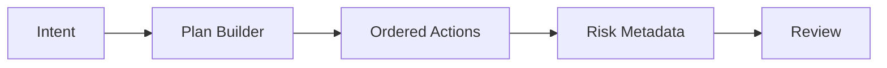

# OmniSense AI — Phase 9 — Action Planning

**Status:** Planned  
**Development model:** Incremental, test-driven, phase-based

## 1. Objective

Convert approved user intent into explicit, structured action plans before execution exists.

## 2. Scope

This phase is intentionally limited to its defined capability. Existing modules should be preserved unless a documented dependency requires a change.

## 3. Architecture

### Architecture / Flow

> GitHub renders Mermaid diagrams directly, so these diagrams stay version-controlled with the documentation.

## 4. Inputs

- Outputs of completed prerequisite phases
- Explicit configuration required by this phase
- User-approved inputs where applicable

## 5. Outputs

- A stable, structured capability for the next phase
- Testable interfaces
- Diagnostics and controlled error states
- Updated documentation when architecture changes

## 6. Security / Boundary

Planning is not execution; ambiguous destructive intent must not be assumed.

## 7. Implementation checklist

- [ ] Confirm prerequisite phase is stable
- [ ] Review relevant project documentation
- [ ] Define interfaces and data contracts
- [ ] Implement only phase scope
- [ ] Add unit tests
- [ ] Add integration tests where applicable
- [ ] Add negative/failure tests
- [ ] Validate resource cleanup
- [ ] Review security implications
- [ ] Update documentation

## 8. Acceptance criteria

Plans are deterministic, inspectable, validated and scoped.

- [ ] Implementation verified
- [ ] Tests pass
- [ ] Error handling verified
- [ ] No unrelated scope added
- [ ] Documentation updated

## 9. Failure handling

The system must fail safely. Invalid inputs, unavailable dependencies, malformed model output, authorization failures and resource failures must produce controlled errors rather than bypassing a boundary.

## 10. Dependencies

This phase depends only on capabilities explicitly established by preceding phases. Any new dependency must be justified for necessity, security, maintenance, license, performance and compatibility.

## 11. Testing strategy

Test the normal path, invalid inputs, dependency failures, boundary conditions and regression behavior. Security-sensitive phases additionally require negative testing and fail-closed behavior.

## 12. Definition of Done

A feature is not complete merely because it runs once. It is complete only when implementation, tests, security review where applicable, documentation and acceptance criteria are satisfied.

---
**Next phase:** Continue only after this phase's acceptance criteria are verified.
