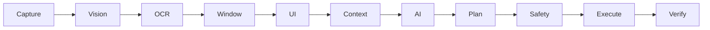
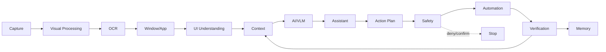

# OmniSense AI — Phase 17 — Full System Integration

**Status:** Planned  
**Development model:** Incremental, test-driven, phase-based

## 1. Objective

Connect the complete perception-to-assistance pipeline while preserving module boundaries.

## 2. Scope

This phase is intentionally limited to its defined capability. Existing modules should be preserved unless a documented dependency requires a change.

## 3. Architecture

### Architecture / Flow

> GitHub renders Mermaid diagrams directly, so these diagrams stay version-controlled with the documentation.

## 4. Inputs

- Outputs of completed prerequisite phases
- Explicit configuration required by this phase
- User-approved inputs where applicable

## 5. Outputs

- A stable, structured capability for the next phase
- Testable interfaces
- Diagnostics and controlled error states
- Updated documentation when architecture changes

## 6. Security / Boundary

Integration must not collapse security and reasoning into one uncontrolled layer.

## 7. Implementation checklist

- [ ] Confirm prerequisite phase is stable
- [ ] Review relevant project documentation
- [ ] Define interfaces and data contracts
- [ ] Implement only phase scope
- [ ] Add unit tests
- [ ] Add integration tests where applicable
- [ ] Add negative/failure tests
- [ ] Validate resource cleanup
- [ ] Review security implications
- [ ] Update documentation

## 8. Acceptance criteria

Full pipeline works with observability, failure isolation and safe shutdown.

- [ ] Implementation verified
- [ ] Tests pass
- [ ] Error handling verified
- [ ] No unrelated scope added
- [ ] Documentation updated

## 9. Failure handling

The system must fail safely. Invalid inputs, unavailable dependencies, malformed model output, authorization failures and resource failures must produce controlled errors rather than bypassing a boundary.

## 10. Dependencies

This phase depends only on capabilities explicitly established by preceding phases. Any new dependency must be justified for necessity, security, maintenance, license, performance and compatibility.

## 11. Testing strategy

Test the normal path, invalid inputs, dependency failures, boundary conditions and regression behavior. Security-sensitive phases additionally require negative testing and fail-closed behavior.

## 12. Definition of Done

A feature is not complete merely because it runs once. It is complete only when implementation, tests, security review where applicable, documentation and acceptance criteria are satisfied.

---
**Next phase:** Continue only after this phase's acceptance criteria are verified.

## Detailed Engineering Expansion

**Primary objective:** Connect the complete pipeline from capture through perception, context, reasoning, planning, safety, execution, verification and memory while preserving every trust boundary and lifecycle contract.

### Integration requirements

- **INT-REQ-001:** Integration requirement 1 MUST have an explicit input contract, output contract, owner, validation point, error behavior, telemetry, security review and automated verification. It MUST NOT create an undocumented shortcut between phases.
- **INT-REQ-002:** Integration requirement 2 MUST have an explicit input contract, output contract, owner, validation point, error behavior, telemetry, security review and automated verification. It MUST NOT create an undocumented shortcut between phases.
- **INT-REQ-003:** Integration requirement 3 MUST have an explicit input contract, output contract, owner, validation point, error behavior, telemetry, security review and automated verification. It MUST NOT create an undocumented shortcut between phases.
- **INT-REQ-004:** Integration requirement 4 MUST have an explicit input contract, output contract, owner, validation point, error behavior, telemetry, security review and automated verification. It MUST NOT create an undocumented shortcut between phases.
- **INT-REQ-005:** Integration requirement 5 MUST have an explicit input contract, output contract, owner, validation point, error behavior, telemetry, security review and automated verification. It MUST NOT create an undocumented shortcut between phases.
- **INT-REQ-006:** Integration requirement 6 MUST have an explicit input contract, output contract, owner, validation point, error behavior, telemetry, security review and automated verification. It MUST NOT create an undocumented shortcut between phases.
- **INT-REQ-007:** Integration requirement 7 MUST have an explicit input contract, output contract, owner, validation point, error behavior, telemetry, security review and automated verification. It MUST NOT create an undocumented shortcut between phases.
- **INT-REQ-008:** Integration requirement 8 MUST have an explicit input contract, output contract, owner, validation point, error behavior, telemetry, security review and automated verification. It MUST NOT create an undocumented shortcut between phases.
- **INT-REQ-009:** Integration requirement 9 MUST have an explicit input contract, output contract, owner, validation point, error behavior, telemetry, security review and automated verification. It MUST NOT create an undocumented shortcut between phases.
- **INT-REQ-010:** Integration requirement 10 MUST have an explicit input contract, output contract, owner, validation point, error behavior, telemetry, security review and automated verification. It MUST NOT create an undocumented shortcut between phases.
- **INT-REQ-011:** Integration requirement 11 MUST have an explicit input contract, output contract, owner, validation point, error behavior, telemetry, security review and automated verification. It MUST NOT create an undocumented shortcut between phases.
- **INT-REQ-012:** Integration requirement 12 MUST have an explicit input contract, output contract, owner, validation point, error behavior, telemetry, security review and automated verification. It MUST NOT create an undocumented shortcut between phases.
- **INT-REQ-013:** Integration requirement 13 MUST have an explicit input contract, output contract, owner, validation point, error behavior, telemetry, security review and automated verification. It MUST NOT create an undocumented shortcut between phases.
- **INT-REQ-014:** Integration requirement 14 MUST have an explicit input contract, output contract, owner, validation point, error behavior, telemetry, security review and automated verification. It MUST NOT create an undocumented shortcut between phases.
- **INT-REQ-015:** Integration requirement 15 MUST have an explicit input contract, output contract, owner, validation point, error behavior, telemetry, security review and automated verification. It MUST NOT create an undocumented shortcut between phases.
- **INT-REQ-016:** Integration requirement 16 MUST have an explicit input contract, output contract, owner, validation point, error behavior, telemetry, security review and automated verification. It MUST NOT create an undocumented shortcut between phases.
- **INT-REQ-017:** Integration requirement 17 MUST have an explicit input contract, output contract, owner, validation point, error behavior, telemetry, security review and automated verification. It MUST NOT create an undocumented shortcut between phases.
- **INT-REQ-018:** Integration requirement 18 MUST have an explicit input contract, output contract, owner, validation point, error behavior, telemetry, security review and automated verification. It MUST NOT create an undocumented shortcut between phases.
- **INT-REQ-019:** Integration requirement 19 MUST have an explicit input contract, output contract, owner, validation point, error behavior, telemetry, security review and automated verification. It MUST NOT create an undocumented shortcut between phases.
- **INT-REQ-020:** Integration requirement 20 MUST have an explicit input contract, output contract, owner, validation point, error behavior, telemetry, security review and automated verification. It MUST NOT create an undocumented shortcut between phases.
- **INT-REQ-021:** Integration requirement 21 MUST have an explicit input contract, output contract, owner, validation point, error behavior, telemetry, security review and automated verification. It MUST NOT create an undocumented shortcut between phases.
- **INT-REQ-022:** Integration requirement 22 MUST have an explicit input contract, output contract, owner, validation point, error behavior, telemetry, security review and automated verification. It MUST NOT create an undocumented shortcut between phases.
- **INT-REQ-023:** Integration requirement 23 MUST have an explicit input contract, output contract, owner, validation point, error behavior, telemetry, security review and automated verification. It MUST NOT create an undocumented shortcut between phases.
- **INT-REQ-024:** Integration requirement 24 MUST have an explicit input contract, output contract, owner, validation point, error behavior, telemetry, security review and automated verification. It MUST NOT create an undocumented shortcut between phases.
- **INT-REQ-025:** Integration requirement 25 MUST have an explicit input contract, output contract, owner, validation point, error behavior, telemetry, security review and automated verification. It MUST NOT create an undocumented shortcut between phases.
- **INT-REQ-026:** Integration requirement 26 MUST have an explicit input contract, output contract, owner, validation point, error behavior, telemetry, security review and automated verification. It MUST NOT create an undocumented shortcut between phases.
- **INT-REQ-027:** Integration requirement 27 MUST have an explicit input contract, output contract, owner, validation point, error behavior, telemetry, security review and automated verification. It MUST NOT create an undocumented shortcut between phases.
- **INT-REQ-028:** Integration requirement 28 MUST have an explicit input contract, output contract, owner, validation point, error behavior, telemetry, security review and automated verification. It MUST NOT create an undocumented shortcut between phases.
- **INT-REQ-029:** Integration requirement 29 MUST have an explicit input contract, output contract, owner, validation point, error behavior, telemetry, security review and automated verification. It MUST NOT create an undocumented shortcut between phases.
- **INT-REQ-030:** Integration requirement 30 MUST have an explicit input contract, output contract, owner, validation point, error behavior, telemetry, security review and automated verification. It MUST NOT create an undocumented shortcut between phases.
- **INT-REQ-031:** Integration requirement 31 MUST have an explicit input contract, output contract, owner, validation point, error behavior, telemetry, security review and automated verification. It MUST NOT create an undocumented shortcut between phases.
- **INT-REQ-032:** Integration requirement 32 MUST have an explicit input contract, output contract, owner, validation point, error behavior, telemetry, security review and automated verification. It MUST NOT create an undocumented shortcut between phases.
- **INT-REQ-033:** Integration requirement 33 MUST have an explicit input contract, output contract, owner, validation point, error behavior, telemetry, security review and automated verification. It MUST NOT create an undocumented shortcut between phases.
- **INT-REQ-034:** Integration requirement 34 MUST have an explicit input contract, output contract, owner, validation point, error behavior, telemetry, security review and automated verification. It MUST NOT create an undocumented shortcut between phases.
- **INT-REQ-035:** Integration requirement 35 MUST have an explicit input contract, output contract, owner, validation point, error behavior, telemetry, security review and automated verification. It MUST NOT create an undocumented shortcut between phases.
- **INT-REQ-036:** Integration requirement 36 MUST have an explicit input contract, output contract, owner, validation point, error behavior, telemetry, security review and automated verification. It MUST NOT create an undocumented shortcut between phases.
- **INT-REQ-037:** Integration requirement 37 MUST have an explicit input contract, output contract, owner, validation point, error behavior, telemetry, security review and automated verification. It MUST NOT create an undocumented shortcut between phases.
- **INT-REQ-038:** Integration requirement 38 MUST have an explicit input contract, output contract, owner, validation point, error behavior, telemetry, security review and automated verification. It MUST NOT create an undocumented shortcut between phases.
- **INT-REQ-039:** Integration requirement 39 MUST have an explicit input contract, output contract, owner, validation point, error behavior, telemetry, security review and automated verification. It MUST NOT create an undocumented shortcut between phases.
- **INT-REQ-040:** Integration requirement 40 MUST have an explicit input contract, output contract, owner, validation point, error behavior, telemetry, security review and automated verification. It MUST NOT create an undocumented shortcut between phases.
- **INT-REQ-041:** Integration requirement 41 MUST have an explicit input contract, output contract, owner, validation point, error behavior, telemetry, security review and automated verification. It MUST NOT create an undocumented shortcut between phases.
- **INT-REQ-042:** Integration requirement 42 MUST have an explicit input contract, output contract, owner, validation point, error behavior, telemetry, security review and automated verification. It MUST NOT create an undocumented shortcut between phases.
- **INT-REQ-043:** Integration requirement 43 MUST have an explicit input contract, output contract, owner, validation point, error behavior, telemetry, security review and automated verification. It MUST NOT create an undocumented shortcut between phases.
- **INT-REQ-044:** Integration requirement 44 MUST have an explicit input contract, output contract, owner, validation point, error behavior, telemetry, security review and automated verification. It MUST NOT create an undocumented shortcut between phases.
- **INT-REQ-045:** Integration requirement 45 MUST have an explicit input contract, output contract, owner, validation point, error behavior, telemetry, security review and automated verification. It MUST NOT create an undocumented shortcut between phases.
- **INT-REQ-046:** Integration requirement 46 MUST have an explicit input contract, output contract, owner, validation point, error behavior, telemetry, security review and automated verification. It MUST NOT create an undocumented shortcut between phases.
- **INT-REQ-047:** Integration requirement 47 MUST have an explicit input contract, output contract, owner, validation point, error behavior, telemetry, security review and automated verification. It MUST NOT create an undocumented shortcut between phases.
- **INT-REQ-048:** Integration requirement 48 MUST have an explicit input contract, output contract, owner, validation point, error behavior, telemetry, security review and automated verification. It MUST NOT create an undocumented shortcut between phases.
- **INT-REQ-049:** Integration requirement 49 MUST have an explicit input contract, output contract, owner, validation point, error behavior, telemetry, security review and automated verification. It MUST NOT create an undocumented shortcut between phases.
- **INT-REQ-050:** Integration requirement 50 MUST have an explicit input contract, output contract, owner, validation point, error behavior, telemetry, security review and automated verification. It MUST NOT create an undocumented shortcut between phases.
- **INT-REQ-051:** Integration requirement 51 MUST have an explicit input contract, output contract, owner, validation point, error behavior, telemetry, security review and automated verification. It MUST NOT create an undocumented shortcut between phases.
- **INT-REQ-052:** Integration requirement 52 MUST have an explicit input contract, output contract, owner, validation point, error behavior, telemetry, security review and automated verification. It MUST NOT create an undocumented shortcut between phases.
- **INT-REQ-053:** Integration requirement 53 MUST have an explicit input contract, output contract, owner, validation point, error behavior, telemetry, security review and automated verification. It MUST NOT create an undocumented shortcut between phases.
- **INT-REQ-054:** Integration requirement 54 MUST have an explicit input contract, output contract, owner, validation point, error behavior, telemetry, security review and automated verification. It MUST NOT create an undocumented shortcut between phases.
- **INT-REQ-055:** Integration requirement 55 MUST have an explicit input contract, output contract, owner, validation point, error behavior, telemetry, security review and automated verification. It MUST NOT create an undocumented shortcut between phases.
- **INT-REQ-056:** Integration requirement 56 MUST have an explicit input contract, output contract, owner, validation point, error behavior, telemetry, security review and automated verification. It MUST NOT create an undocumented shortcut between phases.
- **INT-REQ-057:** Integration requirement 57 MUST have an explicit input contract, output contract, owner, validation point, error behavior, telemetry, security review and automated verification. It MUST NOT create an undocumented shortcut between phases.
- **INT-REQ-058:** Integration requirement 58 MUST have an explicit input contract, output contract, owner, validation point, error behavior, telemetry, security review and automated verification. It MUST NOT create an undocumented shortcut between phases.
- **INT-REQ-059:** Integration requirement 59 MUST have an explicit input contract, output contract, owner, validation point, error behavior, telemetry, security review and automated verification. It MUST NOT create an undocumented shortcut between phases.
- **INT-REQ-060:** Integration requirement 60 MUST have an explicit input contract, output contract, owner, validation point, error behavior, telemetry, security review and automated verification. It MUST NOT create an undocumented shortcut between phases.
- **INT-REQ-061:** Integration requirement 61 MUST have an explicit input contract, output contract, owner, validation point, error behavior, telemetry, security review and automated verification. It MUST NOT create an undocumented shortcut between phases.
- **INT-REQ-062:** Integration requirement 62 MUST have an explicit input contract, output contract, owner, validation point, error behavior, telemetry, security review and automated verification. It MUST NOT create an undocumented shortcut between phases.
- **INT-REQ-063:** Integration requirement 63 MUST have an explicit input contract, output contract, owner, validation point, error behavior, telemetry, security review and automated verification. It MUST NOT create an undocumented shortcut between phases.
- **INT-REQ-064:** Integration requirement 64 MUST have an explicit input contract, output contract, owner, validation point, error behavior, telemetry, security review and automated verification. It MUST NOT create an undocumented shortcut between phases.
- **INT-REQ-065:** Integration requirement 65 MUST have an explicit input contract, output contract, owner, validation point, error behavior, telemetry, security review and automated verification. It MUST NOT create an undocumented shortcut between phases.
- **INT-REQ-066:** Integration requirement 66 MUST have an explicit input contract, output contract, owner, validation point, error behavior, telemetry, security review and automated verification. It MUST NOT create an undocumented shortcut between phases.
- **INT-REQ-067:** Integration requirement 67 MUST have an explicit input contract, output contract, owner, validation point, error behavior, telemetry, security review and automated verification. It MUST NOT create an undocumented shortcut between phases.
- **INT-REQ-068:** Integration requirement 68 MUST have an explicit input contract, output contract, owner, validation point, error behavior, telemetry, security review and automated verification. It MUST NOT create an undocumented shortcut between phases.
- **INT-REQ-069:** Integration requirement 69 MUST have an explicit input contract, output contract, owner, validation point, error behavior, telemetry, security review and automated verification. It MUST NOT create an undocumented shortcut between phases.
- **INT-REQ-070:** Integration requirement 70 MUST have an explicit input contract, output contract, owner, validation point, error behavior, telemetry, security review and automated verification. It MUST NOT create an undocumented shortcut between phases.
- **INT-REQ-071:** Integration requirement 71 MUST have an explicit input contract, output contract, owner, validation point, error behavior, telemetry, security review and automated verification. It MUST NOT create an undocumented shortcut between phases.
- **INT-REQ-072:** Integration requirement 72 MUST have an explicit input contract, output contract, owner, validation point, error behavior, telemetry, security review and automated verification. It MUST NOT create an undocumented shortcut between phases.
- **INT-REQ-073:** Integration requirement 73 MUST have an explicit input contract, output contract, owner, validation point, error behavior, telemetry, security review and automated verification. It MUST NOT create an undocumented shortcut between phases.
- **INT-REQ-074:** Integration requirement 74 MUST have an explicit input contract, output contract, owner, validation point, error behavior, telemetry, security review and automated verification. It MUST NOT create an undocumented shortcut between phases.
- **INT-REQ-075:** Integration requirement 75 MUST have an explicit input contract, output contract, owner, validation point, error behavior, telemetry, security review and automated verification. It MUST NOT create an undocumented shortcut between phases.
- **INT-REQ-076:** Integration requirement 76 MUST have an explicit input contract, output contract, owner, validation point, error behavior, telemetry, security review and automated verification. It MUST NOT create an undocumented shortcut between phases.
- **INT-REQ-077:** Integration requirement 77 MUST have an explicit input contract, output contract, owner, validation point, error behavior, telemetry, security review and automated verification. It MUST NOT create an undocumented shortcut between phases.
- **INT-REQ-078:** Integration requirement 78 MUST have an explicit input contract, output contract, owner, validation point, error behavior, telemetry, security review and automated verification. It MUST NOT create an undocumented shortcut between phases.
- **INT-REQ-079:** Integration requirement 79 MUST have an explicit input contract, output contract, owner, validation point, error behavior, telemetry, security review and automated verification. It MUST NOT create an undocumented shortcut between phases.
- **INT-REQ-080:** Integration requirement 80 MUST have an explicit input contract, output contract, owner, validation point, error behavior, telemetry, security review and automated verification. It MUST NOT create an undocumented shortcut between phases.
- **INT-REQ-081:** Integration requirement 81 MUST have an explicit input contract, output contract, owner, validation point, error behavior, telemetry, security review and automated verification. It MUST NOT create an undocumented shortcut between phases.
- **INT-REQ-082:** Integration requirement 82 MUST have an explicit input contract, output contract, owner, validation point, error behavior, telemetry, security review and automated verification. It MUST NOT create an undocumented shortcut between phases.
- **INT-REQ-083:** Integration requirement 83 MUST have an explicit input contract, output contract, owner, validation point, error behavior, telemetry, security review and automated verification. It MUST NOT create an undocumented shortcut between phases.
- **INT-REQ-084:** Integration requirement 84 MUST have an explicit input contract, output contract, owner, validation point, error behavior, telemetry, security review and automated verification. It MUST NOT create an undocumented shortcut between phases.
- **INT-REQ-085:** Integration requirement 85 MUST have an explicit input contract, output contract, owner, validation point, error behavior, telemetry, security review and automated verification. It MUST NOT create an undocumented shortcut between phases.
- **INT-REQ-086:** Integration requirement 86 MUST have an explicit input contract, output contract, owner, validation point, error behavior, telemetry, security review and automated verification. It MUST NOT create an undocumented shortcut between phases.
- **INT-REQ-087:** Integration requirement 87 MUST have an explicit input contract, output contract, owner, validation point, error behavior, telemetry, security review and automated verification. It MUST NOT create an undocumented shortcut between phases.
- **INT-REQ-088:** Integration requirement 88 MUST have an explicit input contract, output contract, owner, validation point, error behavior, telemetry, security review and automated verification. It MUST NOT create an undocumented shortcut between phases.
- **INT-REQ-089:** Integration requirement 89 MUST have an explicit input contract, output contract, owner, validation point, error behavior, telemetry, security review and automated verification. It MUST NOT create an undocumented shortcut between phases.
- **INT-REQ-090:** Integration requirement 90 MUST have an explicit input contract, output contract, owner, validation point, error behavior, telemetry, security review and automated verification. It MUST NOT create an undocumented shortcut between phases.
- **INT-REQ-091:** Integration requirement 91 MUST have an explicit input contract, output contract, owner, validation point, error behavior, telemetry, security review and automated verification. It MUST NOT create an undocumented shortcut between phases.
- **INT-REQ-092:** Integration requirement 92 MUST have an explicit input contract, output contract, owner, validation point, error behavior, telemetry, security review and automated verification. It MUST NOT create an undocumented shortcut between phases.
- **INT-REQ-093:** Integration requirement 93 MUST have an explicit input contract, output contract, owner, validation point, error behavior, telemetry, security review and automated verification. It MUST NOT create an undocumented shortcut between phases.
- **INT-REQ-094:** Integration requirement 94 MUST have an explicit input contract, output contract, owner, validation point, error behavior, telemetry, security review and automated verification. It MUST NOT create an undocumented shortcut between phases.
- **INT-REQ-095:** Integration requirement 95 MUST have an explicit input contract, output contract, owner, validation point, error behavior, telemetry, security review and automated verification. It MUST NOT create an undocumented shortcut between phases.
- **INT-REQ-096:** Integration requirement 96 MUST have an explicit input contract, output contract, owner, validation point, error behavior, telemetry, security review and automated verification. It MUST NOT create an undocumented shortcut between phases.
- **INT-REQ-097:** Integration requirement 97 MUST have an explicit input contract, output contract, owner, validation point, error behavior, telemetry, security review and automated verification. It MUST NOT create an undocumented shortcut between phases.
- **INT-REQ-098:** Integration requirement 98 MUST have an explicit input contract, output contract, owner, validation point, error behavior, telemetry, security review and automated verification. It MUST NOT create an undocumented shortcut between phases.
- **INT-REQ-099:** Integration requirement 99 MUST have an explicit input contract, output contract, owner, validation point, error behavior, telemetry, security review and automated verification. It MUST NOT create an undocumented shortcut between phases.
- **INT-REQ-100:** Integration requirement 100 MUST have an explicit input contract, output contract, owner, validation point, error behavior, telemetry, security review and automated verification. It MUST NOT create an undocumented shortcut between phases.
- **INT-REQ-101:** Integration requirement 101 MUST have an explicit input contract, output contract, owner, validation point, error behavior, telemetry, security review and automated verification. It MUST NOT create an undocumented shortcut between phases.
- **INT-REQ-102:** Integration requirement 102 MUST have an explicit input contract, output contract, owner, validation point, error behavior, telemetry, security review and automated verification. It MUST NOT create an undocumented shortcut between phases.
- **INT-REQ-103:** Integration requirement 103 MUST have an explicit input contract, output contract, owner, validation point, error behavior, telemetry, security review and automated verification. It MUST NOT create an undocumented shortcut between phases.
- **INT-REQ-104:** Integration requirement 104 MUST have an explicit input contract, output contract, owner, validation point, error behavior, telemetry, security review and automated verification. It MUST NOT create an undocumented shortcut between phases.
- **INT-REQ-105:** Integration requirement 105 MUST have an explicit input contract, output contract, owner, validation point, error behavior, telemetry, security review and automated verification. It MUST NOT create an undocumented shortcut between phases.
- **INT-REQ-106:** Integration requirement 106 MUST have an explicit input contract, output contract, owner, validation point, error behavior, telemetry, security review and automated verification. It MUST NOT create an undocumented shortcut between phases.
- **INT-REQ-107:** Integration requirement 107 MUST have an explicit input contract, output contract, owner, validation point, error behavior, telemetry, security review and automated verification. It MUST NOT create an undocumented shortcut between phases.
- **INT-REQ-108:** Integration requirement 108 MUST have an explicit input contract, output contract, owner, validation point, error behavior, telemetry, security review and automated verification. It MUST NOT create an undocumented shortcut between phases.
- **INT-REQ-109:** Integration requirement 109 MUST have an explicit input contract, output contract, owner, validation point, error behavior, telemetry, security review and automated verification. It MUST NOT create an undocumented shortcut between phases.
- **INT-REQ-110:** Integration requirement 110 MUST have an explicit input contract, output contract, owner, validation point, error behavior, telemetry, security review and automated verification. It MUST NOT create an undocumented shortcut between phases.
- **INT-REQ-111:** Integration requirement 111 MUST have an explicit input contract, output contract, owner, validation point, error behavior, telemetry, security review and automated verification. It MUST NOT create an undocumented shortcut between phases.
- **INT-REQ-112:** Integration requirement 112 MUST have an explicit input contract, output contract, owner, validation point, error behavior, telemetry, security review and automated verification. It MUST NOT create an undocumented shortcut between phases.
- **INT-REQ-113:** Integration requirement 113 MUST have an explicit input contract, output contract, owner, validation point, error behavior, telemetry, security review and automated verification. It MUST NOT create an undocumented shortcut between phases.
- **INT-REQ-114:** Integration requirement 114 MUST have an explicit input contract, output contract, owner, validation point, error behavior, telemetry, security review and automated verification. It MUST NOT create an undocumented shortcut between phases.
- **INT-REQ-115:** Integration requirement 115 MUST have an explicit input contract, output contract, owner, validation point, error behavior, telemetry, security review and automated verification. It MUST NOT create an undocumented shortcut between phases.
- **INT-REQ-116:** Integration requirement 116 MUST have an explicit input contract, output contract, owner, validation point, error behavior, telemetry, security review and automated verification. It MUST NOT create an undocumented shortcut between phases.
- **INT-REQ-117:** Integration requirement 117 MUST have an explicit input contract, output contract, owner, validation point, error behavior, telemetry, security review and automated verification. It MUST NOT create an undocumented shortcut between phases.
- **INT-REQ-118:** Integration requirement 118 MUST have an explicit input contract, output contract, owner, validation point, error behavior, telemetry, security review and automated verification. It MUST NOT create an undocumented shortcut between phases.
- **INT-REQ-119:** Integration requirement 119 MUST have an explicit input contract, output contract, owner, validation point, error behavior, telemetry, security review and automated verification. It MUST NOT create an undocumented shortcut between phases.
- **INT-REQ-120:** Integration requirement 120 MUST have an explicit input contract, output contract, owner, validation point, error behavior, telemetry, security review and automated verification. It MUST NOT create an undocumented shortcut between phases.
- **INT-REQ-121:** Integration requirement 121 MUST have an explicit input contract, output contract, owner, validation point, error behavior, telemetry, security review and automated verification. It MUST NOT create an undocumented shortcut between phases.
- **INT-REQ-122:** Integration requirement 122 MUST have an explicit input contract, output contract, owner, validation point, error behavior, telemetry, security review and automated verification. It MUST NOT create an undocumented shortcut between phases.
- **INT-REQ-123:** Integration requirement 123 MUST have an explicit input contract, output contract, owner, validation point, error behavior, telemetry, security review and automated verification. It MUST NOT create an undocumented shortcut between phases.
- **INT-REQ-124:** Integration requirement 124 MUST have an explicit input contract, output contract, owner, validation point, error behavior, telemetry, security review and automated verification. It MUST NOT create an undocumented shortcut between phases.
- **INT-REQ-125:** Integration requirement 125 MUST have an explicit input contract, output contract, owner, validation point, error behavior, telemetry, security review and automated verification. It MUST NOT create an undocumented shortcut between phases.
- **INT-REQ-126:** Integration requirement 126 MUST have an explicit input contract, output contract, owner, validation point, error behavior, telemetry, security review and automated verification. It MUST NOT create an undocumented shortcut between phases.
- **INT-REQ-127:** Integration requirement 127 MUST have an explicit input contract, output contract, owner, validation point, error behavior, telemetry, security review and automated verification. It MUST NOT create an undocumented shortcut between phases.
- **INT-REQ-128:** Integration requirement 128 MUST have an explicit input contract, output contract, owner, validation point, error behavior, telemetry, security review and automated verification. It MUST NOT create an undocumented shortcut between phases.
- **INT-REQ-129:** Integration requirement 129 MUST have an explicit input contract, output contract, owner, validation point, error behavior, telemetry, security review and automated verification. It MUST NOT create an undocumented shortcut between phases.
- **INT-REQ-130:** Integration requirement 130 MUST have an explicit input contract, output contract, owner, validation point, error behavior, telemetry, security review and automated verification. It MUST NOT create an undocumented shortcut between phases.
- **INT-REQ-131:** Integration requirement 131 MUST have an explicit input contract, output contract, owner, validation point, error behavior, telemetry, security review and automated verification. It MUST NOT create an undocumented shortcut between phases.
- **INT-REQ-132:** Integration requirement 132 MUST have an explicit input contract, output contract, owner, validation point, error behavior, telemetry, security review and automated verification. It MUST NOT create an undocumented shortcut between phases.
- **INT-REQ-133:** Integration requirement 133 MUST have an explicit input contract, output contract, owner, validation point, error behavior, telemetry, security review and automated verification. It MUST NOT create an undocumented shortcut between phases.
- **INT-REQ-134:** Integration requirement 134 MUST have an explicit input contract, output contract, owner, validation point, error behavior, telemetry, security review and automated verification. It MUST NOT create an undocumented shortcut between phases.
- **INT-REQ-135:** Integration requirement 135 MUST have an explicit input contract, output contract, owner, validation point, error behavior, telemetry, security review and automated verification. It MUST NOT create an undocumented shortcut between phases.
- **INT-REQ-136:** Integration requirement 136 MUST have an explicit input contract, output contract, owner, validation point, error behavior, telemetry, security review and automated verification. It MUST NOT create an undocumented shortcut between phases.
- **INT-REQ-137:** Integration requirement 137 MUST have an explicit input contract, output contract, owner, validation point, error behavior, telemetry, security review and automated verification. It MUST NOT create an undocumented shortcut between phases.
- **INT-REQ-138:** Integration requirement 138 MUST have an explicit input contract, output contract, owner, validation point, error behavior, telemetry, security review and automated verification. It MUST NOT create an undocumented shortcut between phases.
- **INT-REQ-139:** Integration requirement 139 MUST have an explicit input contract, output contract, owner, validation point, error behavior, telemetry, security review and automated verification. It MUST NOT create an undocumented shortcut between phases.
- **INT-REQ-140:** Integration requirement 140 MUST have an explicit input contract, output contract, owner, validation point, error behavior, telemetry, security review and automated verification. It MUST NOT create an undocumented shortcut between phases.
- **INT-REQ-141:** Integration requirement 141 MUST have an explicit input contract, output contract, owner, validation point, error behavior, telemetry, security review and automated verification. It MUST NOT create an undocumented shortcut between phases.
- **INT-REQ-142:** Integration requirement 142 MUST have an explicit input contract, output contract, owner, validation point, error behavior, telemetry, security review and automated verification. It MUST NOT create an undocumented shortcut between phases.
- **INT-REQ-143:** Integration requirement 143 MUST have an explicit input contract, output contract, owner, validation point, error behavior, telemetry, security review and automated verification. It MUST NOT create an undocumented shortcut between phases.
- **INT-REQ-144:** Integration requirement 144 MUST have an explicit input contract, output contract, owner, validation point, error behavior, telemetry, security review and automated verification. It MUST NOT create an undocumented shortcut between phases.
- **INT-REQ-145:** Integration requirement 145 MUST have an explicit input contract, output contract, owner, validation point, error behavior, telemetry, security review and automated verification. It MUST NOT create an undocumented shortcut between phases.
- **INT-REQ-146:** Integration requirement 146 MUST have an explicit input contract, output contract, owner, validation point, error behavior, telemetry, security review and automated verification. It MUST NOT create an undocumented shortcut between phases.
- **INT-REQ-147:** Integration requirement 147 MUST have an explicit input contract, output contract, owner, validation point, error behavior, telemetry, security review and automated verification. It MUST NOT create an undocumented shortcut between phases.
- **INT-REQ-148:** Integration requirement 148 MUST have an explicit input contract, output contract, owner, validation point, error behavior, telemetry, security review and automated verification. It MUST NOT create an undocumented shortcut between phases.
- **INT-REQ-149:** Integration requirement 149 MUST have an explicit input contract, output contract, owner, validation point, error behavior, telemetry, security review and automated verification. It MUST NOT create an undocumented shortcut between phases.
- **INT-REQ-150:** Integration requirement 150 MUST have an explicit input contract, output contract, owner, validation point, error behavior, telemetry, security review and automated verification. It MUST NOT create an undocumented shortcut between phases.
- **INT-REQ-151:** Integration requirement 151 MUST have an explicit input contract, output contract, owner, validation point, error behavior, telemetry, security review and automated verification. It MUST NOT create an undocumented shortcut between phases.
- **INT-REQ-152:** Integration requirement 152 MUST have an explicit input contract, output contract, owner, validation point, error behavior, telemetry, security review and automated verification. It MUST NOT create an undocumented shortcut between phases.
- **INT-REQ-153:** Integration requirement 153 MUST have an explicit input contract, output contract, owner, validation point, error behavior, telemetry, security review and automated verification. It MUST NOT create an undocumented shortcut between phases.
- **INT-REQ-154:** Integration requirement 154 MUST have an explicit input contract, output contract, owner, validation point, error behavior, telemetry, security review and automated verification. It MUST NOT create an undocumented shortcut between phases.
- **INT-REQ-155:** Integration requirement 155 MUST have an explicit input contract, output contract, owner, validation point, error behavior, telemetry, security review and automated verification. It MUST NOT create an undocumented shortcut between phases.
- **INT-REQ-156:** Integration requirement 156 MUST have an explicit input contract, output contract, owner, validation point, error behavior, telemetry, security review and automated verification. It MUST NOT create an undocumented shortcut between phases.
- **INT-REQ-157:** Integration requirement 157 MUST have an explicit input contract, output contract, owner, validation point, error behavior, telemetry, security review and automated verification. It MUST NOT create an undocumented shortcut between phases.
- **INT-REQ-158:** Integration requirement 158 MUST have an explicit input contract, output contract, owner, validation point, error behavior, telemetry, security review and automated verification. It MUST NOT create an undocumented shortcut between phases.
- **INT-REQ-159:** Integration requirement 159 MUST have an explicit input contract, output contract, owner, validation point, error behavior, telemetry, security review and automated verification. It MUST NOT create an undocumented shortcut between phases.
- **INT-REQ-160:** Integration requirement 160 MUST have an explicit input contract, output contract, owner, validation point, error behavior, telemetry, security review and automated verification. It MUST NOT create an undocumented shortcut between phases.

### End-to-end flow

### Integration failure matrix

| Boundary | Failure | Required response |
|---|---|---|
| Capture → Vision | invalid frame | reject and preserve previous valid state |
| Vision → OCR | unusable frame | skip OCR and report degraded state |
| OCR → Understanding | malformed text regions | validate schema and isolate bad records |
| Context → AI | stale context | mark stale and request refresh |
| AI → Planning | malformed model output | reject; never execute |
| Planning → Safety | missing risk metadata | deny until classified |
| Safety → Automation | authorization absent | deny/ask user |
| Automation → Verification | ambiguous state | do not claim success |
| Verification → Memory | uncertain outcome | do not persist as confirmed fact |

### Integration questions

- **Question 1:** What contract, lifecycle transition, failure mode, security control, observability evidence and regression test proves this integration boundary is safe?
- **Question 2:** What contract, lifecycle transition, failure mode, security control, observability evidence and regression test proves this integration boundary is safe?
- **Question 3:** What contract, lifecycle transition, failure mode, security control, observability evidence and regression test proves this integration boundary is safe?
- **Question 4:** What contract, lifecycle transition, failure mode, security control, observability evidence and regression test proves this integration boundary is safe?
- **Question 5:** What contract, lifecycle transition, failure mode, security control, observability evidence and regression test proves this integration boundary is safe?
- **Question 6:** What contract, lifecycle transition, failure mode, security control, observability evidence and regression test proves this integration boundary is safe?
- **Question 7:** What contract, lifecycle transition, failure mode, security control, observability evidence and regression test proves this integration boundary is safe?
- **Question 8:** What contract, lifecycle transition, failure mode, security control, observability evidence and regression test proves this integration boundary is safe?
- **Question 9:** What contract, lifecycle transition, failure mode, security control, observability evidence and regression test proves this integration boundary is safe?
- **Question 10:** What contract, lifecycle transition, failure mode, security control, observability evidence and regression test proves this integration boundary is safe?
- **Question 11:** What contract, lifecycle transition, failure mode, security control, observability evidence and regression test proves this integration boundary is safe?
- **Question 12:** What contract, lifecycle transition, failure mode, security control, observability evidence and regression test proves this integration boundary is safe?
- **Question 13:** What contract, lifecycle transition, failure mode, security control, observability evidence and regression test proves this integration boundary is safe?
- **Question 14:** What contract, lifecycle transition, failure mode, security control, observability evidence and regression test proves this integration boundary is safe?
- **Question 15:** What contract, lifecycle transition, failure mode, security control, observability evidence and regression test proves this integration boundary is safe?
- **Question 16:** What contract, lifecycle transition, failure mode, security control, observability evidence and regression test proves this integration boundary is safe?
- **Question 17:** What contract, lifecycle transition, failure mode, security control, observability evidence and regression test proves this integration boundary is safe?
- **Question 18:** What contract, lifecycle transition, failure mode, security control, observability evidence and regression test proves this integration boundary is safe?
- **Question 19:** What contract, lifecycle transition, failure mode, security control, observability evidence and regression test proves this integration boundary is safe?
- **Question 20:** What contract, lifecycle transition, failure mode, security control, observability evidence and regression test proves this integration boundary is safe?
- **Question 21:** What contract, lifecycle transition, failure mode, security control, observability evidence and regression test proves this integration boundary is safe?
- **Question 22:** What contract, lifecycle transition, failure mode, security control, observability evidence and regression test proves this integration boundary is safe?
- **Question 23:** What contract, lifecycle transition, failure mode, security control, observability evidence and regression test proves this integration boundary is safe?
- **Question 24:** What contract, lifecycle transition, failure mode, security control, observability evidence and regression test proves this integration boundary is safe?
- **Question 25:** What contract, lifecycle transition, failure mode, security control, observability evidence and regression test proves this integration boundary is safe?
- **Question 26:** What contract, lifecycle transition, failure mode, security control, observability evidence and regression test proves this integration boundary is safe?
- **Question 27:** What contract, lifecycle transition, failure mode, security control, observability evidence and regression test proves this integration boundary is safe?
- **Question 28:** What contract, lifecycle transition, failure mode, security control, observability evidence and regression test proves this integration boundary is safe?
- **Question 29:** What contract, lifecycle transition, failure mode, security control, observability evidence and regression test proves this integration boundary is safe?
- **Question 30:** What contract, lifecycle transition, failure mode, security control, observability evidence and regression test proves this integration boundary is safe?
- **Question 31:** What contract, lifecycle transition, failure mode, security control, observability evidence and regression test proves this integration boundary is safe?
- **Question 32:** What contract, lifecycle transition, failure mode, security control, observability evidence and regression test proves this integration boundary is safe?
- **Question 33:** What contract, lifecycle transition, failure mode, security control, observability evidence and regression test proves this integration boundary is safe?
- **Question 34:** What contract, lifecycle transition, failure mode, security control, observability evidence and regression test proves this integration boundary is safe?
- **Question 35:** What contract, lifecycle transition, failure mode, security control, observability evidence and regression test proves this integration boundary is safe?
- **Question 36:** What contract, lifecycle transition, failure mode, security control, observability evidence and regression test proves this integration boundary is safe?
- **Question 37:** What contract, lifecycle transition, failure mode, security control, observability evidence and regression test proves this integration boundary is safe?
- **Question 38:** What contract, lifecycle transition, failure mode, security control, observability evidence and regression test proves this integration boundary is safe?
- **Question 39:** What contract, lifecycle transition, failure mode, security control, observability evidence and regression test proves this integration boundary is safe?
- **Question 40:** What contract, lifecycle transition, failure mode, security control, observability evidence and regression test proves this integration boundary is safe?
- **Question 41:** What contract, lifecycle transition, failure mode, security control, observability evidence and regression test proves this integration boundary is safe?
- **Question 42:** What contract, lifecycle transition, failure mode, security control, observability evidence and regression test proves this integration boundary is safe?
- **Question 43:** What contract, lifecycle transition, failure mode, security control, observability evidence and regression test proves this integration boundary is safe?
- **Question 44:** What contract, lifecycle transition, failure mode, security control, observability evidence and regression test proves this integration boundary is safe?
- **Question 45:** What contract, lifecycle transition, failure mode, security control, observability evidence and regression test proves this integration boundary is safe?
- **Question 46:** What contract, lifecycle transition, failure mode, security control, observability evidence and regression test proves this integration boundary is safe?
- **Question 47:** What contract, lifecycle transition, failure mode, security control, observability evidence and regression test proves this integration boundary is safe?
- **Question 48:** What contract, lifecycle transition, failure mode, security control, observability evidence and regression test proves this integration boundary is safe?
- **Question 49:** What contract, lifecycle transition, failure mode, security control, observability evidence and regression test proves this integration boundary is safe?
- **Question 50:** What contract, lifecycle transition, failure mode, security control, observability evidence and regression test proves this integration boundary is safe?
- **Question 51:** What contract, lifecycle transition, failure mode, security control, observability evidence and regression test proves this integration boundary is safe?
- **Question 52:** What contract, lifecycle transition, failure mode, security control, observability evidence and regression test proves this integration boundary is safe?
- **Question 53:** What contract, lifecycle transition, failure mode, security control, observability evidence and regression test proves this integration boundary is safe?
- **Question 54:** What contract, lifecycle transition, failure mode, security control, observability evidence and regression test proves this integration boundary is safe?
- **Question 55:** What contract, lifecycle transition, failure mode, security control, observability evidence and regression test proves this integration boundary is safe?
- **Question 56:** What contract, lifecycle transition, failure mode, security control, observability evidence and regression test proves this integration boundary is safe?
- **Question 57:** What contract, lifecycle transition, failure mode, security control, observability evidence and regression test proves this integration boundary is safe?
- **Question 58:** What contract, lifecycle transition, failure mode, security control, observability evidence and regression test proves this integration boundary is safe?
- **Question 59:** What contract, lifecycle transition, failure mode, security control, observability evidence and regression test proves this integration boundary is safe?
- **Question 60:** What contract, lifecycle transition, failure mode, security control, observability evidence and regression test proves this integration boundary is safe?
- **Question 61:** What contract, lifecycle transition, failure mode, security control, observability evidence and regression test proves this integration boundary is safe?
- **Question 62:** What contract, lifecycle transition, failure mode, security control, observability evidence and regression test proves this integration boundary is safe?
- **Question 63:** What contract, lifecycle transition, failure mode, security control, observability evidence and regression test proves this integration boundary is safe?
- **Question 64:** What contract, lifecycle transition, failure mode, security control, observability evidence and regression test proves this integration boundary is safe?
- **Question 65:** What contract, lifecycle transition, failure mode, security control, observability evidence and regression test proves this integration boundary is safe?
- **Question 66:** What contract, lifecycle transition, failure mode, security control, observability evidence and regression test proves this integration boundary is safe?
- **Question 67:** What contract, lifecycle transition, failure mode, security control, observability evidence and regression test proves this integration boundary is safe?
- **Question 68:** What contract, lifecycle transition, failure mode, security control, observability evidence and regression test proves this integration boundary is safe?
- **Question 69:** What contract, lifecycle transition, failure mode, security control, observability evidence and regression test proves this integration boundary is safe?
- **Question 70:** What contract, lifecycle transition, failure mode, security control, observability evidence and regression test proves this integration boundary is safe?
- **Question 71:** What contract, lifecycle transition, failure mode, security control, observability evidence and regression test proves this integration boundary is safe?
- **Question 72:** What contract, lifecycle transition, failure mode, security control, observability evidence and regression test proves this integration boundary is safe?
- **Question 73:** What contract, lifecycle transition, failure mode, security control, observability evidence and regression test proves this integration boundary is safe?
- **Question 74:** What contract, lifecycle transition, failure mode, security control, observability evidence and regression test proves this integration boundary is safe?
- **Question 75:** What contract, lifecycle transition, failure mode, security control, observability evidence and regression test proves this integration boundary is safe?
- **Question 76:** What contract, lifecycle transition, failure mode, security control, observability evidence and regression test proves this integration boundary is safe?
- **Question 77:** What contract, lifecycle transition, failure mode, security control, observability evidence and regression test proves this integration boundary is safe?
- **Question 78:** What contract, lifecycle transition, failure mode, security control, observability evidence and regression test proves this integration boundary is safe?
- **Question 79:** What contract, lifecycle transition, failure mode, security control, observability evidence and regression test proves this integration boundary is safe?
- **Question 80:** What contract, lifecycle transition, failure mode, security control, observability evidence and regression test proves this integration boundary is safe?
- **Question 81:** What contract, lifecycle transition, failure mode, security control, observability evidence and regression test proves this integration boundary is safe?
- **Question 82:** What contract, lifecycle transition, failure mode, security control, observability evidence and regression test proves this integration boundary is safe?
- **Question 83:** What contract, lifecycle transition, failure mode, security control, observability evidence and regression test proves this integration boundary is safe?
- **Question 84:** What contract, lifecycle transition, failure mode, security control, observability evidence and regression test proves this integration boundary is safe?
- **Question 85:** What contract, lifecycle transition, failure mode, security control, observability evidence and regression test proves this integration boundary is safe?
- **Question 86:** What contract, lifecycle transition, failure mode, security control, observability evidence and regression test proves this integration boundary is safe?
- **Question 87:** What contract, lifecycle transition, failure mode, security control, observability evidence and regression test proves this integration boundary is safe?
- **Question 88:** What contract, lifecycle transition, failure mode, security control, observability evidence and regression test proves this integration boundary is safe?
- **Question 89:** What contract, lifecycle transition, failure mode, security control, observability evidence and regression test proves this integration boundary is safe?
- **Question 90:** What contract, lifecycle transition, failure mode, security control, observability evidence and regression test proves this integration boundary is safe?
- **Question 91:** What contract, lifecycle transition, failure mode, security control, observability evidence and regression test proves this integration boundary is safe?
- **Question 92:** What contract, lifecycle transition, failure mode, security control, observability evidence and regression test proves this integration boundary is safe?
- **Question 93:** What contract, lifecycle transition, failure mode, security control, observability evidence and regression test proves this integration boundary is safe?
- **Question 94:** What contract, lifecycle transition, failure mode, security control, observability evidence and regression test proves this integration boundary is safe?
- **Question 95:** What contract, lifecycle transition, failure mode, security control, observability evidence and regression test proves this integration boundary is safe?
- **Question 96:** What contract, lifecycle transition, failure mode, security control, observability evidence and regression test proves this integration boundary is safe?
- **Question 97:** What contract, lifecycle transition, failure mode, security control, observability evidence and regression test proves this integration boundary is safe?
- **Question 98:** What contract, lifecycle transition, failure mode, security control, observability evidence and regression test proves this integration boundary is safe?
- **Question 99:** What contract, lifecycle transition, failure mode, security control, observability evidence and regression test proves this integration boundary is safe?
- **Question 100:** What contract, lifecycle transition, failure mode, security control, observability evidence and regression test proves this integration boundary is safe?