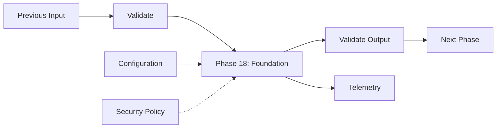
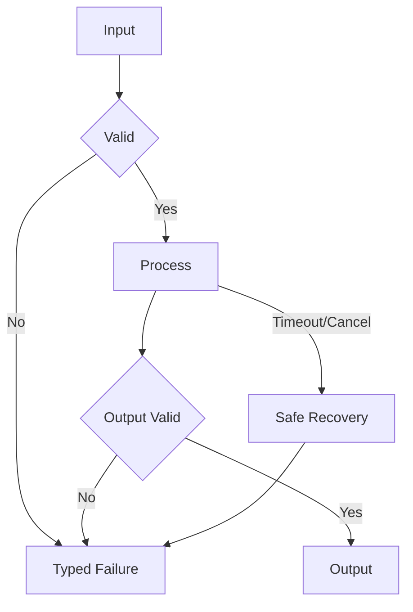
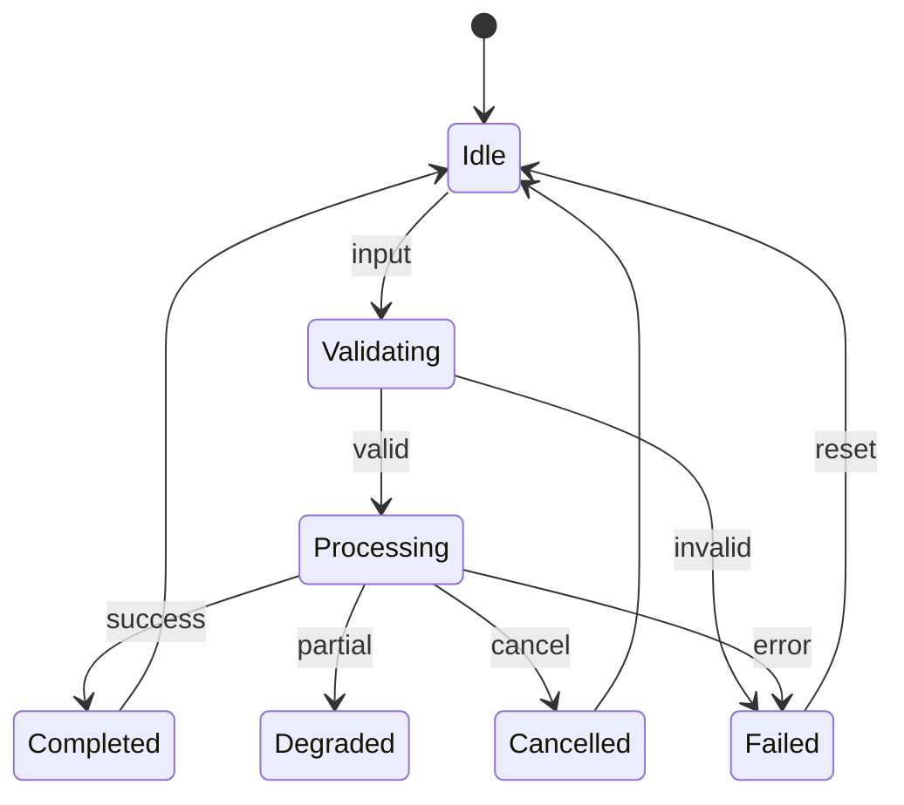
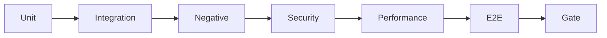
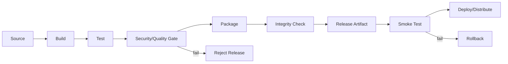

# OmniSense AI — Phase 18 — Packaging & Release

**Detailed Engineering Specification**
**Phase ID:** P00
**Status:** Complete
**Normative terms:** MUST = mandatory; SHOULD = recommended; MAY = optional.
**Principle:** Intelligence without uncontrolled authority.

---

## 1. Executive Summary

Project bootstrap, configuration, dependencies, logging, lifecycle, errors, health, tests and secure defaults.

This document is the implementation contract for Phase 18. It is written for engineers, reviewers, testers and maintainers. It defines scope, architecture, interfaces, data contracts, state, requirements, security, performance, observability, failure behavior, testing, operations and acceptance evidence. Internal implementation may evolve only when the documented external behavior and safety properties remain intact.

## 2. Scope and Boundaries

In scope: phase-specific implementation, contracts, validation, configuration, lifecycle, errors, observability, security, performance, tests and documentation.
Out of scope: undocumented future-phase functionality, unrestricted command execution, hidden recording, hard-coded secrets, security bypasses and unsupported authority escalation.
The phase MUST expose only documented capabilities. Downstream phases MUST consume contracts rather than private internals.

## 3. System Architecture

## 4. Trust Model

| Source | Trust | Rule |
|---|---|---|
| Pixels | Low | Observation only |
| OCR | Low | Untrusted data |
| Window/app metadata | Low/Medium | Context evidence |
| External content | Low | Never authority |
| Model output | Low | Validate before use |
| User authorization | High within scope | Explicit and bounded |
| Security policy | Highest | Cannot be overridden |

## 5. Components

| Component | Responsibility | Forbidden behavior |
|---|---|---|
| Input adapter | Receive data | Bypass validation |
| Validator | Schema/semantic/limit checks | Silent unsafe acceptance |
| Normalizer | Canonical representation | Invisible semantic change |
| Processor | Phase-specific work | Future authority |
| Quality gate | Output quality | Hide degradation |
| Output builder | Stable result | Leak mutable internals |
| Error mapper | Stable errors | Hide root cause |
| Resource manager | Ownership/cleanup | Leaks |
| Telemetry | Safe diagnostics | Secrets/private data |
| Config loader | Validated settings | Unsafe defaults |

### 5.1 Input adapter

Single responsibility.
Explicit input validation.
Explicit output contract.
No hidden mutable global state.
Explicit resource ownership.
Bounded execution.
Safe failure behavior.
Security enforcement at the real boundary.
Positive and negative tests.
Documented platform assumptions.

### 5.2 Validator

Single responsibility.
Explicit input validation.
Explicit output contract.
No hidden mutable global state.
Explicit resource ownership.
Bounded execution.
Safe failure behavior.
Security enforcement at the real boundary.
Positive and negative tests.
Documented platform assumptions.

### 5.3 Normalizer

Single responsibility.
Explicit input validation.
Explicit output contract.
No hidden mutable global state.
Explicit resource ownership.
Bounded execution.
Safe failure behavior.
Security enforcement at the real boundary.
Positive and negative tests.
Documented platform assumptions.

### 5.4 Processor

Single responsibility.
Explicit input validation.
Explicit output contract.
No hidden mutable global state.
Explicit resource ownership.
Bounded execution.
Safe failure behavior.
Security enforcement at the real boundary.
Positive and negative tests.
Documented platform assumptions.

### 5.5 Quality gate

Single responsibility.
Explicit input validation.
Explicit output contract.
No hidden mutable global state.
Explicit resource ownership.
Bounded execution.
Safe failure behavior.
Security enforcement at the real boundary.
Positive and negative tests.
Documented platform assumptions.

### 5.6 Output builder

Single responsibility.
Explicit input validation.
Explicit output contract.
No hidden mutable global state.
Explicit resource ownership.
Bounded execution.
Safe failure behavior.
Security enforcement at the real boundary.
Positive and negative tests.
Documented platform assumptions.

### 5.7 Error mapper

Single responsibility.
Explicit input validation.
Explicit output contract.
No hidden mutable global state.
Explicit resource ownership.
Bounded execution.
Safe failure behavior.
Security enforcement at the real boundary.
Positive and negative tests.
Documented platform assumptions.

### 5.8 Resource manager

Single responsibility.
Explicit input validation.
Explicit output contract.
No hidden mutable global state.
Explicit resource ownership.
Bounded execution.
Safe failure behavior.
Security enforcement at the real boundary.
Positive and negative tests.
Documented platform assumptions.

### 5.9 Configuration

Single responsibility.
Explicit input validation.
Explicit output contract.
No hidden mutable global state.
Explicit resource ownership.
Bounded execution.
Safe failure behavior.
Security enforcement at the real boundary.
Positive and negative tests.
Documented platform assumptions.

### 5.10 Telemetry

Single responsibility.
Explicit input validation.
Explicit output contract.
No hidden mutable global state.
Explicit resource ownership.
Bounded execution.
Safe failure behavior.
Security enforcement at the real boundary.
Positive and negative tests.
Documented platform assumptions.

### 5.11 Health monitor

Single responsibility.
Explicit input validation.
Explicit output contract.
No hidden mutable global state.
Explicit resource ownership.
Bounded execution.
Safe failure behavior.
Security enforcement at the real boundary.
Positive and negative tests.
Documented platform assumptions.

### 5.12 Test harness

Single responsibility.
Explicit input validation.
Explicit output contract.
No hidden mutable global state.
Explicit resource ownership.
Bounded execution.
Safe failure behavior.
Security enforcement at the real boundary.
Positive and negative tests.
Documented platform assumptions.

## 6. Functional Requirements

### FR-00-001 — input acceptance

Phase 18 MUST explicitly handle input acceptance. Preconditions MUST be validated, only phase-owned behavior may execute, the result MUST match the contract, failures MUST be typed, and owned resources MUST be released.

Verification: positive test, negative/boundary test and review of the enforcement point.

### FR-00-002 — schema validation

Phase 18 MUST explicitly handle schema validation. Preconditions MUST be validated, only phase-owned behavior may execute, the result MUST match the contract, failures MUST be typed, and owned resources MUST be released.

Verification: positive test, negative/boundary test and review of the enforcement point.

### FR-00-003 — size limits

Phase 18 MUST explicitly handle size limits. Preconditions MUST be validated, only phase-owned behavior may execute, the result MUST match the contract, failures MUST be typed, and owned resources MUST be released.

Verification: positive test, negative/boundary test and review of the enforcement point.

### FR-00-004 — range validation

Phase 18 MUST explicitly handle range validation. Preconditions MUST be validated, only phase-owned behavior may execute, the result MUST match the contract, failures MUST be typed, and owned resources MUST be released.

Verification: positive test, negative/boundary test and review of the enforcement point.

### FR-00-005 — normalization

Phase 18 MUST explicitly handle normalization. Preconditions MUST be validated, only phase-owned behavior may execute, the result MUST match the contract, failures MUST be typed, and owned resources MUST be released.

Verification: positive test, negative/boundary test and review of the enforcement point.

### FR-00-006 — core processing

Phase 18 MUST explicitly handle core processing. Preconditions MUST be validated, only phase-owned behavior may execute, the result MUST match the contract, failures MUST be typed, and owned resources MUST be released.

Verification: positive test, negative/boundary test and review of the enforcement point.

### FR-00-007 — quality checks

Phase 18 MUST explicitly handle quality checks. Preconditions MUST be validated, only phase-owned behavior may execute, the result MUST match the contract, failures MUST be typed, and owned resources MUST be released.

Verification: positive test, negative/boundary test and review of the enforcement point.

### FR-00-008 — output construction

Phase 18 MUST explicitly handle output construction. Preconditions MUST be validated, only phase-owned behavior may execute, the result MUST match the contract, failures MUST be typed, and owned resources MUST be released.

Verification: positive test, negative/boundary test and review of the enforcement point.

### FR-00-009 — output validation

Phase 18 MUST explicitly handle output validation. Preconditions MUST be validated, only phase-owned behavior may execute, the result MUST match the contract, failures MUST be typed, and owned resources MUST be released.

Verification: positive test, negative/boundary test and review of the enforcement point.

### FR-00-010 — configuration

Phase 18 MUST explicitly handle configuration. Preconditions MUST be validated, only phase-owned behavior may execute, the result MUST match the contract, failures MUST be typed, and owned resources MUST be released.

Verification: positive test, negative/boundary test and review of the enforcement point.

### FR-00-011 — resource ownership

Phase 18 MUST explicitly handle resource ownership. Preconditions MUST be validated, only phase-owned behavior may execute, the result MUST match the contract, failures MUST be typed, and owned resources MUST be released.

Verification: positive test, negative/boundary test and review of the enforcement point.

### FR-00-012 — cleanup

Phase 18 MUST explicitly handle cleanup. Preconditions MUST be validated, only phase-owned behavior may execute, the result MUST match the contract, failures MUST be typed, and owned resources MUST be released.

Verification: positive test, negative/boundary test and review of the enforcement point.

### FR-00-013 — timeout

Phase 18 MUST explicitly handle timeout. Preconditions MUST be validated, only phase-owned behavior may execute, the result MUST match the contract, failures MUST be typed, and owned resources MUST be released.

Verification: positive test, negative/boundary test and review of the enforcement point.

### FR-00-014 — cancellation

Phase 18 MUST explicitly handle cancellation. Preconditions MUST be validated, only phase-owned behavior may execute, the result MUST match the contract, failures MUST be typed, and owned resources MUST be released.

Verification: positive test, negative/boundary test and review of the enforcement point.

### FR-00-015 — concurrency

Phase 18 MUST explicitly handle concurrency. Preconditions MUST be validated, only phase-owned behavior may execute, the result MUST match the contract, failures MUST be typed, and owned resources MUST be released.

Verification: positive test, negative/boundary test and review of the enforcement point.

### FR-00-016 — idempotency where applicable

Phase 18 MUST explicitly handle idempotency where applicable. Preconditions MUST be validated, only phase-owned behavior may execute, the result MUST match the contract, failures MUST be typed, and owned resources MUST be released.

Verification: positive test, negative/boundary test and review of the enforcement point.

### FR-00-017 — correlation IDs

Phase 18 MUST explicitly handle correlation IDs. Preconditions MUST be validated, only phase-owned behavior may execute, the result MUST match the contract, failures MUST be typed, and owned resources MUST be released.

Verification: positive test, negative/boundary test and review of the enforcement point.

### FR-00-018 — provenance

Phase 18 MUST explicitly handle provenance. Preconditions MUST be validated, only phase-owned behavior may execute, the result MUST match the contract, failures MUST be typed, and owned resources MUST be released.

Verification: positive test, negative/boundary test and review of the enforcement point.

### FR-00-019 — confidence metadata

Phase 18 MUST explicitly handle confidence metadata. Preconditions MUST be validated, only phase-owned behavior may execute, the result MUST match the contract, failures MUST be typed, and owned resources MUST be released.

Verification: positive test, negative/boundary test and review of the enforcement point.

### FR-00-020 — partial results

Phase 18 MUST explicitly handle partial results. Preconditions MUST be validated, only phase-owned behavior may execute, the result MUST match the contract, failures MUST be typed, and owned resources MUST be released.

Verification: positive test, negative/boundary test and review of the enforcement point.

### FR-00-021 — degraded mode

Phase 18 MUST explicitly handle degraded mode. Preconditions MUST be validated, only phase-owned behavior may execute, the result MUST match the contract, failures MUST be typed, and owned resources MUST be released.

Verification: positive test, negative/boundary test and review of the enforcement point.

### FR-00-022 — dependency isolation

Phase 18 MUST explicitly handle dependency isolation. Preconditions MUST be validated, only phase-owned behavior may execute, the result MUST match the contract, failures MUST be typed, and owned resources MUST be released.

Verification: positive test, negative/boundary test and review of the enforcement point.

### FR-00-023 — dependency failure

Phase 18 MUST explicitly handle dependency failure. Preconditions MUST be validated, only phase-owned behavior may execute, the result MUST match the contract, failures MUST be typed, and owned resources MUST be released.

Verification: positive test, negative/boundary test and review of the enforcement point.

### FR-00-024 — platform failure

Phase 18 MUST explicitly handle platform failure. Preconditions MUST be validated, only phase-owned behavior may execute, the result MUST match the contract, failures MUST be typed, and owned resources MUST be released.

Verification: positive test, negative/boundary test and review of the enforcement point.

### FR-00-025 — serialization

Phase 18 MUST explicitly handle serialization. Preconditions MUST be validated, only phase-owned behavior may execute, the result MUST match the contract, failures MUST be typed, and owned resources MUST be released.

Verification: positive test, negative/boundary test and review of the enforcement point.

### FR-00-026 — deserialization

Phase 18 MUST explicitly handle deserialization. Preconditions MUST be validated, only phase-owned behavior may execute, the result MUST match the contract, failures MUST be typed, and owned resources MUST be released.

Verification: positive test, negative/boundary test and review of the enforcement point.

### FR-00-027 — privacy minimization

Phase 18 MUST explicitly handle privacy minimization. Preconditions MUST be validated, only phase-owned behavior may execute, the result MUST match the contract, failures MUST be typed, and owned resources MUST be released.

Verification: positive test, negative/boundary test and review of the enforcement point.

### FR-00-028 — secret redaction

Phase 18 MUST explicitly handle secret redaction. Preconditions MUST be validated, only phase-owned behavior may execute, the result MUST match the contract, failures MUST be typed, and owned resources MUST be released.

Verification: positive test, negative/boundary test and review of the enforcement point.

### FR-00-029 — security rejection

Phase 18 MUST explicitly handle security rejection. Preconditions MUST be validated, only phase-owned behavior may execute, the result MUST match the contract, failures MUST be typed, and owned resources MUST be released.

Verification: positive test, negative/boundary test and review of the enforcement point.

### FR-00-030 — policy enforcement

Phase 18 MUST explicitly handle policy enforcement. Preconditions MUST be validated, only phase-owned behavior may execute, the result MUST match the contract, failures MUST be typed, and owned resources MUST be released.

Verification: positive test, negative/boundary test and review of the enforcement point.

### FR-00-031 — health reporting

Phase 18 MUST explicitly handle health reporting. Preconditions MUST be validated, only phase-owned behavior may execute, the result MUST match the contract, failures MUST be typed, and owned resources MUST be released.

Verification: positive test, negative/boundary test and review of the enforcement point.

### FR-00-032 — startup

Phase 18 MUST explicitly handle startup. Preconditions MUST be validated, only phase-owned behavior may execute, the result MUST match the contract, failures MUST be typed, and owned resources MUST be released.

Verification: positive test, negative/boundary test and review of the enforcement point.

### FR-00-033 — shutdown

Phase 18 MUST explicitly handle shutdown. Preconditions MUST be validated, only phase-owned behavior may execute, the result MUST match the contract, failures MUST be typed, and owned resources MUST be released.

Verification: positive test, negative/boundary test and review of the enforcement point.

### FR-00-034 — restart

Phase 18 MUST explicitly handle restart. Preconditions MUST be validated, only phase-owned behavior may execute, the result MUST match the contract, failures MUST be typed, and owned resources MUST be released.

Verification: positive test, negative/boundary test and review of the enforcement point.

### FR-00-035 — state consistency

Phase 18 MUST explicitly handle state consistency. Preconditions MUST be validated, only phase-owned behavior may execute, the result MUST match the contract, failures MUST be typed, and owned resources MUST be released.

Verification: positive test, negative/boundary test and review of the enforcement point.

### FR-00-036 — backpressure

Phase 18 MUST explicitly handle backpressure. Preconditions MUST be validated, only phase-owned behavior may execute, the result MUST match the contract, failures MUST be typed, and owned resources MUST be released.

Verification: positive test, negative/boundary test and review of the enforcement point.

### FR-00-037 — error mapping

Phase 18 MUST explicitly handle error mapping. Preconditions MUST be validated, only phase-owned behavior may execute, the result MUST match the contract, failures MUST be typed, and owned resources MUST be released.

Verification: positive test, negative/boundary test and review of the enforcement point.

### FR-00-038 — recovery

Phase 18 MUST explicitly handle recovery. Preconditions MUST be validated, only phase-owned behavior may execute, the result MUST match the contract, failures MUST be typed, and owned resources MUST be released.

Verification: positive test, negative/boundary test and review of the enforcement point.

### FR-00-039 — regression protection

Phase 18 MUST explicitly handle regression protection. Preconditions MUST be validated, only phase-owned behavior may execute, the result MUST match the contract, failures MUST be typed, and owned resources MUST be released.

Verification: positive test, negative/boundary test and review of the enforcement point.

### FR-00-040 — documentation

Phase 18 MUST explicitly handle documentation. Preconditions MUST be validated, only phase-owned behavior may execute, the result MUST match the contract, failures MUST be typed, and owned resources MUST be released.

Verification: positive test, negative/boundary test and review of the enforcement point.

### FR-00-041 — handoff

Phase 18 MUST explicitly handle handoff. Preconditions MUST be validated, only phase-owned behavior may execute, the result MUST match the contract, failures MUST be typed, and owned resources MUST be released.

Verification: positive test, negative/boundary test and review of the enforcement point.

### FR-00-042 — version compatibility

Phase 18 MUST explicitly handle version compatibility. Preconditions MUST be validated, only phase-owned behavior may execute, the result MUST match the contract, failures MUST be typed, and owned resources MUST be released.

Verification: positive test, negative/boundary test and review of the enforcement point.

### FR-00-043 — diagnostics

Phase 18 MUST explicitly handle diagnostics. Preconditions MUST be validated, only phase-owned behavior may execute, the result MUST match the contract, failures MUST be typed, and owned resources MUST be released.

Verification: positive test, negative/boundary test and review of the enforcement point.

### FR-00-044 — resource budgets

Phase 18 MUST explicitly handle resource budgets. Preconditions MUST be validated, only phase-owned behavior may execute, the result MUST match the contract, failures MUST be typed, and owned resources MUST be released.

Verification: positive test, negative/boundary test and review of the enforcement point.

### FR-00-045 — deterministic fixtures

Phase 18 MUST explicitly handle deterministic fixtures. Preconditions MUST be validated, only phase-owned behavior may execute, the result MUST match the contract, failures MUST be typed, and owned resources MUST be released.

Verification: positive test, negative/boundary test and review of the enforcement point.

### FR-00-046 — safe defaults

Phase 18 MUST explicitly handle safe defaults. Preconditions MUST be validated, only phase-owned behavior may execute, the result MUST match the contract, failures MUST be typed, and owned resources MUST be released.

Verification: positive test, negative/boundary test and review of the enforcement point.

### FR-00-047 — boundary enforcement

Phase 18 MUST explicitly handle boundary enforcement. Preconditions MUST be validated, only phase-owned behavior may execute, the result MUST match the contract, failures MUST be typed, and owned resources MUST be released.

Verification: positive test, negative/boundary test and review of the enforcement point.

### FR-00-048 — operational visibility

Phase 18 MUST explicitly handle operational visibility. Preconditions MUST be validated, only phase-owned behavior may execute, the result MUST match the contract, failures MUST be typed, and owned resources MUST be released.

Verification: positive test, negative/boundary test and review of the enforcement point.

### FR-00-049 — failure evidence

Phase 18 MUST explicitly handle failure evidence. Preconditions MUST be validated, only phase-owned behavior may execute, the result MUST match the contract, failures MUST be typed, and owned resources MUST be released.

Verification: positive test, negative/boundary test and review of the enforcement point.

### FR-00-050 — release evidence

Phase 18 MUST explicitly handle release evidence. Preconditions MUST be validated, only phase-owned behavior may execute, the result MUST match the contract, failures MUST be typed, and owned resources MUST be released.

Verification: positive test, negative/boundary test and review of the enforcement point.

### FR-00-051 — maintainability

Phase 18 MUST explicitly handle maintainability. Preconditions MUST be validated, only phase-owned behavior may execute, the result MUST match the contract, failures MUST be typed, and owned resources MUST be released.

Verification: positive test, negative/boundary test and review of the enforcement point.

### FR-00-052 — testability

Phase 18 MUST explicitly handle testability. Preconditions MUST be validated, only phase-owned behavior may execute, the result MUST match the contract, failures MUST be typed, and owned resources MUST be released.

Verification: positive test, negative/boundary test and review of the enforcement point.

### FR-00-053 — portability

Phase 18 MUST explicitly handle portability. Preconditions MUST be validated, only phase-owned behavior may execute, the result MUST match the contract, failures MUST be typed, and owned resources MUST be released.

Verification: positive test, negative/boundary test and review of the enforcement point.

### FR-00-054 — contract stability

Phase 18 MUST explicitly handle contract stability. Preconditions MUST be validated, only phase-owned behavior may execute, the result MUST match the contract, failures MUST be typed, and owned resources MUST be released.

Verification: positive test, negative/boundary test and review of the enforcement point.

### FR-00-055 — migration

Phase 18 MUST explicitly handle migration. Preconditions MUST be validated, only phase-owned behavior may execute, the result MUST match the contract, failures MUST be typed, and owned resources MUST be released.

Verification: positive test, negative/boundary test and review of the enforcement point.

### FR-00-056 — rollback

Phase 18 MUST explicitly handle rollback. Preconditions MUST be validated, only phase-owned behavior may execute, the result MUST match the contract, failures MUST be typed, and owned resources MUST be released.

Verification: positive test, negative/boundary test and review of the enforcement point.

### FR-00-057 — configuration precedence

Phase 18 MUST explicitly handle configuration precedence. Preconditions MUST be validated, only phase-owned behavior may execute, the result MUST match the contract, failures MUST be typed, and owned resources MUST be released.

Verification: positive test, negative/boundary test and review of the enforcement point.

### FR-00-058 — environment isolation

Phase 18 MUST explicitly handle environment isolation. Preconditions MUST be validated, only phase-owned behavior may execute, the result MUST match the contract, failures MUST be typed, and owned resources MUST be released.

Verification: positive test, negative/boundary test and review of the enforcement point.

### FR-00-059 — schema evolution

Phase 18 MUST explicitly handle schema evolution. Preconditions MUST be validated, only phase-owned behavior may execute, the result MUST match the contract, failures MUST be typed, and owned resources MUST be released.

Verification: positive test, negative/boundary test and review of the enforcement point.

### FR-00-060 — compatibility checks

Phase 18 MUST explicitly handle compatibility checks. Preconditions MUST be validated, only phase-owned behavior may execute, the result MUST match the contract, failures MUST be typed, and owned resources MUST be released.

Verification: positive test, negative/boundary test and review of the enforcement point.

## 7. Non-Functional Requirements

### NFR-001 — correctness

The correctness property MUST have a reviewable implementation characteristic and verification method. Optimization MUST NOT weaken correctness, security, privacy or cleanup.

### NFR-002 — reliability

The reliability property MUST have a reviewable implementation characteristic and verification method. Optimization MUST NOT weaken correctness, security, privacy or cleanup.

### NFR-003 — maintainability

The maintainability property MUST have a reviewable implementation characteristic and verification method. Optimization MUST NOT weaken correctness, security, privacy or cleanup.

### NFR-004 — testability

The testability property MUST have a reviewable implementation characteristic and verification method. Optimization MUST NOT weaken correctness, security, privacy or cleanup.

### NFR-005 — observability

The observability property MUST have a reviewable implementation characteristic and verification method. Optimization MUST NOT weaken correctness, security, privacy or cleanup.

### NFR-006 — privacy

The privacy property MUST have a reviewable implementation characteristic and verification method. Optimization MUST NOT weaken correctness, security, privacy or cleanup.

### NFR-007 — security

The security property MUST have a reviewable implementation characteristic and verification method. Optimization MUST NOT weaken correctness, security, privacy or cleanup.

### NFR-008 — resource safety

The resource safety property MUST have a reviewable implementation characteristic and verification method. Optimization MUST NOT weaken correctness, security, privacy or cleanup.

### NFR-009 — portability

The portability property MUST have a reviewable implementation characteristic and verification method. Optimization MUST NOT weaken correctness, security, privacy or cleanup.

### NFR-010 — compatibility

The compatibility property MUST have a reviewable implementation characteristic and verification method. Optimization MUST NOT weaken correctness, security, privacy or cleanup.

### NFR-011 — latency

The latency property MUST have a reviewable implementation characteristic and verification method. Optimization MUST NOT weaken correctness, security, privacy or cleanup.

### NFR-012 — throughput

The throughput property MUST have a reviewable implementation characteristic and verification method. Optimization MUST NOT weaken correctness, security, privacy or cleanup.

### NFR-013 — memory stability

The memory stability property MUST have a reviewable implementation characteristic and verification method. Optimization MUST NOT weaken correctness, security, privacy or cleanup.

### NFR-014 — CPU efficiency

The CPU efficiency property MUST have a reviewable implementation characteristic and verification method. Optimization MUST NOT weaken correctness, security, privacy or cleanup.

### NFR-015 — GPU efficiency

The GPU efficiency property MUST have a reviewable implementation characteristic and verification method. Optimization MUST NOT weaken correctness, security, privacy or cleanup.

### NFR-016 — graceful degradation

The graceful degradation property MUST have a reviewable implementation characteristic and verification method. Optimization MUST NOT weaken correctness, security, privacy or cleanup.

### NFR-017 — cancellation

The cancellation property MUST have a reviewable implementation characteristic and verification method. Optimization MUST NOT weaken correctness, security, privacy or cleanup.

### NFR-018 — timeout behavior

The timeout behavior property MUST have a reviewable implementation characteristic and verification method. Optimization MUST NOT weaken correctness, security, privacy or cleanup.

### NFR-019 — reproducibility

The reproducibility property MUST have a reviewable implementation characteristic and verification method. Optimization MUST NOT weaken correctness, security, privacy or cleanup.

### NFR-020 — diagnosability

The diagnosability property MUST have a reviewable implementation characteristic and verification method. Optimization MUST NOT weaken correctness, security, privacy or cleanup.

### NFR-021 — dependency hygiene

The dependency hygiene property MUST have a reviewable implementation characteristic and verification method. Optimization MUST NOT weaken correctness, security, privacy or cleanup.

### NFR-022 — license compatibility

The license compatibility property MUST have a reviewable implementation characteristic and verification method. Optimization MUST NOT weaken correctness, security, privacy or cleanup.

### NFR-023 — safe defaults

The safe defaults property MUST have a reviewable implementation characteristic and verification method. Optimization MUST NOT weaken correctness, security, privacy or cleanup.

### NFR-024 — versionability

The versionability property MUST have a reviewable implementation characteristic and verification method. Optimization MUST NOT weaken correctness, security, privacy or cleanup.

### NFR-025 — backward compatibility

The backward compatibility property MUST have a reviewable implementation characteristic and verification method. Optimization MUST NOT weaken correctness, security, privacy or cleanup.

### NFR-026 — failure isolation

The failure isolation property MUST have a reviewable implementation characteristic and verification method. Optimization MUST NOT weaken correctness, security, privacy or cleanup.

### NFR-027 — startup predictability

The startup predictability property MUST have a reviewable implementation characteristic and verification method. Optimization MUST NOT weaken correctness, security, privacy or cleanup.

### NFR-028 — shutdown predictability

The shutdown predictability property MUST have a reviewable implementation characteristic and verification method. Optimization MUST NOT weaken correctness, security, privacy or cleanup.

## 8. Data Contracts

### 8.1 PhaseInput

| Field | Requirement |
|---|---|
| schema_version | Explicit contract version |
| correlation_id | Correlates related operations |
| timestamp | Consistent format |
| status | Explicit outcome |
| payload | Phase-relevant data only |
| provenance | Source/transformation |
| confidence | Bounded when applicable |
| diagnostics | Safe metadata |

### 8.2 PhaseOutput

| Field | Requirement |
|---|---|
| schema_version | Explicit contract version |
| correlation_id | Correlates related operations |
| timestamp | Consistent format |
| status | Explicit outcome |
| payload | Phase-relevant data only |
| provenance | Source/transformation |
| confidence | Bounded when applicable |
| diagnostics | Safe metadata |

### 8.3 ProcessingMetadata

| Field | Requirement |
|---|---|
| schema_version | Explicit contract version |
| correlation_id | Correlates related operations |
| timestamp | Consistent format |
| status | Explicit outcome |
| payload | Phase-relevant data only |
| provenance | Source/transformation |
| confidence | Bounded when applicable |
| diagnostics | Safe metadata |

### 8.4 QualityReport

| Field | Requirement |
|---|---|
| schema_version | Explicit contract version |
| correlation_id | Correlates related operations |
| timestamp | Consistent format |
| status | Explicit outcome |
| payload | Phase-relevant data only |
| provenance | Source/transformation |
| confidence | Bounded when applicable |
| diagnostics | Safe metadata |

### 8.5 ConfigurationSnapshot

| Field | Requirement |
|---|---|
| schema_version | Explicit contract version |
| correlation_id | Correlates related operations |
| timestamp | Consistent format |
| status | Explicit outcome |
| payload | Phase-relevant data only |
| provenance | Source/transformation |
| confidence | Bounded when applicable |
| diagnostics | Safe metadata |

### 8.6 HealthState

| Field | Requirement |
|---|---|
| schema_version | Explicit contract version |
| correlation_id | Correlates related operations |
| timestamp | Consistent format |
| status | Explicit outcome |
| payload | Phase-relevant data only |
| provenance | Source/transformation |
| confidence | Bounded when applicable |
| diagnostics | Safe metadata |

### 8.7 ErrorRecord

| Field | Requirement |
|---|---|
| schema_version | Explicit contract version |
| correlation_id | Correlates related operations |
| timestamp | Consistent format |
| status | Explicit outcome |
| payload | Phase-relevant data only |
| provenance | Source/transformation |
| confidence | Bounded when applicable |
| diagnostics | Safe metadata |

### 8.8 TelemetryEvent

| Field | Requirement |
|---|---|
| schema_version | Explicit contract version |
| correlation_id | Correlates related operations |
| timestamp | Consistent format |
| status | Explicit outcome |
| payload | Phase-relevant data only |
| provenance | Source/transformation |
| confidence | Bounded when applicable |
| diagnostics | Safe metadata |

### 8.9 CorrelationContext

| Field | Requirement |
|---|---|
| schema_version | Explicit contract version |
| correlation_id | Correlates related operations |
| timestamp | Consistent format |
| status | Explicit outcome |
| payload | Phase-relevant data only |
| provenance | Source/transformation |
| confidence | Bounded when applicable |
| diagnostics | Safe metadata |

### 8.10 ResourceHandle

| Field | Requirement |
|---|---|
| schema_version | Explicit contract version |
| correlation_id | Correlates related operations |
| timestamp | Consistent format |
| status | Explicit outcome |
| payload | Phase-relevant data only |
| provenance | Source/transformation |
| confidence | Bounded when applicable |
| diagnostics | Safe metadata |

### 8.11 CancellationContext

| Field | Requirement |
|---|---|
| schema_version | Explicit contract version |
| correlation_id | Correlates related operations |
| timestamp | Consistent format |
| status | Explicit outcome |
| payload | Phase-relevant data only |
| provenance | Source/transformation |
| confidence | Bounded when applicable |
| diagnostics | Safe metadata |

### 8.12 VersionInfo

| Field | Requirement |
|---|---|
| schema_version | Explicit contract version |
| correlation_id | Correlates related operations |
| timestamp | Consistent format |
| status | Explicit outcome |
| payload | Phase-relevant data only |
| provenance | Source/transformation |
| confidence | Bounded when applicable |
| diagnostics | Safe metadata |

### 8.13 CapabilityDescriptor

| Field | Requirement |
|---|---|
| schema_version | Explicit contract version |
| correlation_id | Correlates related operations |
| timestamp | Consistent format |
| status | Explicit outcome |
| payload | Phase-relevant data only |
| provenance | Source/transformation |
| confidence | Bounded when applicable |
| diagnostics | Safe metadata |

### 8.14 DiagnosticContext

| Field | Requirement |
|---|---|
| schema_version | Explicit contract version |
| correlation_id | Correlates related operations |
| timestamp | Consistent format |
| status | Explicit outcome |
| payload | Phase-relevant data only |
| provenance | Source/transformation |
| confidence | Bounded when applicable |
| diagnostics | Safe metadata |

## 9. State Machine

## 10. Processing Algorithms

### Algorithm 1 — Controlled Operation

Receive input.
Create/propagate correlation ID.
Validate schema.
Validate limits.
Normalize approved fields.
Establish timeout/cancellation budget.
Acquire required resources.
Execute phase-specific work.
Check deadline/resources.
Evaluate quality.
Build output.
Validate output.
Emit telemetry.
Release resources.
Return explicit outcome.

### Algorithm 2 — Controlled Operation

Receive input.
Create/propagate correlation ID.
Validate schema.
Validate limits.
Normalize approved fields.
Establish timeout/cancellation budget.
Acquire required resources.
Execute phase-specific work.
Check deadline/resources.
Evaluate quality.
Build output.
Validate output.
Emit telemetry.
Release resources.
Return explicit outcome.

### Algorithm 3 — Controlled Operation

Receive input.
Create/propagate correlation ID.
Validate schema.
Validate limits.
Normalize approved fields.
Establish timeout/cancellation budget.
Acquire required resources.
Execute phase-specific work.
Check deadline/resources.
Evaluate quality.
Build output.
Validate output.
Emit telemetry.
Release resources.
Return explicit outcome.

### Algorithm 4 — Controlled Operation

Receive input.
Create/propagate correlation ID.
Validate schema.
Validate limits.
Normalize approved fields.
Establish timeout/cancellation budget.
Acquire required resources.
Execute phase-specific work.
Check deadline/resources.
Evaluate quality.
Build output.
Validate output.
Emit telemetry.
Release resources.
Return explicit outcome.

### Algorithm 5 — Controlled Operation

Receive input.
Create/propagate correlation ID.
Validate schema.
Validate limits.
Normalize approved fields.
Establish timeout/cancellation budget.
Acquire required resources.
Execute phase-specific work.
Check deadline/resources.
Evaluate quality.
Build output.
Validate output.
Emit telemetry.
Release resources.
Return explicit outcome.

### Algorithm 6 — Controlled Operation

Receive input.
Create/propagate correlation ID.
Validate schema.
Validate limits.
Normalize approved fields.
Establish timeout/cancellation budget.
Acquire required resources.
Execute phase-specific work.
Check deadline/resources.
Evaluate quality.
Build output.
Validate output.
Emit telemetry.
Release resources.
Return explicit outcome.

### Algorithm 7 — Controlled Operation

Receive input.
Create/propagate correlation ID.
Validate schema.
Validate limits.
Normalize approved fields.
Establish timeout/cancellation budget.
Acquire required resources.
Execute phase-specific work.
Check deadline/resources.
Evaluate quality.
Build output.
Validate output.
Emit telemetry.
Release resources.
Return explicit outcome.

### Algorithm 8 — Controlled Operation

Receive input.
Create/propagate correlation ID.
Validate schema.
Validate limits.
Normalize approved fields.
Establish timeout/cancellation budget.
Acquire required resources.
Execute phase-specific work.
Check deadline/resources.
Evaluate quality.
Build output.
Validate output.
Emit telemetry.
Release resources.
Return explicit outcome.

### Algorithm 9 — Controlled Operation

Receive input.
Create/propagate correlation ID.
Validate schema.
Validate limits.
Normalize approved fields.
Establish timeout/cancellation budget.
Acquire required resources.
Execute phase-specific work.
Check deadline/resources.
Evaluate quality.
Build output.
Validate output.
Emit telemetry.
Release resources.
Return explicit outcome.

### Algorithm 10 — Controlled Operation

Receive input.
Create/propagate correlation ID.
Validate schema.
Validate limits.
Normalize approved fields.
Establish timeout/cancellation budget.
Acquire required resources.
Execute phase-specific work.
Check deadline/resources.
Evaluate quality.
Build output.
Validate output.
Emit telemetry.
Release resources.
Return explicit outcome.

### Algorithm 11 — Controlled Operation

Receive input.
Create/propagate correlation ID.
Validate schema.
Validate limits.
Normalize approved fields.
Establish timeout/cancellation budget.
Acquire required resources.
Execute phase-specific work.
Check deadline/resources.
Evaluate quality.
Build output.
Validate output.
Emit telemetry.
Release resources.
Return explicit outcome.

### Algorithm 12 — Controlled Operation

Receive input.
Create/propagate correlation ID.
Validate schema.
Validate limits.
Normalize approved fields.
Establish timeout/cancellation budget.
Acquire required resources.
Execute phase-specific work.
Check deadline/resources.
Evaluate quality.
Build output.
Validate output.
Emit telemetry.
Release resources.
Return explicit outcome.

### Algorithm 13 — Controlled Operation

Receive input.
Create/propagate correlation ID.
Validate schema.
Validate limits.
Normalize approved fields.
Establish timeout/cancellation budget.
Acquire required resources.
Execute phase-specific work.
Check deadline/resources.
Evaluate quality.
Build output.
Validate output.
Emit telemetry.
Release resources.
Return explicit outcome.

### Algorithm 14 — Controlled Operation

Receive input.
Create/propagate correlation ID.
Validate schema.
Validate limits.
Normalize approved fields.
Establish timeout/cancellation budget.
Acquire required resources.
Execute phase-specific work.
Check deadline/resources.
Evaluate quality.
Build output.
Validate output.
Emit telemetry.
Release resources.
Return explicit outcome.

### Algorithm 15 — Controlled Operation

Receive input.
Create/propagate correlation ID.
Validate schema.
Validate limits.
Normalize approved fields.
Establish timeout/cancellation budget.
Acquire required resources.
Execute phase-specific work.
Check deadline/resources.
Evaluate quality.
Build output.
Validate output.
Emit telemetry.
Release resources.
Return explicit outcome.

### Algorithm 16 — Controlled Operation

Receive input.
Create/propagate correlation ID.
Validate schema.
Validate limits.
Normalize approved fields.
Establish timeout/cancellation budget.
Acquire required resources.
Execute phase-specific work.
Check deadline/resources.
Evaluate quality.
Build output.
Validate output.
Emit telemetry.
Release resources.
Return explicit outcome.

### Algorithm 17 — Controlled Operation

Receive input.
Create/propagate correlation ID.
Validate schema.
Validate limits.
Normalize approved fields.
Establish timeout/cancellation budget.
Acquire required resources.
Execute phase-specific work.
Check deadline/resources.
Evaluate quality.
Build output.
Validate output.
Emit telemetry.
Release resources.
Return explicit outcome.

### Algorithm 18 — Controlled Operation

Receive input.
Create/propagate correlation ID.
Validate schema.
Validate limits.
Normalize approved fields.
Establish timeout/cancellation budget.
Acquire required resources.
Execute phase-specific work.
Check deadline/resources.
Evaluate quality.
Build output.
Validate output.
Emit telemetry.
Release resources.
Return explicit outcome.

### Algorithm 19 — Controlled Operation

Receive input.
Create/propagate correlation ID.
Validate schema.
Validate limits.
Normalize approved fields.
Establish timeout/cancellation budget.
Acquire required resources.
Execute phase-specific work.
Check deadline/resources.
Evaluate quality.
Build output.
Validate output.
Emit telemetry.
Release resources.
Return explicit outcome.

### Algorithm 20 — Controlled Operation

Receive input.
Create/propagate correlation ID.
Validate schema.
Validate limits.
Normalize approved fields.
Establish timeout/cancellation budget.
Acquire required resources.
Execute phase-specific work.
Check deadline/resources.
Evaluate quality.
Build output.
Validate output.
Emit telemetry.
Release resources.
Return explicit outcome.

## 11. Configuration

| Category | Rule |
|---|---|
| Enablement | Explicit |
| Limits | Bounded |
| Timeout | Defined |
| Concurrency | Defined maximum |
| Quality | Documented threshold |
| Diagnostics | Safe verbosity |
| Provider | Replaceable where relevant |
| Privacy | Retention/redaction control |

Secrets MUST never be committed or logged. Unsafe configuration MUST fail closed.

## 12. Error Taxonomy

### ERR-001 — INVALID_INPUT

Use a stable category. Messages MUST aid diagnosis without exposing credentials, tokens, secrets or unnecessary private data. Security and authorization failures MUST fail closed.

### ERR-002 — SCHEMA_MISMATCH

Use a stable category. Messages MUST aid diagnosis without exposing credentials, tokens, secrets or unnecessary private data. Security and authorization failures MUST fail closed.

### ERR-003 — OUT_OF_BOUNDS

Use a stable category. Messages MUST aid diagnosis without exposing credentials, tokens, secrets or unnecessary private data. Security and authorization failures MUST fail closed.

### ERR-004 — UNSUPPORTED_FORMAT

Use a stable category. Messages MUST aid diagnosis without exposing credentials, tokens, secrets or unnecessary private data. Security and authorization failures MUST fail closed.

### ERR-005 — CONFIG_INVALID

Use a stable category. Messages MUST aid diagnosis without exposing credentials, tokens, secrets or unnecessary private data. Security and authorization failures MUST fail closed.

### ERR-006 — RESOURCE_UNAVAILABLE

Use a stable category. Messages MUST aid diagnosis without exposing credentials, tokens, secrets or unnecessary private data. Security and authorization failures MUST fail closed.

### ERR-007 — RESOURCE_EXHAUSTED

Use a stable category. Messages MUST aid diagnosis without exposing credentials, tokens, secrets or unnecessary private data. Security and authorization failures MUST fail closed.

### ERR-008 — TIMEOUT

Use a stable category. Messages MUST aid diagnosis without exposing credentials, tokens, secrets or unnecessary private data. Security and authorization failures MUST fail closed.

### ERR-009 — CANCELLED

Use a stable category. Messages MUST aid diagnosis without exposing credentials, tokens, secrets or unnecessary private data. Security and authorization failures MUST fail closed.

### ERR-010 — DEPENDENCY_UNAVAILABLE

Use a stable category. Messages MUST aid diagnosis without exposing credentials, tokens, secrets or unnecessary private data. Security and authorization failures MUST fail closed.

### ERR-011 — DEPENDENCY_FAILURE

Use a stable category. Messages MUST aid diagnosis without exposing credentials, tokens, secrets or unnecessary private data. Security and authorization failures MUST fail closed.

### ERR-012 — PROCESSING_FAILURE

Use a stable category. Messages MUST aid diagnosis without exposing credentials, tokens, secrets or unnecessary private data. Security and authorization failures MUST fail closed.

### ERR-013 — OUTPUT_INVALID

Use a stable category. Messages MUST aid diagnosis without exposing credentials, tokens, secrets or unnecessary private data. Security and authorization failures MUST fail closed.

### ERR-014 — PERMISSION_DENIED

Use a stable category. Messages MUST aid diagnosis without exposing credentials, tokens, secrets or unnecessary private data. Security and authorization failures MUST fail closed.

### ERR-015 — POLICY_DENIED

Use a stable category. Messages MUST aid diagnosis without exposing credentials, tokens, secrets or unnecessary private data. Security and authorization failures MUST fail closed.

### ERR-016 — RATE_LIMITED

Use a stable category. Messages MUST aid diagnosis without exposing credentials, tokens, secrets or unnecessary private data. Security and authorization failures MUST fail closed.

### ERR-017 — PLATFORM_UNSUPPORTED

Use a stable category. Messages MUST aid diagnosis without exposing credentials, tokens, secrets or unnecessary private data. Security and authorization failures MUST fail closed.

### ERR-018 — STATE_CONFLICT

Use a stable category. Messages MUST aid diagnosis without exposing credentials, tokens, secrets or unnecessary private data. Security and authorization failures MUST fail closed.

### ERR-019 — CONCURRENCY_ERROR

Use a stable category. Messages MUST aid diagnosis without exposing credentials, tokens, secrets or unnecessary private data. Security and authorization failures MUST fail closed.

### ERR-020 — SERIALIZATION_ERROR

Use a stable category. Messages MUST aid diagnosis without exposing credentials, tokens, secrets or unnecessary private data. Security and authorization failures MUST fail closed.

### ERR-021 — DESERIALIZATION_ERROR

Use a stable category. Messages MUST aid diagnosis without exposing credentials, tokens, secrets or unnecessary private data. Security and authorization failures MUST fail closed.

### ERR-022 — SECURITY_REJECTED

Use a stable category. Messages MUST aid diagnosis without exposing credentials, tokens, secrets or unnecessary private data. Security and authorization failures MUST fail closed.

### ERR-023 — SENSITIVE_DATA_BLOCKED

Use a stable category. Messages MUST aid diagnosis without exposing credentials, tokens, secrets or unnecessary private data. Security and authorization failures MUST fail closed.

### ERR-024 — DEGRADED_RESULT

Use a stable category. Messages MUST aid diagnosis without exposing credentials, tokens, secrets or unnecessary private data. Security and authorization failures MUST fail closed.

### ERR-025 — VERIFICATION_FAILED

Use a stable category. Messages MUST aid diagnosis without exposing credentials, tokens, secrets or unnecessary private data. Security and authorization failures MUST fail closed.

### ERR-026 — CLEANUP_FAILED

Use a stable category. Messages MUST aid diagnosis without exposing credentials, tokens, secrets or unnecessary private data. Security and authorization failures MUST fail closed.

### ERR-027 — STARTUP_FAILED

Use a stable category. Messages MUST aid diagnosis without exposing credentials, tokens, secrets or unnecessary private data. Security and authorization failures MUST fail closed.

### ERR-028 — SHUTDOWN_FAILED

Use a stable category. Messages MUST aid diagnosis without exposing credentials, tokens, secrets or unnecessary private data. Security and authorization failures MUST fail closed.

### ERR-029 — VERSION_MISMATCH

Use a stable category. Messages MUST aid diagnosis without exposing credentials, tokens, secrets or unnecessary private data. Security and authorization failures MUST fail closed.

### ERR-030 — INTERNAL_ERROR

Use a stable category. Messages MUST aid diagnosis without exposing credentials, tokens, secrets or unnecessary private data. Security and authorization failures MUST fail closed.

## 13. Observability

### Event 1 — startup

Include phase ID, event, outcome, correlation ID and timing where applicable. Metadata MUST be safe and redacted.

### Event 2 — shutdown

Include phase ID, event, outcome, correlation ID and timing where applicable. Metadata MUST be safe and redacted.

### Event 3 — operation_start

Include phase ID, event, outcome, correlation ID and timing where applicable. Metadata MUST be safe and redacted.

### Event 4 — operation_complete

Include phase ID, event, outcome, correlation ID and timing where applicable. Metadata MUST be safe and redacted.

### Event 5 — operation_failed

Include phase ID, event, outcome, correlation ID and timing where applicable. Metadata MUST be safe and redacted.

### Event 6 — validation_failure

Include phase ID, event, outcome, correlation ID and timing where applicable. Metadata MUST be safe and redacted.

### Event 7 — timeout

Include phase ID, event, outcome, correlation ID and timing where applicable. Metadata MUST be safe and redacted.

### Event 8 — cancellation

Include phase ID, event, outcome, correlation ID and timing where applicable. Metadata MUST be safe and redacted.

### Event 9 — degraded_result

Include phase ID, event, outcome, correlation ID and timing where applicable. Metadata MUST be safe and redacted.

### Event 10 — dependency_failure

Include phase ID, event, outcome, correlation ID and timing where applicable. Metadata MUST be safe and redacted.

### Event 11 — resource_acquire

Include phase ID, event, outcome, correlation ID and timing where applicable. Metadata MUST be safe and redacted.

### Event 12 — resource_release

Include phase ID, event, outcome, correlation ID and timing where applicable. Metadata MUST be safe and redacted.

### Event 13 — health_change

Include phase ID, event, outcome, correlation ID and timing where applicable. Metadata MUST be safe and redacted.

### Event 14 — security_event

Include phase ID, event, outcome, correlation ID and timing where applicable. Metadata MUST be safe and redacted.

### Event 15 — policy_decision

Include phase ID, event, outcome, correlation ID and timing where applicable. Metadata MUST be safe and redacted.

### Event 16 — performance_sample

Include phase ID, event, outcome, correlation ID and timing where applicable. Metadata MUST be safe and redacted.

### Event 17 — version_event

Include phase ID, event, outcome, correlation ID and timing where applicable. Metadata MUST be safe and redacted.

### Event 18 — contract_mismatch

Include phase ID, event, outcome, correlation ID and timing where applicable. Metadata MUST be safe and redacted.

### Event 19 — configuration_change

Include phase ID, event, outcome, correlation ID and timing where applicable. Metadata MUST be safe and redacted.

## 14. Metrics

- METRIC-01 operation_count: define unit, collection point, aggregation window, baseline and action threshold.
- METRIC-02 success_count: define unit, collection point, aggregation window, baseline and action threshold.
- METRIC-03 failure_count: define unit, collection point, aggregation window, baseline and action threshold.
- METRIC-04 partial_count: define unit, collection point, aggregation window, baseline and action threshold.
- METRIC-05 cancel_count: define unit, collection point, aggregation window, baseline and action threshold.
- METRIC-06 latency_ms: define unit, collection point, aggregation window, baseline and action threshold.
- METRIC-07 p50_latency: define unit, collection point, aggregation window, baseline and action threshold.
- METRIC-08 p95_latency: define unit, collection point, aggregation window, baseline and action threshold.
- METRIC-09 p99_latency: define unit, collection point, aggregation window, baseline and action threshold.
- METRIC-10 cpu_percent: define unit, collection point, aggregation window, baseline and action threshold.
- METRIC-11 memory_mb: define unit, collection point, aggregation window, baseline and action threshold.
- METRIC-12 gpu_mb: define unit, collection point, aggregation window, baseline and action threshold.
- METRIC-13 queue_depth: define unit, collection point, aggregation window, baseline and action threshold.
- METRIC-14 timeouts: define unit, collection point, aggregation window, baseline and action threshold.
- METRIC-15 retries: define unit, collection point, aggregation window, baseline and action threshold.
- METRIC-16 resource_leaks: define unit, collection point, aggregation window, baseline and action threshold.
- METRIC-17 validation_failures: define unit, collection point, aggregation window, baseline and action threshold.
- METRIC-18 policy_denials: define unit, collection point, aggregation window, baseline and action threshold.
- METRIC-19 output_failures: define unit, collection point, aggregation window, baseline and action threshold.
- METRIC-20 throughput: define unit, collection point, aggregation window, baseline and action threshold.
- METRIC-21 startup_time: define unit, collection point, aggregation window, baseline and action threshold.
- METRIC-22 shutdown_time: define unit, collection point, aggregation window, baseline and action threshold.
- METRIC-23 error_rate: define unit, collection point, aggregation window, baseline and action threshold.
- METRIC-24 degraded_rate: define unit, collection point, aggregation window, baseline and action threshold.

## 15. Security Requirements

### SEC-001 — least privilege

Identify the enforcement point, failure behavior and automated test for least privilege.

### SEC-002 — input validation

Identify the enforcement point, failure behavior and automated test for input validation.

### SEC-003 — bounded resources

Identify the enforcement point, failure behavior and automated test for bounded resources.

### SEC-004 — secret redaction

Identify the enforcement point, failure behavior and automated test for secret redaction.

### SEC-005 — safe temporary resources

Identify the enforcement point, failure behavior and automated test for safe temporary resources.

### SEC-006 — timeouts

Identify the enforcement point, failure behavior and automated test for timeouts.

### SEC-007 — cancellation

Identify the enforcement point, failure behavior and automated test for cancellation.

### SEC-008 — dependency isolation

Identify the enforcement point, failure behavior and automated test for dependency isolation.

### SEC-009 — output validation

Identify the enforcement point, failure behavior and automated test for output validation.

### SEC-010 — trust-boundary enforcement

Identify the enforcement point, failure behavior and automated test for trust-boundary enforcement.

### SEC-011 — privacy minimization

Identify the enforcement point, failure behavior and automated test for privacy minimization.

### SEC-012 — secure defaults

Identify the enforcement point, failure behavior and automated test for secure defaults.

### SEC-013 — no arbitrary execution

Identify the enforcement point, failure behavior and automated test for no arbitrary execution.

### SEC-014 — no hidden network access

Identify the enforcement point, failure behavior and automated test for no hidden network access.

### SEC-015 — auditability

Identify the enforcement point, failure behavior and automated test for auditability.

### SEC-016 — safe failure

Identify the enforcement point, failure behavior and automated test for safe failure.

### SEC-017 — configuration integrity

Identify the enforcement point, failure behavior and automated test for configuration integrity.

### SEC-018 — dependency review

Identify the enforcement point, failure behavior and automated test for dependency review.

### SEC-019 — security regression tests

Identify the enforcement point, failure behavior and automated test for security regression tests.

### SEC-020 — tamper awareness

Identify the enforcement point, failure behavior and automated test for tamper awareness.

### SEC-021 — supply-chain awareness

Identify the enforcement point, failure behavior and automated test for supply-chain awareness.

### SEC-022 — path safety

Identify the enforcement point, failure behavior and automated test for path safety.

### SEC-023 — content isolation

Identify the enforcement point, failure behavior and automated test for content isolation.

### SEC-024 — rate limiting

Identify the enforcement point, failure behavior and automated test for rate limiting.

### SEC-025 — privilege separation

Identify the enforcement point, failure behavior and automated test for privilege separation.

## 16. Performance Engineering

### PERF-001 — startup latency

Measure startup latency with deterministic fixtures. Record environment, configuration, input size and sample count. Do not accept an optimization that weakens correctness or security.

### PERF-002 — steady-state latency

Measure steady-state latency with deterministic fixtures. Record environment, configuration, input size and sample count. Do not accept an optimization that weakens correctness or security.

### PERF-003 — tail latency

Measure tail latency with deterministic fixtures. Record environment, configuration, input size and sample count. Do not accept an optimization that weakens correctness or security.

### PERF-004 — memory growth

Measure memory growth with deterministic fixtures. Record environment, configuration, input size and sample count. Do not accept an optimization that weakens correctness or security.

### PERF-005 — CPU use

Measure CPU use with deterministic fixtures. Record environment, configuration, input size and sample count. Do not accept an optimization that weakens correctness or security.

### PERF-006 — GPU use

Measure GPU use with deterministic fixtures. Record environment, configuration, input size and sample count. Do not accept an optimization that weakens correctness or security.

### PERF-007 — I/O

Measure I/O with deterministic fixtures. Record environment, configuration, input size and sample count. Do not accept an optimization that weakens correctness or security.

### PERF-008 — allocation rate

Measure allocation rate with deterministic fixtures. Record environment, configuration, input size and sample count. Do not accept an optimization that weakens correctness or security.

### PERF-009 — queue depth

Measure queue depth with deterministic fixtures. Record environment, configuration, input size and sample count. Do not accept an optimization that weakens correctness or security.

### PERF-010 — concurrency

Measure concurrency with deterministic fixtures. Record environment, configuration, input size and sample count. Do not accept an optimization that weakens correctness or security.

### PERF-011 — backpressure

Measure backpressure with deterministic fixtures. Record environment, configuration, input size and sample count. Do not accept an optimization that weakens correctness or security.

### PERF-012 — serialization cost

Measure serialization cost with deterministic fixtures. Record environment, configuration, input size and sample count. Do not accept an optimization that weakens correctness or security.

### PERF-013 — dependency latency

Measure dependency latency with deterministic fixtures. Record environment, configuration, input size and sample count. Do not accept an optimization that weakens correctness or security.

### PERF-014 — timeout budget

Measure timeout budget with deterministic fixtures. Record environment, configuration, input size and sample count. Do not accept an optimization that weakens correctness or security.

### PERF-015 — cleanup cost

Measure cleanup cost with deterministic fixtures. Record environment, configuration, input size and sample count. Do not accept an optimization that weakens correctness or security.

### PERF-016 — telemetry overhead

Measure telemetry overhead with deterministic fixtures. Record environment, configuration, input size and sample count. Do not accept an optimization that weakens correctness or security.

### PERF-017 — cache behavior

Measure cache behavior with deterministic fixtures. Record environment, configuration, input size and sample count. Do not accept an optimization that weakens correctness or security.

### PERF-018 — repeated operation cost

Measure repeated operation cost with deterministic fixtures. Record environment, configuration, input size and sample count. Do not accept an optimization that weakens correctness or security.

## 17. Testing Strategy

### TEST-001 — happy path

Setup: deterministic fixture. Action: exercise happy path. Expected: documented result or typed failure, no boundary violation, cleanup and safe diagnostics. Evidence: automated assertion plus relevant telemetry.

### TEST-002 — empty input

Setup: deterministic fixture. Action: exercise empty input. Expected: documented result or typed failure, no boundary violation, cleanup and safe diagnostics. Evidence: automated assertion plus relevant telemetry.

### TEST-003 — null input

Setup: deterministic fixture. Action: exercise null input. Expected: documented result or typed failure, no boundary violation, cleanup and safe diagnostics. Evidence: automated assertion plus relevant telemetry.

### TEST-004 — malformed input

Setup: deterministic fixture. Action: exercise malformed input. Expected: documented result or typed failure, no boundary violation, cleanup and safe diagnostics. Evidence: automated assertion plus relevant telemetry.

### TEST-005 — oversized input

Setup: deterministic fixture. Action: exercise oversized input. Expected: documented result or typed failure, no boundary violation, cleanup and safe diagnostics. Evidence: automated assertion plus relevant telemetry.

### TEST-006 — unsupported input

Setup: deterministic fixture. Action: exercise unsupported input. Expected: documented result or typed failure, no boundary violation, cleanup and safe diagnostics. Evidence: automated assertion plus relevant telemetry.

### TEST-007 — minimum boundary

Setup: deterministic fixture. Action: exercise minimum boundary. Expected: documented result or typed failure, no boundary violation, cleanup and safe diagnostics. Evidence: automated assertion plus relevant telemetry.

### TEST-008 — maximum boundary

Setup: deterministic fixture. Action: exercise maximum boundary. Expected: documented result or typed failure, no boundary violation, cleanup and safe diagnostics. Evidence: automated assertion plus relevant telemetry.

### TEST-009 — timeout

Setup: deterministic fixture. Action: exercise timeout. Expected: documented result or typed failure, no boundary violation, cleanup and safe diagnostics. Evidence: automated assertion plus relevant telemetry.

### TEST-010 — cancellation

Setup: deterministic fixture. Action: exercise cancellation. Expected: documented result or typed failure, no boundary violation, cleanup and safe diagnostics. Evidence: automated assertion plus relevant telemetry.

### TEST-011 — dependency unavailable

Setup: deterministic fixture. Action: exercise dependency unavailable. Expected: documented result or typed failure, no boundary violation, cleanup and safe diagnostics. Evidence: automated assertion plus relevant telemetry.

### TEST-012 — dependency failure

Setup: deterministic fixture. Action: exercise dependency failure. Expected: documented result or typed failure, no boundary violation, cleanup and safe diagnostics. Evidence: automated assertion plus relevant telemetry.

### TEST-013 — resource exhaustion

Setup: deterministic fixture. Action: exercise resource exhaustion. Expected: documented result or typed failure, no boundary violation, cleanup and safe diagnostics. Evidence: automated assertion plus relevant telemetry.

### TEST-014 — concurrency

Setup: deterministic fixture. Action: exercise concurrency. Expected: documented result or typed failure, no boundary violation, cleanup and safe diagnostics. Evidence: automated assertion plus relevant telemetry.

### TEST-015 — repeated invocation

Setup: deterministic fixture. Action: exercise repeated invocation. Expected: documented result or typed failure, no boundary violation, cleanup and safe diagnostics. Evidence: automated assertion plus relevant telemetry.

### TEST-016 — restart

Setup: deterministic fixture. Action: exercise restart. Expected: documented result or typed failure, no boundary violation, cleanup and safe diagnostics. Evidence: automated assertion plus relevant telemetry.

### TEST-017 — shutdown

Setup: deterministic fixture. Action: exercise shutdown. Expected: documented result or typed failure, no boundary violation, cleanup and safe diagnostics. Evidence: automated assertion plus relevant telemetry.

### TEST-018 — partial failure

Setup: deterministic fixture. Action: exercise partial failure. Expected: documented result or typed failure, no boundary violation, cleanup and safe diagnostics. Evidence: automated assertion plus relevant telemetry.

### TEST-019 — degraded result

Setup: deterministic fixture. Action: exercise degraded result. Expected: documented result or typed failure, no boundary violation, cleanup and safe diagnostics. Evidence: automated assertion plus relevant telemetry.

### TEST-020 — invalid configuration

Setup: deterministic fixture. Action: exercise invalid configuration. Expected: documented result or typed failure, no boundary violation, cleanup and safe diagnostics. Evidence: automated assertion plus relevant telemetry.

### TEST-021 — missing configuration

Setup: deterministic fixture. Action: exercise missing configuration. Expected: documented result or typed failure, no boundary violation, cleanup and safe diagnostics. Evidence: automated assertion plus relevant telemetry.

### TEST-022 — version mismatch

Setup: deterministic fixture. Action: exercise version mismatch. Expected: documented result or typed failure, no boundary violation, cleanup and safe diagnostics. Evidence: automated assertion plus relevant telemetry.

### TEST-023 — serialization round trip

Setup: deterministic fixture. Action: exercise serialization round trip. Expected: documented result or typed failure, no boundary violation, cleanup and safe diagnostics. Evidence: automated assertion plus relevant telemetry.

### TEST-024 — output schema

Setup: deterministic fixture. Action: exercise output schema. Expected: documented result or typed failure, no boundary violation, cleanup and safe diagnostics. Evidence: automated assertion plus relevant telemetry.

### TEST-025 — privacy redaction

Setup: deterministic fixture. Action: exercise privacy redaction. Expected: documented result or typed failure, no boundary violation, cleanup and safe diagnostics. Evidence: automated assertion plus relevant telemetry.

### TEST-026 — security rejection

Setup: deterministic fixture. Action: exercise security rejection. Expected: documented result or typed failure, no boundary violation, cleanup and safe diagnostics. Evidence: automated assertion plus relevant telemetry.

### TEST-027 — permission denial

Setup: deterministic fixture. Action: exercise permission denial. Expected: documented result or typed failure, no boundary violation, cleanup and safe diagnostics. Evidence: automated assertion plus relevant telemetry.

### TEST-028 — recovery

Setup: deterministic fixture. Action: exercise recovery. Expected: documented result or typed failure, no boundary violation, cleanup and safe diagnostics. Evidence: automated assertion plus relevant telemetry.

### TEST-029 — regression

Setup: deterministic fixture. Action: exercise regression. Expected: documented result or typed failure, no boundary violation, cleanup and safe diagnostics. Evidence: automated assertion plus relevant telemetry.

### TEST-030 — performance baseline

Setup: deterministic fixture. Action: exercise performance baseline. Expected: documented result or typed failure, no boundary violation, cleanup and safe diagnostics. Evidence: automated assertion plus relevant telemetry.

### TEST-031 — tail latency

Setup: deterministic fixture. Action: exercise tail latency. Expected: documented result or typed failure, no boundary violation, cleanup and safe diagnostics. Evidence: automated assertion plus relevant telemetry.

### TEST-032 — memory stability

Setup: deterministic fixture. Action: exercise memory stability. Expected: documented result or typed failure, no boundary violation, cleanup and safe diagnostics. Evidence: automated assertion plus relevant telemetry.

### TEST-033 — long-running soak

Setup: deterministic fixture. Action: exercise long-running soak. Expected: documented result or typed failure, no boundary violation, cleanup and safe diagnostics. Evidence: automated assertion plus relevant telemetry.

### TEST-034 — rapid start-stop

Setup: deterministic fixture. Action: exercise rapid start-stop. Expected: documented result or typed failure, no boundary violation, cleanup and safe diagnostics. Evidence: automated assertion plus relevant telemetry.

### TEST-035 — race condition

Setup: deterministic fixture. Action: exercise race condition. Expected: documented result or typed failure, no boundary violation, cleanup and safe diagnostics. Evidence: automated assertion plus relevant telemetry.

### TEST-036 — exception mapping

Setup: deterministic fixture. Action: exercise exception mapping. Expected: documented result or typed failure, no boundary violation, cleanup and safe diagnostics. Evidence: automated assertion plus relevant telemetry.

### TEST-037 — logging schema

Setup: deterministic fixture. Action: exercise logging schema. Expected: documented result or typed failure, no boundary violation, cleanup and safe diagnostics. Evidence: automated assertion plus relevant telemetry.

### TEST-038 — metrics schema

Setup: deterministic fixture. Action: exercise metrics schema. Expected: documented result or typed failure, no boundary violation, cleanup and safe diagnostics. Evidence: automated assertion plus relevant telemetry.

### TEST-039 — contract compatibility

Setup: deterministic fixture. Action: exercise contract compatibility. Expected: documented result or typed failure, no boundary violation, cleanup and safe diagnostics. Evidence: automated assertion plus relevant telemetry.

### TEST-040 — platform difference

Setup: deterministic fixture. Action: exercise platform difference. Expected: documented result or typed failure, no boundary violation, cleanup and safe diagnostics. Evidence: automated assertion plus relevant telemetry.

### TEST-041 — low-resource environment

Setup: deterministic fixture. Action: exercise low-resource environment. Expected: documented result or typed failure, no boundary violation, cleanup and safe diagnostics. Evidence: automated assertion plus relevant telemetry.

### TEST-042 — interrupted operation

Setup: deterministic fixture. Action: exercise interrupted operation. Expected: documented result or typed failure, no boundary violation, cleanup and safe diagnostics. Evidence: automated assertion plus relevant telemetry.

### TEST-043 — corrupt intermediate state

Setup: deterministic fixture. Action: exercise corrupt intermediate state. Expected: documented result or typed failure, no boundary violation, cleanup and safe diagnostics. Evidence: automated assertion plus relevant telemetry.

### TEST-044 — unexpected dependency output

Setup: deterministic fixture. Action: exercise unexpected dependency output. Expected: documented result or typed failure, no boundary violation, cleanup and safe diagnostics. Evidence: automated assertion plus relevant telemetry.

### TEST-045 — duplicate input

Setup: deterministic fixture. Action: exercise duplicate input. Expected: documented result or typed failure, no boundary violation, cleanup and safe diagnostics. Evidence: automated assertion plus relevant telemetry.

### TEST-046 — idempotency

Setup: deterministic fixture. Action: exercise idempotency. Expected: documented result or typed failure, no boundary violation, cleanup and safe diagnostics. Evidence: automated assertion plus relevant telemetry.

### TEST-047 — full pipeline

Setup: deterministic fixture. Action: exercise full pipeline. Expected: documented result or typed failure, no boundary violation, cleanup and safe diagnostics. Evidence: automated assertion plus relevant telemetry.

### TEST-048 — cold start

Setup: deterministic fixture. Action: exercise cold start. Expected: documented result or typed failure, no boundary violation, cleanup and safe diagnostics. Evidence: automated assertion plus relevant telemetry.

### TEST-049 — warm start

Setup: deterministic fixture. Action: exercise warm start. Expected: documented result or typed failure, no boundary violation, cleanup and safe diagnostics. Evidence: automated assertion plus relevant telemetry.

### TEST-050 — configuration reload

Setup: deterministic fixture. Action: exercise configuration reload. Expected: documented result or typed failure, no boundary violation, cleanup and safe diagnostics. Evidence: automated assertion plus relevant telemetry.

### TEST-051 — dependency restart

Setup: deterministic fixture. Action: exercise dependency restart. Expected: documented result or typed failure, no boundary violation, cleanup and safe diagnostics. Evidence: automated assertion plus relevant telemetry.

### TEST-052 — resource cleanup

Setup: deterministic fixture. Action: exercise resource cleanup. Expected: documented result or typed failure, no boundary violation, cleanup and safe diagnostics. Evidence: automated assertion plus relevant telemetry.

### TEST-053 — process termination

Setup: deterministic fixture. Action: exercise process termination. Expected: documented result or typed failure, no boundary violation, cleanup and safe diagnostics. Evidence: automated assertion plus relevant telemetry.

### TEST-054 — unexpected platform state

Setup: deterministic fixture. Action: exercise unexpected platform state. Expected: documented result or typed failure, no boundary violation, cleanup and safe diagnostics. Evidence: automated assertion plus relevant telemetry.

### TEST-055 — bad metadata

Setup: deterministic fixture. Action: exercise bad metadata. Expected: documented result or typed failure, no boundary violation, cleanup and safe diagnostics. Evidence: automated assertion plus relevant telemetry.

### TEST-056 — missing metadata

Setup: deterministic fixture. Action: exercise missing metadata. Expected: documented result or typed failure, no boundary violation, cleanup and safe diagnostics. Evidence: automated assertion plus relevant telemetry.

### TEST-057 — stale context

Setup: deterministic fixture. Action: exercise stale context. Expected: documented result or typed failure, no boundary violation, cleanup and safe diagnostics. Evidence: automated assertion plus relevant telemetry.

### TEST-058 — partial dependency response

Setup: deterministic fixture. Action: exercise partial dependency response. Expected: documented result or typed failure, no boundary violation, cleanup and safe diagnostics. Evidence: automated assertion plus relevant telemetry.

### TEST-059 — schema migration

Setup: deterministic fixture. Action: exercise schema migration. Expected: documented result or typed failure, no boundary violation, cleanup and safe diagnostics. Evidence: automated assertion plus relevant telemetry.

## 18. Failure and Recovery

### Recovery Scenario 1

Stop at the nearest safe boundary, classify the failure, preserve diagnostic context, release resources and return a controlled result. Retry only when safe, bounded and explicitly defined.

### Recovery Scenario 2

Stop at the nearest safe boundary, classify the failure, preserve diagnostic context, release resources and return a controlled result. Retry only when safe, bounded and explicitly defined.

### Recovery Scenario 3

Stop at the nearest safe boundary, classify the failure, preserve diagnostic context, release resources and return a controlled result. Retry only when safe, bounded and explicitly defined.

### Recovery Scenario 4

Stop at the nearest safe boundary, classify the failure, preserve diagnostic context, release resources and return a controlled result. Retry only when safe, bounded and explicitly defined.

### Recovery Scenario 5

Stop at the nearest safe boundary, classify the failure, preserve diagnostic context, release resources and return a controlled result. Retry only when safe, bounded and explicitly defined.

### Recovery Scenario 6

Stop at the nearest safe boundary, classify the failure, preserve diagnostic context, release resources and return a controlled result. Retry only when safe, bounded and explicitly defined.

### Recovery Scenario 7

Stop at the nearest safe boundary, classify the failure, preserve diagnostic context, release resources and return a controlled result. Retry only when safe, bounded and explicitly defined.

### Recovery Scenario 8

Stop at the nearest safe boundary, classify the failure, preserve diagnostic context, release resources and return a controlled result. Retry only when safe, bounded and explicitly defined.

### Recovery Scenario 9

Stop at the nearest safe boundary, classify the failure, preserve diagnostic context, release resources and return a controlled result. Retry only when safe, bounded and explicitly defined.

### Recovery Scenario 10

Stop at the nearest safe boundary, classify the failure, preserve diagnostic context, release resources and return a controlled result. Retry only when safe, bounded and explicitly defined.

### Recovery Scenario 11

Stop at the nearest safe boundary, classify the failure, preserve diagnostic context, release resources and return a controlled result. Retry only when safe, bounded and explicitly defined.

### Recovery Scenario 12

Stop at the nearest safe boundary, classify the failure, preserve diagnostic context, release resources and return a controlled result. Retry only when safe, bounded and explicitly defined.

### Recovery Scenario 13

Stop at the nearest safe boundary, classify the failure, preserve diagnostic context, release resources and return a controlled result. Retry only when safe, bounded and explicitly defined.

### Recovery Scenario 14

Stop at the nearest safe boundary, classify the failure, preserve diagnostic context, release resources and return a controlled result. Retry only when safe, bounded and explicitly defined.

### Recovery Scenario 15

Stop at the nearest safe boundary, classify the failure, preserve diagnostic context, release resources and return a controlled result. Retry only when safe, bounded and explicitly defined.

### Recovery Scenario 16

Stop at the nearest safe boundary, classify the failure, preserve diagnostic context, release resources and return a controlled result. Retry only when safe, bounded and explicitly defined.

### Recovery Scenario 17

Stop at the nearest safe boundary, classify the failure, preserve diagnostic context, release resources and return a controlled result. Retry only when safe, bounded and explicitly defined.

### Recovery Scenario 18

Stop at the nearest safe boundary, classify the failure, preserve diagnostic context, release resources and return a controlled result. Retry only when safe, bounded and explicitly defined.

### Recovery Scenario 19

Stop at the nearest safe boundary, classify the failure, preserve diagnostic context, release resources and return a controlled result. Retry only when safe, bounded and explicitly defined.

### Recovery Scenario 20

Stop at the nearest safe boundary, classify the failure, preserve diagnostic context, release resources and return a controlled result. Retry only when safe, bounded and explicitly defined.

### Recovery Scenario 21

Stop at the nearest safe boundary, classify the failure, preserve diagnostic context, release resources and return a controlled result. Retry only when safe, bounded and explicitly defined.

### Recovery Scenario 22

Stop at the nearest safe boundary, classify the failure, preserve diagnostic context, release resources and return a controlled result. Retry only when safe, bounded and explicitly defined.

### Recovery Scenario 23

Stop at the nearest safe boundary, classify the failure, preserve diagnostic context, release resources and return a controlled result. Retry only when safe, bounded and explicitly defined.

### Recovery Scenario 24

Stop at the nearest safe boundary, classify the failure, preserve diagnostic context, release resources and return a controlled result. Retry only when safe, bounded and explicitly defined.

### Recovery Scenario 25

Stop at the nearest safe boundary, classify the failure, preserve diagnostic context, release resources and return a controlled result. Retry only when safe, bounded and explicitly defined.

### Recovery Scenario 26

Stop at the nearest safe boundary, classify the failure, preserve diagnostic context, release resources and return a controlled result. Retry only when safe, bounded and explicitly defined.

### Recovery Scenario 27

Stop at the nearest safe boundary, classify the failure, preserve diagnostic context, release resources and return a controlled result. Retry only when safe, bounded and explicitly defined.

### Recovery Scenario 28

Stop at the nearest safe boundary, classify the failure, preserve diagnostic context, release resources and return a controlled result. Retry only when safe, bounded and explicitly defined.

### Recovery Scenario 29

Stop at the nearest safe boundary, classify the failure, preserve diagnostic context, release resources and return a controlled result. Retry only when safe, bounded and explicitly defined.

### Recovery Scenario 30

Stop at the nearest safe boundary, classify the failure, preserve diagnostic context, release resources and return a controlled result. Retry only when safe, bounded and explicitly defined.

### Recovery Scenario 31

Stop at the nearest safe boundary, classify the failure, preserve diagnostic context, release resources and return a controlled result. Retry only when safe, bounded and explicitly defined.

### Recovery Scenario 32

Stop at the nearest safe boundary, classify the failure, preserve diagnostic context, release resources and return a controlled result. Retry only when safe, bounded and explicitly defined.

### Recovery Scenario 33

Stop at the nearest safe boundary, classify the failure, preserve diagnostic context, release resources and return a controlled result. Retry only when safe, bounded and explicitly defined.

### Recovery Scenario 34

Stop at the nearest safe boundary, classify the failure, preserve diagnostic context, release resources and return a controlled result. Retry only when safe, bounded and explicitly defined.

### Recovery Scenario 35

Stop at the nearest safe boundary, classify the failure, preserve diagnostic context, release resources and return a controlled result. Retry only when safe, bounded and explicitly defined.

### Recovery Scenario 36

Stop at the nearest safe boundary, classify the failure, preserve diagnostic context, release resources and return a controlled result. Retry only when safe, bounded and explicitly defined.

### Recovery Scenario 37

Stop at the nearest safe boundary, classify the failure, preserve diagnostic context, release resources and return a controlled result. Retry only when safe, bounded and explicitly defined.

### Recovery Scenario 38

Stop at the nearest safe boundary, classify the failure, preserve diagnostic context, release resources and return a controlled result. Retry only when safe, bounded and explicitly defined.

### Recovery Scenario 39

Stop at the nearest safe boundary, classify the failure, preserve diagnostic context, release resources and return a controlled result. Retry only when safe, bounded and explicitly defined.

### Recovery Scenario 40

Stop at the nearest safe boundary, classify the failure, preserve diagnostic context, release resources and return a controlled result. Retry only when safe, bounded and explicitly defined.

## 19. Implementation Sequence

1. Define contract for implementation item 1.
1. Add validation and error behavior.
1. Implement only Phase 18 behavior.
1. Add positive, negative and boundary tests.
1. Add telemetry and cleanup.
1. Review security, privacy and performance.

2. Define contract for implementation item 2.
2. Add validation and error behavior.
2. Implement only Phase 18 behavior.
2. Add positive, negative and boundary tests.
2. Add telemetry and cleanup.
2. Review security, privacy and performance.

3. Define contract for implementation item 3.
3. Add validation and error behavior.
3. Implement only Phase 18 behavior.
3. Add positive, negative and boundary tests.
3. Add telemetry and cleanup.
3. Review security, privacy and performance.

4. Define contract for implementation item 4.
4. Add validation and error behavior.
4. Implement only Phase 18 behavior.
4. Add positive, negative and boundary tests.
4. Add telemetry and cleanup.
4. Review security, privacy and performance.

5. Define contract for implementation item 5.
5. Add validation and error behavior.
5. Implement only Phase 18 behavior.
5. Add positive, negative and boundary tests.
5. Add telemetry and cleanup.
5. Review security, privacy and performance.

6. Define contract for implementation item 6.
6. Add validation and error behavior.
6. Implement only Phase 18 behavior.
6. Add positive, negative and boundary tests.
6. Add telemetry and cleanup.
6. Review security, privacy and performance.

7. Define contract for implementation item 7.
7. Add validation and error behavior.
7. Implement only Phase 18 behavior.
7. Add positive, negative and boundary tests.
7. Add telemetry and cleanup.
7. Review security, privacy and performance.

8. Define contract for implementation item 8.
8. Add validation and error behavior.
8. Implement only Phase 18 behavior.
8. Add positive, negative and boundary tests.
8. Add telemetry and cleanup.
8. Review security, privacy and performance.

9. Define contract for implementation item 9.
9. Add validation and error behavior.
9. Implement only Phase 18 behavior.
9. Add positive, negative and boundary tests.
9. Add telemetry and cleanup.
9. Review security, privacy and performance.

10. Define contract for implementation item 10.
10. Add validation and error behavior.
10. Implement only Phase 18 behavior.
10. Add positive, negative and boundary tests.
10. Add telemetry and cleanup.
10. Review security, privacy and performance.

11. Define contract for implementation item 11.
11. Add validation and error behavior.
11. Implement only Phase 18 behavior.
11. Add positive, negative and boundary tests.
11. Add telemetry and cleanup.
11. Review security, privacy and performance.

12. Define contract for implementation item 12.
12. Add validation and error behavior.
12. Implement only Phase 18 behavior.
12. Add positive, negative and boundary tests.
12. Add telemetry and cleanup.
12. Review security, privacy and performance.

13. Define contract for implementation item 13.
13. Add validation and error behavior.
13. Implement only Phase 18 behavior.
13. Add positive, negative and boundary tests.
13. Add telemetry and cleanup.
13. Review security, privacy and performance.

14. Define contract for implementation item 14.
14. Add validation and error behavior.
14. Implement only Phase 18 behavior.
14. Add positive, negative and boundary tests.
14. Add telemetry and cleanup.
14. Review security, privacy and performance.

15. Define contract for implementation item 15.
15. Add validation and error behavior.
15. Implement only Phase 18 behavior.
15. Add positive, negative and boundary tests.
15. Add telemetry and cleanup.
15. Review security, privacy and performance.

16. Define contract for implementation item 16.
16. Add validation and error behavior.
16. Implement only Phase 18 behavior.
16. Add positive, negative and boundary tests.
16. Add telemetry and cleanup.
16. Review security, privacy and performance.

17. Define contract for implementation item 17.
17. Add validation and error behavior.
17. Implement only Phase 18 behavior.
17. Add positive, negative and boundary tests.
17. Add telemetry and cleanup.
17. Review security, privacy and performance.

18. Define contract for implementation item 18.
18. Add validation and error behavior.
18. Implement only Phase 18 behavior.
18. Add positive, negative and boundary tests.
18. Add telemetry and cleanup.
18. Review security, privacy and performance.

19. Define contract for implementation item 19.
19. Add validation and error behavior.
19. Implement only Phase 18 behavior.
19. Add positive, negative and boundary tests.
19. Add telemetry and cleanup.
19. Review security, privacy and performance.

20. Define contract for implementation item 20.
20. Add validation and error behavior.
20. Implement only Phase 18 behavior.
20. Add positive, negative and boundary tests.
20. Add telemetry and cleanup.
20. Review security, privacy and performance.

21. Define contract for implementation item 21.
21. Add validation and error behavior.
21. Implement only Phase 18 behavior.
21. Add positive, negative and boundary tests.
21. Add telemetry and cleanup.
21. Review security, privacy and performance.

22. Define contract for implementation item 22.
22. Add validation and error behavior.
22. Implement only Phase 18 behavior.
22. Add positive, negative and boundary tests.
22. Add telemetry and cleanup.
22. Review security, privacy and performance.

23. Define contract for implementation item 23.
23. Add validation and error behavior.
23. Implement only Phase 18 behavior.
23. Add positive, negative and boundary tests.
23. Add telemetry and cleanup.
23. Review security, privacy and performance.

24. Define contract for implementation item 24.
24. Add validation and error behavior.
24. Implement only Phase 18 behavior.
24. Add positive, negative and boundary tests.
24. Add telemetry and cleanup.
24. Review security, privacy and performance.

25. Define contract for implementation item 25.
25. Add validation and error behavior.
25. Implement only Phase 18 behavior.
25. Add positive, negative and boundary tests.
25. Add telemetry and cleanup.
25. Review security, privacy and performance.

26. Define contract for implementation item 26.
26. Add validation and error behavior.
26. Implement only Phase 18 behavior.
26. Add positive, negative and boundary tests.
26. Add telemetry and cleanup.
26. Review security, privacy and performance.

27. Define contract for implementation item 27.
27. Add validation and error behavior.
27. Implement only Phase 18 behavior.
27. Add positive, negative and boundary tests.
27. Add telemetry and cleanup.
27. Review security, privacy and performance.

28. Define contract for implementation item 28.
28. Add validation and error behavior.
28. Implement only Phase 18 behavior.
28. Add positive, negative and boundary tests.
28. Add telemetry and cleanup.
28. Review security, privacy and performance.

29. Define contract for implementation item 29.
29. Add validation and error behavior.
29. Implement only Phase 18 behavior.
29. Add positive, negative and boundary tests.
29. Add telemetry and cleanup.
29. Review security, privacy and performance.

30. Define contract for implementation item 30.
30. Add validation and error behavior.
30. Implement only Phase 18 behavior.
30. Add positive, negative and boundary tests.
30. Add telemetry and cleanup.
30. Review security, privacy and performance.

31. Define contract for implementation item 31.
31. Add validation and error behavior.
31. Implement only Phase 18 behavior.
31. Add positive, negative and boundary tests.
31. Add telemetry and cleanup.
31. Review security, privacy and performance.

32. Define contract for implementation item 32.
32. Add validation and error behavior.
32. Implement only Phase 18 behavior.
32. Add positive, negative and boundary tests.
32. Add telemetry and cleanup.
32. Review security, privacy and performance.

33. Define contract for implementation item 33.
33. Add validation and error behavior.
33. Implement only Phase 18 behavior.
33. Add positive, negative and boundary tests.
33. Add telemetry and cleanup.
33. Review security, privacy and performance.

34. Define contract for implementation item 34.
34. Add validation and error behavior.
34. Implement only Phase 18 behavior.
34. Add positive, negative and boundary tests.
34. Add telemetry and cleanup.
34. Review security, privacy and performance.

35. Define contract for implementation item 35.
35. Add validation and error behavior.
35. Implement only Phase 18 behavior.
35. Add positive, negative and boundary tests.
35. Add telemetry and cleanup.
35. Review security, privacy and performance.

36. Define contract for implementation item 36.
36. Add validation and error behavior.
36. Implement only Phase 18 behavior.
36. Add positive, negative and boundary tests.
36. Add telemetry and cleanup.
36. Review security, privacy and performance.

37. Define contract for implementation item 37.
37. Add validation and error behavior.
37. Implement only Phase 18 behavior.
37. Add positive, negative and boundary tests.
37. Add telemetry and cleanup.
37. Review security, privacy and performance.

38. Define contract for implementation item 38.
38. Add validation and error behavior.
38. Implement only Phase 18 behavior.
38. Add positive, negative and boundary tests.
38. Add telemetry and cleanup.
38. Review security, privacy and performance.

39. Define contract for implementation item 39.
39. Add validation and error behavior.
39. Implement only Phase 18 behavior.
39. Add positive, negative and boundary tests.
39. Add telemetry and cleanup.
39. Review security, privacy and performance.

40. Define contract for implementation item 40.
40. Add validation and error behavior.
40. Implement only Phase 18 behavior.
40. Add positive, negative and boundary tests.
40. Add telemetry and cleanup.
40. Review security, privacy and performance.

## 20. Review Checklist

- [ ] 01. scope
- [ ] 02. no future-phase leakage
- [ ] 03. contracts
- [ ] 04. input validation
- [ ] 05. output validation
- [ ] 06. typed errors
- [ ] 07. timeouts
- [ ] 08. cancellation
- [ ] 09. cleanup
- [ ] 10. concurrency
- [ ] 11. configuration
- [ ] 12. secret protection
- [ ] 13. redacted logs
- [ ] 14. metrics
- [ ] 15. health
- [ ] 16. negative tests
- [ ] 17. boundary tests
- [ ] 18. regression tests
- [ ] 19. security tests
- [ ] 20. performance baseline
- [ ] 21. dependency review
- [ ] 22. license review
- [ ] 23. platform behavior
- [ ] 24. failure recovery
- [ ] 25. startup
- [ ] 26. shutdown
- [ ] 27. versioning
- [ ] 28. compatibility
- [ ] 29. migration
- [ ] 30. rollback
- [ ] 31. diagnostics
- [ ] 32. fixtures
- [ ] 33. no unsafe globals
- [ ] 34. no hard-coded secrets
- [ ] 35. no bypass path
- [ ] 36. authorization
- [ ] 37. untrusted model output
- [ ] 38. privacy
- [ ] 39. retention
- [ ] 40. CI
- [ ] 41. production config
- [ ] 42. documentation
- [ ] 43. acceptance evidence
- [ ] 44. commit traceability
- [ ] 45. resource limits
- [ ] 46. failure injection
- [ ] 47. observability
- [ ] 48. handoff

## 21. Acceptance Criteria

- [ ] AC-001: Phase 18 requirement group 1 is implemented, tested, observable, documented and verified.
- [ ] AC-002: Phase 18 requirement group 2 is implemented, tested, observable, documented and verified.
- [ ] AC-003: Phase 18 requirement group 3 is implemented, tested, observable, documented and verified.
- [ ] AC-004: Phase 18 requirement group 4 is implemented, tested, observable, documented and verified.
- [ ] AC-005: Phase 18 requirement group 5 is implemented, tested, observable, documented and verified.
- [ ] AC-006: Phase 18 requirement group 6 is implemented, tested, observable, documented and verified.
- [ ] AC-007: Phase 18 requirement group 7 is implemented, tested, observable, documented and verified.
- [ ] AC-008: Phase 18 requirement group 8 is implemented, tested, observable, documented and verified.
- [ ] AC-009: Phase 18 requirement group 9 is implemented, tested, observable, documented and verified.
- [ ] AC-010: Phase 18 requirement group 10 is implemented, tested, observable, documented and verified.
- [ ] AC-011: Phase 18 requirement group 11 is implemented, tested, observable, documented and verified.
- [ ] AC-012: Phase 18 requirement group 12 is implemented, tested, observable, documented and verified.
- [ ] AC-013: Phase 18 requirement group 13 is implemented, tested, observable, documented and verified.
- [ ] AC-014: Phase 18 requirement group 14 is implemented, tested, observable, documented and verified.
- [ ] AC-015: Phase 18 requirement group 15 is implemented, tested, observable, documented and verified.
- [ ] AC-016: Phase 18 requirement group 16 is implemented, tested, observable, documented and verified.
- [ ] AC-017: Phase 18 requirement group 17 is implemented, tested, observable, documented and verified.
- [ ] AC-018: Phase 18 requirement group 18 is implemented, tested, observable, documented and verified.
- [ ] AC-019: Phase 18 requirement group 19 is implemented, tested, observable, documented and verified.
- [ ] AC-020: Phase 18 requirement group 20 is implemented, tested, observable, documented and verified.
- [ ] AC-021: Phase 18 requirement group 21 is implemented, tested, observable, documented and verified.
- [ ] AC-022: Phase 18 requirement group 22 is implemented, tested, observable, documented and verified.
- [ ] AC-023: Phase 18 requirement group 23 is implemented, tested, observable, documented and verified.
- [ ] AC-024: Phase 18 requirement group 24 is implemented, tested, observable, documented and verified.
- [ ] AC-025: Phase 18 requirement group 25 is implemented, tested, observable, documented and verified.
- [ ] AC-026: Phase 18 requirement group 26 is implemented, tested, observable, documented and verified.
- [ ] AC-027: Phase 18 requirement group 27 is implemented, tested, observable, documented and verified.
- [ ] AC-028: Phase 18 requirement group 28 is implemented, tested, observable, documented and verified.
- [ ] AC-029: Phase 18 requirement group 29 is implemented, tested, observable, documented and verified.
- [ ] AC-030: Phase 18 requirement group 30 is implemented, tested, observable, documented and verified.
- [ ] AC-031: Phase 18 requirement group 31 is implemented, tested, observable, documented and verified.
- [ ] AC-032: Phase 18 requirement group 32 is implemented, tested, observable, documented and verified.
- [ ] AC-033: Phase 18 requirement group 33 is implemented, tested, observable, documented and verified.
- [ ] AC-034: Phase 18 requirement group 34 is implemented, tested, observable, documented and verified.
- [ ] AC-035: Phase 18 requirement group 35 is implemented, tested, observable, documented and verified.
- [ ] AC-036: Phase 18 requirement group 36 is implemented, tested, observable, documented and verified.
- [ ] AC-037: Phase 18 requirement group 37 is implemented, tested, observable, documented and verified.
- [ ] AC-038: Phase 18 requirement group 38 is implemented, tested, observable, documented and verified.
- [ ] AC-039: Phase 18 requirement group 39 is implemented, tested, observable, documented and verified.
- [ ] AC-040: Phase 18 requirement group 40 is implemented, tested, observable, documented and verified.
- [ ] AC-041: Phase 18 requirement group 41 is implemented, tested, observable, documented and verified.
- [ ] AC-042: Phase 18 requirement group 42 is implemented, tested, observable, documented and verified.
- [ ] AC-043: Phase 18 requirement group 43 is implemented, tested, observable, documented and verified.
- [ ] AC-044: Phase 18 requirement group 44 is implemented, tested, observable, documented and verified.
- [ ] AC-045: Phase 18 requirement group 45 is implemented, tested, observable, documented and verified.
- [ ] AC-046: Phase 18 requirement group 46 is implemented, tested, observable, documented and verified.
- [ ] AC-047: Phase 18 requirement group 47 is implemented, tested, observable, documented and verified.
- [ ] AC-048: Phase 18 requirement group 48 is implemented, tested, observable, documented and verified.
- [ ] AC-049: Phase 18 requirement group 49 is implemented, tested, observable, documented and verified.
- [ ] AC-050: Phase 18 requirement group 50 is implemented, tested, observable, documented and verified.
- [ ] AC-051: Phase 18 requirement group 51 is implemented, tested, observable, documented and verified.
- [ ] AC-052: Phase 18 requirement group 52 is implemented, tested, observable, documented and verified.
- [ ] AC-053: Phase 18 requirement group 53 is implemented, tested, observable, documented and verified.
- [ ] AC-054: Phase 18 requirement group 54 is implemented, tested, observable, documented and verified.
- [ ] AC-055: Phase 18 requirement group 55 is implemented, tested, observable, documented and verified.
- [ ] AC-056: Phase 18 requirement group 56 is implemented, tested, observable, documented and verified.
- [ ] AC-057: Phase 18 requirement group 57 is implemented, tested, observable, documented and verified.
- [ ] AC-058: Phase 18 requirement group 58 is implemented, tested, observable, documented and verified.
- [ ] AC-059: Phase 18 requirement group 59 is implemented, tested, observable, documented and verified.
- [ ] AC-060: Phase 18 requirement group 60 is implemented, tested, observable, documented and verified.

## 22. Operational Runbook

### Startup

Load configuration.
Validate configuration.
Initialize dependencies.
Initialize telemetry.
Allocate required resources.
Report healthy only after mandatory checks pass.

### Normal Operation

Validate every input.
Enforce limits.
Track correlation IDs.
Emit bounded telemetry.
Surface degradation.
Never bypass policy.

### Shutdown

Stop accepting work.
Cancel/drain safely.
Release resources.
Flush telemetry.
Report completion.

### Incident Handling

Capture phase version and correlation ID.
Identify first failing boundary.
Inspect typed error.
Reproduce with fixture.
Fix root cause.
Add regression test.
Re-run security and integration gates.

## 23. Troubleshooting

| Symptom | Check | Evidence | Safe response |
|---|---|---|---|
| startup failure | configuration/dependencies | startup logs | fix configuration |
| input rejection | schema/limits | validation error | correct input |
| timeout | latency/resources | operation telemetry | profile or tune bounded budget |
| resource leak | ownership/cleanup | lifecycle logs | fix cleanup |
| invalid output | output validator | schema error | fix producer |
| security rejection | policy/security event | security telemetry | investigate; never bypass |
| performance regression | baseline benchmark | performance report | profile before optimizing |
| shutdown hang | active resources | shutdown diagnostics | cancel/drain safely |

## 24. Dependencies and Compatibility

Every dependency MUST have a purpose, supported version range, license compatibility, security review, runtime cost and failure behavior. Platform-specific code SHOULD be isolated behind adapters. Dependency failure MUST NOT create an authority bypass.

- Dependency review 1: necessity, version, license, advisories, compatibility, resource cost, maintenance and failure behavior.
- Dependency review 2: necessity, version, license, advisories, compatibility, resource cost, maintenance and failure behavior.
- Dependency review 3: necessity, version, license, advisories, compatibility, resource cost, maintenance and failure behavior.
- Dependency review 4: necessity, version, license, advisories, compatibility, resource cost, maintenance and failure behavior.
- Dependency review 5: necessity, version, license, advisories, compatibility, resource cost, maintenance and failure behavior.
- Dependency review 6: necessity, version, license, advisories, compatibility, resource cost, maintenance and failure behavior.
- Dependency review 7: necessity, version, license, advisories, compatibility, resource cost, maintenance and failure behavior.
- Dependency review 8: necessity, version, license, advisories, compatibility, resource cost, maintenance and failure behavior.
- Dependency review 9: necessity, version, license, advisories, compatibility, resource cost, maintenance and failure behavior.
- Dependency review 10: necessity, version, license, advisories, compatibility, resource cost, maintenance and failure behavior.
- Dependency review 11: necessity, version, license, advisories, compatibility, resource cost, maintenance and failure behavior.
- Dependency review 12: necessity, version, license, advisories, compatibility, resource cost, maintenance and failure behavior.
- Dependency review 13: necessity, version, license, advisories, compatibility, resource cost, maintenance and failure behavior.
- Dependency review 14: necessity, version, license, advisories, compatibility, resource cost, maintenance and failure behavior.
- Dependency review 15: necessity, version, license, advisories, compatibility, resource cost, maintenance and failure behavior.
- Dependency review 16: necessity, version, license, advisories, compatibility, resource cost, maintenance and failure behavior.
- Dependency review 17: necessity, version, license, advisories, compatibility, resource cost, maintenance and failure behavior.
- Dependency review 18: necessity, version, license, advisories, compatibility, resource cost, maintenance and failure behavior.
- Dependency review 19: necessity, version, license, advisories, compatibility, resource cost, maintenance and failure behavior.
- Dependency review 20: necessity, version, license, advisories, compatibility, resource cost, maintenance and failure behavior.
- Dependency review 21: necessity, version, license, advisories, compatibility, resource cost, maintenance and failure behavior.
- Dependency review 22: necessity, version, license, advisories, compatibility, resource cost, maintenance and failure behavior.
- Dependency review 23: necessity, version, license, advisories, compatibility, resource cost, maintenance and failure behavior.
- Dependency review 24: necessity, version, license, advisories, compatibility, resource cost, maintenance and failure behavior.
- Dependency review 25: necessity, version, license, advisories, compatibility, resource cost, maintenance and failure behavior.

## 25. Versioning and Migration

Breaking contract changes require versioning, migration notes, compatibility tests and rollback guidance. Internal refactors preserving the public contract should not force downstream changes.

## 26. Architecture Decisions

### ADR-01 — Explicit phase boundary

Keep the phase behind a documented interface.

### ADR-02 — Fail closed

Uncertainty at validation, authorization, verification or security boundaries produces controlled failure.

### ADR-03 — Evidence over assumption

Observed content and generated output are evidence, not authority.

## 27. Definition of Done

[ ] Functional requirements implemented.
[ ] Contracts validated.
[ ] Unit tests pass.
[ ] Integration tests pass where applicable.
[ ] Negative/boundary tests pass.
[ ] Security review complete.
[ ] Performance baseline recorded.
[ ] Resource cleanup verified.
[ ] Observability available.
[ ] Configuration documented.
[ ] No secrets committed.
[ ] No future-phase scope leaked.
[ ] Acceptance evidence recorded.
[ ] Documentation matches implementation.
[ ] Handoff contract verified.

## 28. Handoff Contract

Inputs, outputs, errors, lifecycle, resource ownership, configuration, security assumptions, tests and known limitations MUST be documented before handoff. Downstream phases MUST NOT depend on private internals.

## 29. Engineering Evidence

Completion evidence SHOULD include implementation commit, test commands/results, environment, benchmarks where relevant, security review, known limitations and unresolved risks. Another engineer MUST be able to reproduce verification.

---

**Phase 18 engineering rule:** build deeply, keep authority narrow, verify boundaries, and leave reproducible evidence.

## Phase-Specific Release Engineering Contract

**Objective:** Create reproducible, secure, versioned release artifacts with installation, upgrade, configuration validation, smoke tests, diagnostics, integrity checks and rollback evidence.

- **REL-REQ-001:** Release requirement 1 MUST define an owner, artifact/input, validation rule, security implication, test evidence, rollback behavior and audit evidence.
- **REL-REQ-002:** Release requirement 2 MUST define an owner, artifact/input, validation rule, security implication, test evidence, rollback behavior and audit evidence.
- **REL-REQ-003:** Release requirement 3 MUST define an owner, artifact/input, validation rule, security implication, test evidence, rollback behavior and audit evidence.
- **REL-REQ-004:** Release requirement 4 MUST define an owner, artifact/input, validation rule, security implication, test evidence, rollback behavior and audit evidence.
- **REL-REQ-005:** Release requirement 5 MUST define an owner, artifact/input, validation rule, security implication, test evidence, rollback behavior and audit evidence.
- **REL-REQ-006:** Release requirement 6 MUST define an owner, artifact/input, validation rule, security implication, test evidence, rollback behavior and audit evidence.
- **REL-REQ-007:** Release requirement 7 MUST define an owner, artifact/input, validation rule, security implication, test evidence, rollback behavior and audit evidence.
- **REL-REQ-008:** Release requirement 8 MUST define an owner, artifact/input, validation rule, security implication, test evidence, rollback behavior and audit evidence.
- **REL-REQ-009:** Release requirement 9 MUST define an owner, artifact/input, validation rule, security implication, test evidence, rollback behavior and audit evidence.
- **REL-REQ-010:** Release requirement 10 MUST define an owner, artifact/input, validation rule, security implication, test evidence, rollback behavior and audit evidence.
- **REL-REQ-011:** Release requirement 11 MUST define an owner, artifact/input, validation rule, security implication, test evidence, rollback behavior and audit evidence.
- **REL-REQ-012:** Release requirement 12 MUST define an owner, artifact/input, validation rule, security implication, test evidence, rollback behavior and audit evidence.
- **REL-REQ-013:** Release requirement 13 MUST define an owner, artifact/input, validation rule, security implication, test evidence, rollback behavior and audit evidence.
- **REL-REQ-014:** Release requirement 14 MUST define an owner, artifact/input, validation rule, security implication, test evidence, rollback behavior and audit evidence.
- **REL-REQ-015:** Release requirement 15 MUST define an owner, artifact/input, validation rule, security implication, test evidence, rollback behavior and audit evidence.
- **REL-REQ-016:** Release requirement 16 MUST define an owner, artifact/input, validation rule, security implication, test evidence, rollback behavior and audit evidence.
- **REL-REQ-017:** Release requirement 17 MUST define an owner, artifact/input, validation rule, security implication, test evidence, rollback behavior and audit evidence.
- **REL-REQ-018:** Release requirement 18 MUST define an owner, artifact/input, validation rule, security implication, test evidence, rollback behavior and audit evidence.
- **REL-REQ-019:** Release requirement 19 MUST define an owner, artifact/input, validation rule, security implication, test evidence, rollback behavior and audit evidence.
- **REL-REQ-020:** Release requirement 20 MUST define an owner, artifact/input, validation rule, security implication, test evidence, rollback behavior and audit evidence.
- **REL-REQ-021:** Release requirement 21 MUST define an owner, artifact/input, validation rule, security implication, test evidence, rollback behavior and audit evidence.
- **REL-REQ-022:** Release requirement 22 MUST define an owner, artifact/input, validation rule, security implication, test evidence, rollback behavior and audit evidence.
- **REL-REQ-023:** Release requirement 23 MUST define an owner, artifact/input, validation rule, security implication, test evidence, rollback behavior and audit evidence.
- **REL-REQ-024:** Release requirement 24 MUST define an owner, artifact/input, validation rule, security implication, test evidence, rollback behavior and audit evidence.
- **REL-REQ-025:** Release requirement 25 MUST define an owner, artifact/input, validation rule, security implication, test evidence, rollback behavior and audit evidence.
- **REL-REQ-026:** Release requirement 26 MUST define an owner, artifact/input, validation rule, security implication, test evidence, rollback behavior and audit evidence.
- **REL-REQ-027:** Release requirement 27 MUST define an owner, artifact/input, validation rule, security implication, test evidence, rollback behavior and audit evidence.
- **REL-REQ-028:** Release requirement 28 MUST define an owner, artifact/input, validation rule, security implication, test evidence, rollback behavior and audit evidence.
- **REL-REQ-029:** Release requirement 29 MUST define an owner, artifact/input, validation rule, security implication, test evidence, rollback behavior and audit evidence.
- **REL-REQ-030:** Release requirement 30 MUST define an owner, artifact/input, validation rule, security implication, test evidence, rollback behavior and audit evidence.
- **REL-REQ-031:** Release requirement 31 MUST define an owner, artifact/input, validation rule, security implication, test evidence, rollback behavior and audit evidence.
- **REL-REQ-032:** Release requirement 32 MUST define an owner, artifact/input, validation rule, security implication, test evidence, rollback behavior and audit evidence.
- **REL-REQ-033:** Release requirement 33 MUST define an owner, artifact/input, validation rule, security implication, test evidence, rollback behavior and audit evidence.
- **REL-REQ-034:** Release requirement 34 MUST define an owner, artifact/input, validation rule, security implication, test evidence, rollback behavior and audit evidence.
- **REL-REQ-035:** Release requirement 35 MUST define an owner, artifact/input, validation rule, security implication, test evidence, rollback behavior and audit evidence.
- **REL-REQ-036:** Release requirement 36 MUST define an owner, artifact/input, validation rule, security implication, test evidence, rollback behavior and audit evidence.
- **REL-REQ-037:** Release requirement 37 MUST define an owner, artifact/input, validation rule, security implication, test evidence, rollback behavior and audit evidence.
- **REL-REQ-038:** Release requirement 38 MUST define an owner, artifact/input, validation rule, security implication, test evidence, rollback behavior and audit evidence.
- **REL-REQ-039:** Release requirement 39 MUST define an owner, artifact/input, validation rule, security implication, test evidence, rollback behavior and audit evidence.
- **REL-REQ-040:** Release requirement 40 MUST define an owner, artifact/input, validation rule, security implication, test evidence, rollback behavior and audit evidence.
- **REL-REQ-041:** Release requirement 41 MUST define an owner, artifact/input, validation rule, security implication, test evidence, rollback behavior and audit evidence.
- **REL-REQ-042:** Release requirement 42 MUST define an owner, artifact/input, validation rule, security implication, test evidence, rollback behavior and audit evidence.
- **REL-REQ-043:** Release requirement 43 MUST define an owner, artifact/input, validation rule, security implication, test evidence, rollback behavior and audit evidence.
- **REL-REQ-044:** Release requirement 44 MUST define an owner, artifact/input, validation rule, security implication, test evidence, rollback behavior and audit evidence.
- **REL-REQ-045:** Release requirement 45 MUST define an owner, artifact/input, validation rule, security implication, test evidence, rollback behavior and audit evidence.
- **REL-REQ-046:** Release requirement 46 MUST define an owner, artifact/input, validation rule, security implication, test evidence, rollback behavior and audit evidence.
- **REL-REQ-047:** Release requirement 47 MUST define an owner, artifact/input, validation rule, security implication, test evidence, rollback behavior and audit evidence.
- **REL-REQ-048:** Release requirement 48 MUST define an owner, artifact/input, validation rule, security implication, test evidence, rollback behavior and audit evidence.
- **REL-REQ-049:** Release requirement 49 MUST define an owner, artifact/input, validation rule, security implication, test evidence, rollback behavior and audit evidence.
- **REL-REQ-050:** Release requirement 50 MUST define an owner, artifact/input, validation rule, security implication, test evidence, rollback behavior and audit evidence.
- **REL-REQ-051:** Release requirement 51 MUST define an owner, artifact/input, validation rule, security implication, test evidence, rollback behavior and audit evidence.
- **REL-REQ-052:** Release requirement 52 MUST define an owner, artifact/input, validation rule, security implication, test evidence, rollback behavior and audit evidence.
- **REL-REQ-053:** Release requirement 53 MUST define an owner, artifact/input, validation rule, security implication, test evidence, rollback behavior and audit evidence.
- **REL-REQ-054:** Release requirement 54 MUST define an owner, artifact/input, validation rule, security implication, test evidence, rollback behavior and audit evidence.
- **REL-REQ-055:** Release requirement 55 MUST define an owner, artifact/input, validation rule, security implication, test evidence, rollback behavior and audit evidence.
- **REL-REQ-056:** Release requirement 56 MUST define an owner, artifact/input, validation rule, security implication, test evidence, rollback behavior and audit evidence.
- **REL-REQ-057:** Release requirement 57 MUST define an owner, artifact/input, validation rule, security implication, test evidence, rollback behavior and audit evidence.
- **REL-REQ-058:** Release requirement 58 MUST define an owner, artifact/input, validation rule, security implication, test evidence, rollback behavior and audit evidence.
- **REL-REQ-059:** Release requirement 59 MUST define an owner, artifact/input, validation rule, security implication, test evidence, rollback behavior and audit evidence.
- **REL-REQ-060:** Release requirement 60 MUST define an owner, artifact/input, validation rule, security implication, test evidence, rollback behavior and audit evidence.
- **REL-REQ-061:** Release requirement 61 MUST define an owner, artifact/input, validation rule, security implication, test evidence, rollback behavior and audit evidence.
- **REL-REQ-062:** Release requirement 62 MUST define an owner, artifact/input, validation rule, security implication, test evidence, rollback behavior and audit evidence.
- **REL-REQ-063:** Release requirement 63 MUST define an owner, artifact/input, validation rule, security implication, test evidence, rollback behavior and audit evidence.
- **REL-REQ-064:** Release requirement 64 MUST define an owner, artifact/input, validation rule, security implication, test evidence, rollback behavior and audit evidence.
- **REL-REQ-065:** Release requirement 65 MUST define an owner, artifact/input, validation rule, security implication, test evidence, rollback behavior and audit evidence.
- **REL-REQ-066:** Release requirement 66 MUST define an owner, artifact/input, validation rule, security implication, test evidence, rollback behavior and audit evidence.
- **REL-REQ-067:** Release requirement 67 MUST define an owner, artifact/input, validation rule, security implication, test evidence, rollback behavior and audit evidence.
- **REL-REQ-068:** Release requirement 68 MUST define an owner, artifact/input, validation rule, security implication, test evidence, rollback behavior and audit evidence.
- **REL-REQ-069:** Release requirement 69 MUST define an owner, artifact/input, validation rule, security implication, test evidence, rollback behavior and audit evidence.
- **REL-REQ-070:** Release requirement 70 MUST define an owner, artifact/input, validation rule, security implication, test evidence, rollback behavior and audit evidence.
- **REL-REQ-071:** Release requirement 71 MUST define an owner, artifact/input, validation rule, security implication, test evidence, rollback behavior and audit evidence.
- **REL-REQ-072:** Release requirement 72 MUST define an owner, artifact/input, validation rule, security implication, test evidence, rollback behavior and audit evidence.
- **REL-REQ-073:** Release requirement 73 MUST define an owner, artifact/input, validation rule, security implication, test evidence, rollback behavior and audit evidence.
- **REL-REQ-074:** Release requirement 74 MUST define an owner, artifact/input, validation rule, security implication, test evidence, rollback behavior and audit evidence.
- **REL-REQ-075:** Release requirement 75 MUST define an owner, artifact/input, validation rule, security implication, test evidence, rollback behavior and audit evidence.
- **REL-REQ-076:** Release requirement 76 MUST define an owner, artifact/input, validation rule, security implication, test evidence, rollback behavior and audit evidence.
- **REL-REQ-077:** Release requirement 77 MUST define an owner, artifact/input, validation rule, security implication, test evidence, rollback behavior and audit evidence.
- **REL-REQ-078:** Release requirement 78 MUST define an owner, artifact/input, validation rule, security implication, test evidence, rollback behavior and audit evidence.
- **REL-REQ-079:** Release requirement 79 MUST define an owner, artifact/input, validation rule, security implication, test evidence, rollback behavior and audit evidence.
- **REL-REQ-080:** Release requirement 80 MUST define an owner, artifact/input, validation rule, security implication, test evidence, rollback behavior and audit evidence.
- **REL-REQ-081:** Release requirement 81 MUST define an owner, artifact/input, validation rule, security implication, test evidence, rollback behavior and audit evidence.
- **REL-REQ-082:** Release requirement 82 MUST define an owner, artifact/input, validation rule, security implication, test evidence, rollback behavior and audit evidence.
- **REL-REQ-083:** Release requirement 83 MUST define an owner, artifact/input, validation rule, security implication, test evidence, rollback behavior and audit evidence.
- **REL-REQ-084:** Release requirement 84 MUST define an owner, artifact/input, validation rule, security implication, test evidence, rollback behavior and audit evidence.
- **REL-REQ-085:** Release requirement 85 MUST define an owner, artifact/input, validation rule, security implication, test evidence, rollback behavior and audit evidence.
- **REL-REQ-086:** Release requirement 86 MUST define an owner, artifact/input, validation rule, security implication, test evidence, rollback behavior and audit evidence.
- **REL-REQ-087:** Release requirement 87 MUST define an owner, artifact/input, validation rule, security implication, test evidence, rollback behavior and audit evidence.
- **REL-REQ-088:** Release requirement 88 MUST define an owner, artifact/input, validation rule, security implication, test evidence, rollback behavior and audit evidence.
- **REL-REQ-089:** Release requirement 89 MUST define an owner, artifact/input, validation rule, security implication, test evidence, rollback behavior and audit evidence.
- **REL-REQ-090:** Release requirement 90 MUST define an owner, artifact/input, validation rule, security implication, test evidence, rollback behavior and audit evidence.
- **REL-REQ-091:** Release requirement 91 MUST define an owner, artifact/input, validation rule, security implication, test evidence, rollback behavior and audit evidence.
- **REL-REQ-092:** Release requirement 92 MUST define an owner, artifact/input, validation rule, security implication, test evidence, rollback behavior and audit evidence.
- **REL-REQ-093:** Release requirement 93 MUST define an owner, artifact/input, validation rule, security implication, test evidence, rollback behavior and audit evidence.
- **REL-REQ-094:** Release requirement 94 MUST define an owner, artifact/input, validation rule, security implication, test evidence, rollback behavior and audit evidence.
- **REL-REQ-095:** Release requirement 95 MUST define an owner, artifact/input, validation rule, security implication, test evidence, rollback behavior and audit evidence.
- **REL-REQ-096:** Release requirement 96 MUST define an owner, artifact/input, validation rule, security implication, test evidence, rollback behavior and audit evidence.
- **REL-REQ-097:** Release requirement 97 MUST define an owner, artifact/input, validation rule, security implication, test evidence, rollback behavior and audit evidence.
- **REL-REQ-098:** Release requirement 98 MUST define an owner, artifact/input, validation rule, security implication, test evidence, rollback behavior and audit evidence.
- **REL-REQ-099:** Release requirement 99 MUST define an owner, artifact/input, validation rule, security implication, test evidence, rollback behavior and audit evidence.
- **REL-REQ-100:** Release requirement 100 MUST define an owner, artifact/input, validation rule, security implication, test evidence, rollback behavior and audit evidence.
- **REL-REQ-101:** Release requirement 101 MUST define an owner, artifact/input, validation rule, security implication, test evidence, rollback behavior and audit evidence.
- **REL-REQ-102:** Release requirement 102 MUST define an owner, artifact/input, validation rule, security implication, test evidence, rollback behavior and audit evidence.
- **REL-REQ-103:** Release requirement 103 MUST define an owner, artifact/input, validation rule, security implication, test evidence, rollback behavior and audit evidence.
- **REL-REQ-104:** Release requirement 104 MUST define an owner, artifact/input, validation rule, security implication, test evidence, rollback behavior and audit evidence.
- **REL-REQ-105:** Release requirement 105 MUST define an owner, artifact/input, validation rule, security implication, test evidence, rollback behavior and audit evidence.
- **REL-REQ-106:** Release requirement 106 MUST define an owner, artifact/input, validation rule, security implication, test evidence, rollback behavior and audit evidence.
- **REL-REQ-107:** Release requirement 107 MUST define an owner, artifact/input, validation rule, security implication, test evidence, rollback behavior and audit evidence.
- **REL-REQ-108:** Release requirement 108 MUST define an owner, artifact/input, validation rule, security implication, test evidence, rollback behavior and audit evidence.
- **REL-REQ-109:** Release requirement 109 MUST define an owner, artifact/input, validation rule, security implication, test evidence, rollback behavior and audit evidence.
- **REL-REQ-110:** Release requirement 110 MUST define an owner, artifact/input, validation rule, security implication, test evidence, rollback behavior and audit evidence.
- **REL-REQ-111:** Release requirement 111 MUST define an owner, artifact/input, validation rule, security implication, test evidence, rollback behavior and audit evidence.
- **REL-REQ-112:** Release requirement 112 MUST define an owner, artifact/input, validation rule, security implication, test evidence, rollback behavior and audit evidence.
- **REL-REQ-113:** Release requirement 113 MUST define an owner, artifact/input, validation rule, security implication, test evidence, rollback behavior and audit evidence.
- **REL-REQ-114:** Release requirement 114 MUST define an owner, artifact/input, validation rule, security implication, test evidence, rollback behavior and audit evidence.
- **REL-REQ-115:** Release requirement 115 MUST define an owner, artifact/input, validation rule, security implication, test evidence, rollback behavior and audit evidence.
- **REL-REQ-116:** Release requirement 116 MUST define an owner, artifact/input, validation rule, security implication, test evidence, rollback behavior and audit evidence.
- **REL-REQ-117:** Release requirement 117 MUST define an owner, artifact/input, validation rule, security implication, test evidence, rollback behavior and audit evidence.
- **REL-REQ-118:** Release requirement 118 MUST define an owner, artifact/input, validation rule, security implication, test evidence, rollback behavior and audit evidence.
- **REL-REQ-119:** Release requirement 119 MUST define an owner, artifact/input, validation rule, security implication, test evidence, rollback behavior and audit evidence.
- **REL-REQ-120:** Release requirement 120 MUST define an owner, artifact/input, validation rule, security implication, test evidence, rollback behavior and audit evidence.
- **REL-REQ-121:** Release requirement 121 MUST define an owner, artifact/input, validation rule, security implication, test evidence, rollback behavior and audit evidence.
- **REL-REQ-122:** Release requirement 122 MUST define an owner, artifact/input, validation rule, security implication, test evidence, rollback behavior and audit evidence.
- **REL-REQ-123:** Release requirement 123 MUST define an owner, artifact/input, validation rule, security implication, test evidence, rollback behavior and audit evidence.
- **REL-REQ-124:** Release requirement 124 MUST define an owner, artifact/input, validation rule, security implication, test evidence, rollback behavior and audit evidence.
- **REL-REQ-125:** Release requirement 125 MUST define an owner, artifact/input, validation rule, security implication, test evidence, rollback behavior and audit evidence.
- **REL-REQ-126:** Release requirement 126 MUST define an owner, artifact/input, validation rule, security implication, test evidence, rollback behavior and audit evidence.
- **REL-REQ-127:** Release requirement 127 MUST define an owner, artifact/input, validation rule, security implication, test evidence, rollback behavior and audit evidence.
- **REL-REQ-128:** Release requirement 128 MUST define an owner, artifact/input, validation rule, security implication, test evidence, rollback behavior and audit evidence.
- **REL-REQ-129:** Release requirement 129 MUST define an owner, artifact/input, validation rule, security implication, test evidence, rollback behavior and audit evidence.
- **REL-REQ-130:** Release requirement 130 MUST define an owner, artifact/input, validation rule, security implication, test evidence, rollback behavior and audit evidence.
- **REL-REQ-131:** Release requirement 131 MUST define an owner, artifact/input, validation rule, security implication, test evidence, rollback behavior and audit evidence.
- **REL-REQ-132:** Release requirement 132 MUST define an owner, artifact/input, validation rule, security implication, test evidence, rollback behavior and audit evidence.
- **REL-REQ-133:** Release requirement 133 MUST define an owner, artifact/input, validation rule, security implication, test evidence, rollback behavior and audit evidence.
- **REL-REQ-134:** Release requirement 134 MUST define an owner, artifact/input, validation rule, security implication, test evidence, rollback behavior and audit evidence.
- **REL-REQ-135:** Release requirement 135 MUST define an owner, artifact/input, validation rule, security implication, test evidence, rollback behavior and audit evidence.
- **REL-REQ-136:** Release requirement 136 MUST define an owner, artifact/input, validation rule, security implication, test evidence, rollback behavior and audit evidence.
- **REL-REQ-137:** Release requirement 137 MUST define an owner, artifact/input, validation rule, security implication, test evidence, rollback behavior and audit evidence.
- **REL-REQ-138:** Release requirement 138 MUST define an owner, artifact/input, validation rule, security implication, test evidence, rollback behavior and audit evidence.
- **REL-REQ-139:** Release requirement 139 MUST define an owner, artifact/input, validation rule, security implication, test evidence, rollback behavior and audit evidence.
- **REL-REQ-140:** Release requirement 140 MUST define an owner, artifact/input, validation rule, security implication, test evidence, rollback behavior and audit evidence.
- **REL-REQ-141:** Release requirement 141 MUST define an owner, artifact/input, validation rule, security implication, test evidence, rollback behavior and audit evidence.
- **REL-REQ-142:** Release requirement 142 MUST define an owner, artifact/input, validation rule, security implication, test evidence, rollback behavior and audit evidence.
- **REL-REQ-143:** Release requirement 143 MUST define an owner, artifact/input, validation rule, security implication, test evidence, rollback behavior and audit evidence.
- **REL-REQ-144:** Release requirement 144 MUST define an owner, artifact/input, validation rule, security implication, test evidence, rollback behavior and audit evidence.
- **REL-REQ-145:** Release requirement 145 MUST define an owner, artifact/input, validation rule, security implication, test evidence, rollback behavior and audit evidence.
- **REL-REQ-146:** Release requirement 146 MUST define an owner, artifact/input, validation rule, security implication, test evidence, rollback behavior and audit evidence.
- **REL-REQ-147:** Release requirement 147 MUST define an owner, artifact/input, validation rule, security implication, test evidence, rollback behavior and audit evidence.
- **REL-REQ-148:** Release requirement 148 MUST define an owner, artifact/input, validation rule, security implication, test evidence, rollback behavior and audit evidence.
- **REL-REQ-149:** Release requirement 149 MUST define an owner, artifact/input, validation rule, security implication, test evidence, rollback behavior and audit evidence.
- **REL-REQ-150:** Release requirement 150 MUST define an owner, artifact/input, validation rule, security implication, test evidence, rollback behavior and audit evidence.
- **REL-REQ-151:** Release requirement 151 MUST define an owner, artifact/input, validation rule, security implication, test evidence, rollback behavior and audit evidence.
- **REL-REQ-152:** Release requirement 152 MUST define an owner, artifact/input, validation rule, security implication, test evidence, rollback behavior and audit evidence.
- **REL-REQ-153:** Release requirement 153 MUST define an owner, artifact/input, validation rule, security implication, test evidence, rollback behavior and audit evidence.
- **REL-REQ-154:** Release requirement 154 MUST define an owner, artifact/input, validation rule, security implication, test evidence, rollback behavior and audit evidence.
- **REL-REQ-155:** Release requirement 155 MUST define an owner, artifact/input, validation rule, security implication, test evidence, rollback behavior and audit evidence.
- **REL-REQ-156:** Release requirement 156 MUST define an owner, artifact/input, validation rule, security implication, test evidence, rollback behavior and audit evidence.
- **REL-REQ-157:** Release requirement 157 MUST define an owner, artifact/input, validation rule, security implication, test evidence, rollback behavior and audit evidence.
- **REL-REQ-158:** Release requirement 158 MUST define an owner, artifact/input, validation rule, security implication, test evidence, rollback behavior and audit evidence.
- **REL-REQ-159:** Release requirement 159 MUST define an owner, artifact/input, validation rule, security implication, test evidence, rollback behavior and audit evidence.
- **REL-REQ-160:** Release requirement 160 MUST define an owner, artifact/input, validation rule, security implication, test evidence, rollback behavior and audit evidence.
- **REL-REQ-161:** Release requirement 161 MUST define an owner, artifact/input, validation rule, security implication, test evidence, rollback behavior and audit evidence.
- **REL-REQ-162:** Release requirement 162 MUST define an owner, artifact/input, validation rule, security implication, test evidence, rollback behavior and audit evidence.
- **REL-REQ-163:** Release requirement 163 MUST define an owner, artifact/input, validation rule, security implication, test evidence, rollback behavior and audit evidence.
- **REL-REQ-164:** Release requirement 164 MUST define an owner, artifact/input, validation rule, security implication, test evidence, rollback behavior and audit evidence.
- **REL-REQ-165:** Release requirement 165 MUST define an owner, artifact/input, validation rule, security implication, test evidence, rollback behavior and audit evidence.
- **REL-REQ-166:** Release requirement 166 MUST define an owner, artifact/input, validation rule, security implication, test evidence, rollback behavior and audit evidence.
- **REL-REQ-167:** Release requirement 167 MUST define an owner, artifact/input, validation rule, security implication, test evidence, rollback behavior and audit evidence.
- **REL-REQ-168:** Release requirement 168 MUST define an owner, artifact/input, validation rule, security implication, test evidence, rollback behavior and audit evidence.
- **REL-REQ-169:** Release requirement 169 MUST define an owner, artifact/input, validation rule, security implication, test evidence, rollback behavior and audit evidence.
- **REL-REQ-170:** Release requirement 170 MUST define an owner, artifact/input, validation rule, security implication, test evidence, rollback behavior and audit evidence.
- **REL-REQ-171:** Release requirement 171 MUST define an owner, artifact/input, validation rule, security implication, test evidence, rollback behavior and audit evidence.
- **REL-REQ-172:** Release requirement 172 MUST define an owner, artifact/input, validation rule, security implication, test evidence, rollback behavior and audit evidence.
- **REL-REQ-173:** Release requirement 173 MUST define an owner, artifact/input, validation rule, security implication, test evidence, rollback behavior and audit evidence.
- **REL-REQ-174:** Release requirement 174 MUST define an owner, artifact/input, validation rule, security implication, test evidence, rollback behavior and audit evidence.
- **REL-REQ-175:** Release requirement 175 MUST define an owner, artifact/input, validation rule, security implication, test evidence, rollback behavior and audit evidence.
- **REL-REQ-176:** Release requirement 176 MUST define an owner, artifact/input, validation rule, security implication, test evidence, rollback behavior and audit evidence.
- **REL-REQ-177:** Release requirement 177 MUST define an owner, artifact/input, validation rule, security implication, test evidence, rollback behavior and audit evidence.
- **REL-REQ-178:** Release requirement 178 MUST define an owner, artifact/input, validation rule, security implication, test evidence, rollback behavior and audit evidence.
- **REL-REQ-179:** Release requirement 179 MUST define an owner, artifact/input, validation rule, security implication, test evidence, rollback behavior and audit evidence.
- **REL-REQ-180:** Release requirement 180 MUST define an owner, artifact/input, validation rule, security implication, test evidence, rollback behavior and audit evidence.

