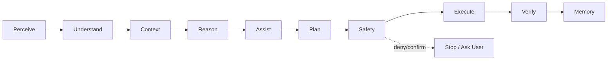

# OmniSense AI — Phase Engineering Documentation

These phase files are detailed engineering specifications rather than short feature notes. Each phase defines scope, architecture, requirements, contracts, state, errors, security, performance, testing, operations, acceptance and handoff.

## Principle

> Intelligence without uncontrolled authority.

## Development lifecycle

PLAN → DESIGN → IMPLEMENT → TEST → SECURITY → VERIFY → DOCUMENT → COMMIT → HANDOFF

## Phase status

| 0 | Foundation | Complete |
| 1 | Screen Capture | Implemented / Current |
| 2 | Visual Processing | Planned |
| 3 | OCR | Planned |
| 4 | Window & App Detection | Planned |
| 5 | UI / Visual Understanding | Planned |
| 6 | Context Engine | Planned |
| 7 | AI / VLM Integration | Planned |
| 8 | Intelligent Assistant | Planned |
| 9 | Action Planning | Planned |
| 10 | Safety & Permission Engine | Planned |
| 11 | Desktop Automation | Planned |
| 12 | Action Verification | Planned |
| 13 | Memory | Planned |
| 14 | Performance | Planned |
| 15 | Security Hardening | Planned |
| 16 | Testing & Evaluation | Planned |
| 17 | Full System Integration | Planned |
| 18 | Packaging & Release | Planned |

## Completion gate

Implementation + tests + security review + performance evidence where applicable + documentation + acceptance evidence + handoff contract = phase complete.
