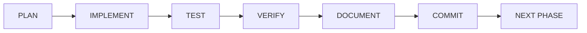
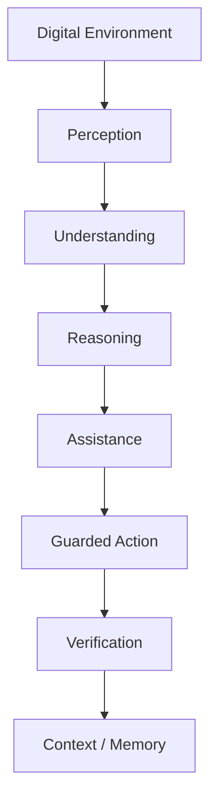
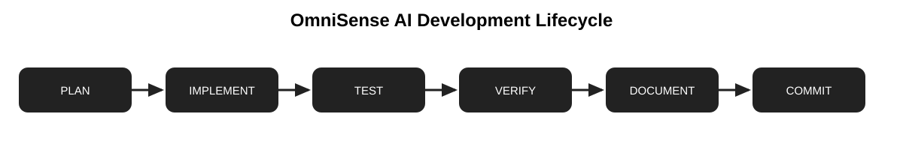
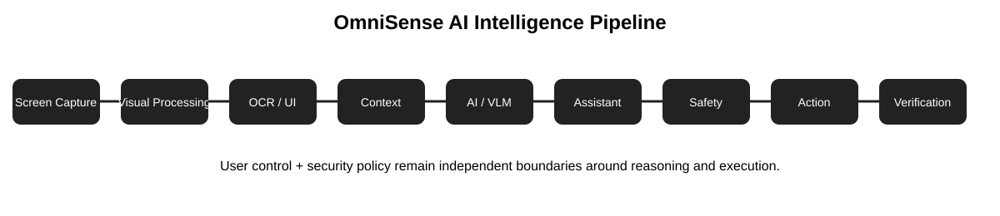

# OmniSense AI — Development Phase Documentation

This directory contains the phase-level engineering specifications for OmniSense AI.

## Development lifecycle

## System evolution

## Visual diagrams

## Phase map

| Phase | Name | Status |
|---|---|---|
| 0 | Foundation | Complete |
| 1 | Screen Capture | Implemented / Current |
| 2 | Visual Processing | Planned |
| 3 | OCR | Planned |
| 4 | Window & App Detection | Planned |
| 5 | UI / Visual Understanding | Planned |
| 6 | Context Engine | Planned |
| 7 | AI / VLM Integration | Planned |
| 8 | Intelligent Assistant | Planned |
| 9 | Action Planning | Planned |
| 10 | Safety & Permission Engine | Planned |
| 11 | Desktop Automation | Planned |
| 12 | Action Verification | Planned |
| 13 | Memory | Planned |
| 14 | Performance | Planned |
| 15 | Security Hardening | Planned |
| 16 | Testing & Evaluation | Planned |
| 17 | Full Integration | Planned |
| 18 | Packaging & Release | Planned |

## Phase completion rule

A phase is complete only after implementation, tests, verification, documentation and acceptance criteria are satisfied. Future-phase functionality must not be silently introduced into an earlier phase.

## Core boundary

**Intelligence without uncontrolled authority.**

AI reasoning, external content and generated actions remain lower-trust than application security policy and explicit user authorization.
