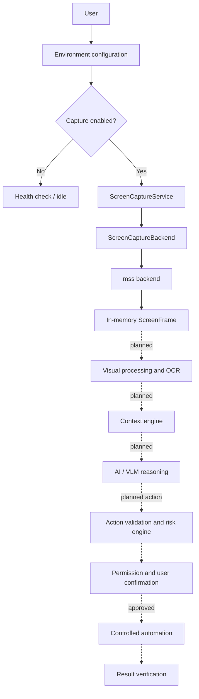

# OmniSense AI

OmniSense AI is a privacy-conscious desktop intelligence platform under incremental development. Its long-term goal is to help a computer perceive the user's visible digital environment, understand context, provide useful assistance, and take only explicitly controlled actions.

> **See -> Understand -> Reason -> Assist -> Safely Act**

## Current Status

The repository currently contains the Phase 0 foundation and the initial screen-capture capability:

- Typed application and capture configuration loaded from environment variables.
- Structured logging with basic secret redaction.
- Deterministic health checking and a runnable application entry point.
- Monitor enumeration through a backend interface.
- `mss`-based monitor and region capture.
- Explicit capture permission, start/stop, pause/resume, monitor selection, region validation, and controlled errors.
- Unit tests for configuration, logging, models, backend behavior, the service, and the application health check.

OCR, computer vision, window detection, context understanding, AI model integration, automation, persistence, and a user interface are planned capabilities, not implemented features in this revision.

## Architecture

The architecture keeps perception, intelligence, authorization, execution, and verification separate. The dashed portion represents the planned end-state pipeline; the solid capture path is the capability available in this repository today.



## Project Layout

```text
.
├── Docs/                       # Vision, requirements, architecture, security, and process docs
├── src/omnisense_ai/
│   ├── app.py                  # Health check and application entry point
│   ├── config.py               # Environment-based configuration
│   ├── logging_config.py       # Redacting logger setup
│   └── screen_capture/
│       ├── backend.py          # Backend protocol and mss implementation
│       ├── errors.py           # Capture-specific exceptions
│       ├── models.py           # Monitor, region, frame, and state models
│       └── service.py          # Capture lifecycle and validation
├── tests/                      # Pytest test suite
├── .env.example                # Safe local configuration template
└── pyproject.toml              # Package metadata and tool configuration
```

## Requirements

- Python 3.11 or newer
- Windows is the initial target platform for real screen capture
- A virtual environment is recommended

## Quick Start

Create and activate a virtual environment, then install the package with development dependencies:

```powershell
py -3.11 -m venv .venv
.\.venv\Scripts\Activate.ps1
python -m pip install --upgrade pip
python -m pip install -e ".[dev]"
```

Run the application health check:

```powershell
python -m omnisense_ai
```

Run the test suite:

```powershell
python -m pytest
```

The real screen-capture integration test is intentionally opt-in because it accesses the active desktop:

```powershell
$env:OMNISENSE_RUN_SCREEN_CAPTURE_INTEGRATION = "1"
python -m pytest tests/test_screen_capture_backend.py
```

## Configuration

Configuration is read from the process environment. Copy `.env.example` as a reference, but load values through your chosen local environment tooling rather than committing a `.env` file.

| Variable | Default | Description |
| --- | --- | --- |
| `OMNISENSE_ENVIRONMENT` | `development` | Runtime environment label |
| `OMNISENSE_LOG_LEVEL` | `INFO` | `DEBUG`, `INFO`, `WARNING`, `ERROR`, or `CRITICAL` |
| `OMNISENSE_CAPTURE_ENABLED` | `false` | Explicit opt-in switch for screen capture |
| `OMNISENSE_CAPTURE_MONITOR_ID` | `primary` | Monitor identifier, or the primary monitor selector |
| `OMNISENSE_CAPTURE_INTERVAL_MS` | `1000` | Capture interval; minimum is 100 ms |
| `OMNISENSE_CAPTURE_MAX_FPS` | `1` | Maximum capture rate; maximum is 10 FPS |
| `OMNISENSE_CAPTURE_REGION` | empty | Optional `x,y,width,height` region |

Secrets, when future integrations require them, must be supplied only by the local environment. Do not place API keys, tokens, passwords, or private keys in source control.

## Safety and Privacy

Safety is an architectural constraint, not a later convenience:

- Screen capture requires explicit configuration and can be stopped or paused.
- Captured frames are represented in memory and are not persisted by the current implementation.
- Screen text, OCR output, documents, web content, and AI output are treated as untrusted or conditionally trusted data.
- AI reasoning must never directly execute shell commands or access unrestricted filesystem APIs.
- Future actions must pass validation, risk classification, permission checks, user confirmation where required, and result verification.
- Protected operating-system paths, credentials, privilege escalation, security bypasses, and destructive system operations are blocked by design.

See [SECURITY_MODEL.md](Docs/SECURITY_MODEL.md) and [PROJECT_BOUNDARIES.md](Docs/PROJECT_BOUNDARIES.md) for the governing security and scope rules.

## Development Roadmap

Development is phase-based and test-driven. The current milestone is the foundation plus the first screen-capture slice.

```text
Phase 0  Foundation                         Current
Phase 1  Screen capture                     Initial implementation present
Phase 2  Visual processing                  Planned
Phase 3  OCR engine                          Planned
Phase 4  Window and application detection   Planned
Phase 5  UI and visual understanding        Planned
Phase 6+ Context, AI, safe automation,      Planned
         verification, hardening, release
```

New work should follow: **plan -> implement -> test -> verify -> document**. Features from future phases should remain disabled until their phase is approved.

## Documentation

The `Docs/` directory is the project reference set:

- [Project vision](Docs/Project_vision.md)
- [Software requirements specification](Docs/SRS.md)
- [System architecture](Docs/SYSTEM_ARCHITECTURE.md)
- [Technology stack](Docs/TECH_STACK.md)
- [Development phases](Docs/DEVELOPMENT_PHASES.md)
- [Security model](Docs/SECURITY_MODEL.md)
- [Project boundaries](Docs/PROJECT_BOUNDARIES.md)
- [Testing and evaluation](Docs/TESTING_AND_EVALUATION.md)
- [Coding standards](Docs/CODING_STANDARDS.md)
- [AI development rules](Docs/AI_DEVELOPMENT_RULES.md)

## License

No license has been declared yet.